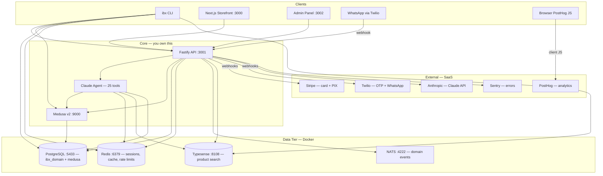
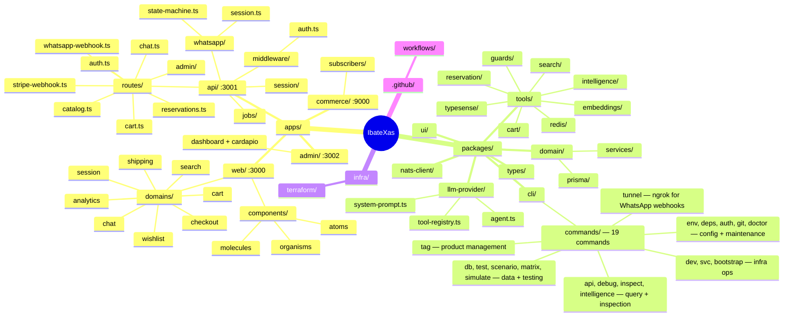
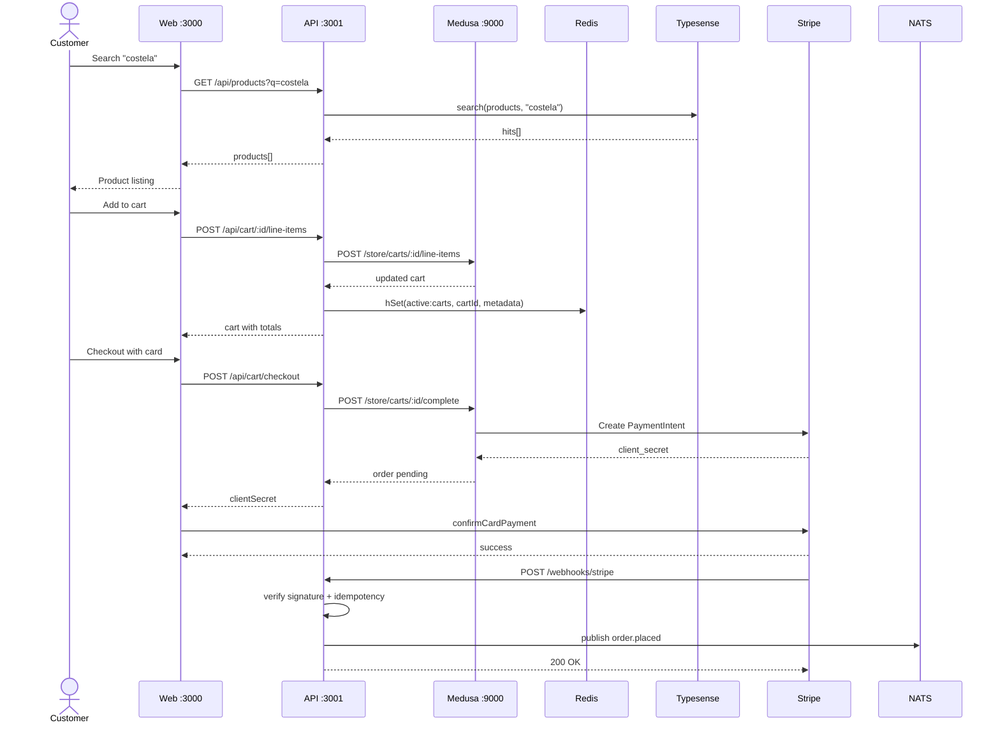
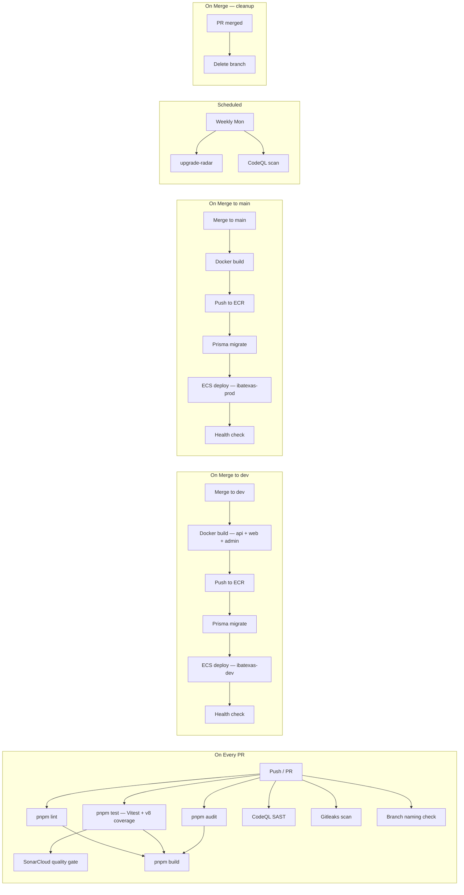

# Architecture

> Find anything in < 30 seconds.

---

## 1. Big Picture — System Context

Where the project ends and the world begins.

---

## 2. Source of Truth — Module Map

If you need X, go to Y.

### CLI → Core Engine Interaction

Every `ibx` command goes through the same infrastructure the apps use. No separate paths.

| Command group | Touches | Why |
|---------------|---------|-----|
| `dev`, `svc`, `bootstrap` | Docker, Medusa, Postgres, Redis, Typesense, NATS | Start/stop/setup the full stack |
| `db` | Postgres (Prisma + Medusa migrations), Typesense (reindex) | Schema + data lifecycle |
| `test`, `scenario`, `matrix`, `simulate` | All data stores + Medusa | Seed, verify, simulate customer behavior |
| `api` (products, search, chat) | Medusa admin API, Typesense, API :3001 | Query catalog, test agent |
| `debug` | Redis (raw keys), Typesense (raw docs), Postgres (profiles) | Infrastructure inspection |
| `inspect` | Typesense, Postgres, Redis, Medusa | Business-level state (what the UI sees) |
| `intelligence` | Redis (sorted sets), Postgres (order history) | Co-purchase matrix, global scores |
| `tag` | Medusa admin API → Typesense reindex → Redis cache flush | Product metadata |
| `deps` | pnpm workspace, Git | Dependency overrides audit + drift detection |
| `env`, `auth`, `doctor` | dotenv, Redis, all infra (doctor) | Config validation, OTP debugging, health check |
| `git` | Git | Branch status, recent commits |
| `tunnel` | ngrok → API :3001 | Expose local API for WhatsApp webhook testing |

---

## 3. Life of a Request — Purchase Flow

Trace a customer purchase from search to order confirmation.

---

## 4. Safety Net — CI/CD + Testing Pipeline

What runs when. Helps decide what's priority vs noise.

---

## Where Is X?

| Concern | Go to | Start reading |
|---------|-------|---------------|
| Auth (middleware) | `apps/api/src/middleware/auth.ts` | `requireAuth()` |
| Auth (OTP + JWT) | `apps/api/src/routes/auth.ts` | `sendOtp`, `verifyOtp` |
| Payments | `apps/api/src/routes/stripe-webhook.ts` | webhook handler |
| Cart operations | `packages/tools/src/cart/` | `add-to-cart.ts` |
| Checkout | `packages/tools/src/cart/create-checkout.ts` | `createCheckout()` |
| Product search | `packages/tools/src/search/search-products.ts` | `searchProducts()` |
| Reservations | `packages/tools/src/reservation/` | `check-availability.ts` |
| AI Agent loop | `packages/llm-provider/src/agent.ts` | `runAgent()` |
| Tool registry | `packages/llm-provider/src/tool-registry.ts` | tool definitions |
| WhatsApp | `apps/api/src/whatsapp/state-machine.ts` | state machine |
| Analytics events | `apps/web/src/domains/analytics/events.ts` | `AnalyticsEvent` union |
| Typesense indexing | `packages/tools/src/typesense/index-product.ts` | `indexProduct()` |
| Delivery/shipping | `packages/tools/src/catalog/estimate-delivery.ts` | fee calculation |
| Redis client + keys | `packages/tools/src/redis/client.ts` + `key.ts` | `rk()` |
| Circuit breaker | `packages/tools/src/redis/circuit-breaker.ts` | `RedisCircuitBreaker` |
| NATS events | `packages/nats-client/src/index.ts` | `publishNatsEvent()` |
| Prisma schema | `packages/domain/prisma/schema.prisma` | entities |
| Domain services | `packages/domain/src/services/` | `reservation.service.ts` etc |
| CLI (all 19 cmds) | `packages/cli/src/commands/` | one file per command |
| CLI (services def) | `packages/cli/src/services.ts` | port assignments, service registry |
| CLI (scenarios) | `packages/cli/src/scenarios/` | YAML-driven state testing |
| Shared UI | `packages/ui/src/` | `atoms/`, `molecules/` |
| Web components | `apps/web/src/components/` | app-specific UI |
| Env config | `apps/api/src/config.ts` | Zod schema |
| Docker services | `docker-compose.yml` | PG, Redis, Typesense, NATS |
| Terraform | `infra/terraform/environments/dev/` | `main.tf` |
| CI/CD | `.github/workflows/` | `ci.yml`, `deploy.yml` |
| Error handling | `apps/api/src/errors/handler.ts` | `registerErrorHandler()` |
| Sessions | `apps/api/src/session/store.ts` | Redis conversation store |

---

## How Do I Run X?

| Task | Command |
|------|---------|
| **Basics** | |
| Start everything | `ibx dev` |
| Stop everything | `ibx dev stop` |
| First-time setup | `ibx bootstrap` |
| Health check | `ibx doctor` |
| All commands | `ibx --help` |
| Command help | `ibx <command> --help` |
| **Build & Test** | |
| Build all | `ibx dev build` |
| Run all tests | `ibx test` |
| Run one test | `ibx test -- path/to/file.test.ts` |
| E2E tests | `npx playwright test` |
| Lint | `pnpm lint` |
| **Database** | |
| Apply domain migrations | `ibx db migrate:domain` |
| Seed products | `ibx db seed` |
| Seed domain tables | `ibx db seed:domain` |
| Full reseed | `ibx db reset` |
| Reindex Typesense | `ibx db reindex` |
| **Infrastructure** | |
| Docker services up | `ibx svc up` |
| Docker services down | `ibx svc down` |
| Service status | `ibx svc status` |
| Expose for WhatsApp | `ibx tunnel` |
| **Debugging** | |
| Inspect Redis keys | `ibx debug redis [pattern]` |
| Search Typesense | `ibx debug typesense [query]` |
| Customer profile | `ibx debug profile <customerId>` |
| OTP rate-limit flush | `ibx auth flush [phoneHash]` |
| **Data & Intelligence** | |
| Tag a product | `ibx tag add <handle> <tag>` |
| Rebuild co-purchase | `ibx intel copurchase-rebuild` |
| Run scenario | `ibx scenario run <name>` |
| Simulate orders | `ibx simulate full` |
| **Maintenance** | |
| Env check | `ibx env check` |
| Dependency audit | `ibx deps audit` |
| Dependency drift | `ibx deps drift` |
| Git status | `ibx git status` |

---

## CI/CD Workflows

All workflows in `.github/workflows/`.

| Workflow | Trigger | Purpose |
|----------|---------|---------|
| `ci.yml` | PR + push main/dev | Lint, test, audit, build, SonarCloud |
| `deploy.yml` | Push to main | Docker -> ECR -> migrate -> ECS deploy -> health check |
| `deploy-staging.yml` | Push to dev | Same pipeline, `ibatexas-dev` cluster |
| `codeql.yml` | PR + push + weekly | CodeQL SAST (JS/TS) |
| `secret-scan.yml` | PR + push main/dev | Gitleaks secret detection |
| `branch-naming.yml` | PR open/reopen/sync | Enforces `type/description` naming |
| `cleanup-branches.yml` | PR merged | Deletes merged branches |
| `override-drift.yml` | PR changing package.json | `pnpm check:overrides` |
| `upgrade-radar.yml` | Weekly + manual | `pnpm upgrade:radar` |

## Infrastructure

Terraform in `infra/terraform/environments/dev/` manages:
ECS Fargate cluster, ECR repos (api/web/admin), ALB, ACM certs,
Route53 DNS, IAM roles, security groups, Secrets Manager.

State backend: S3 (defined, provisioning tracked in INFRA-17).
