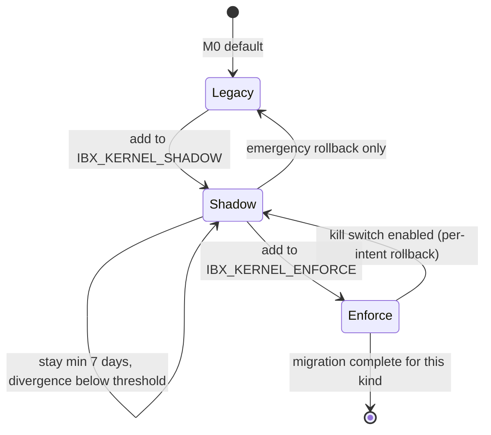
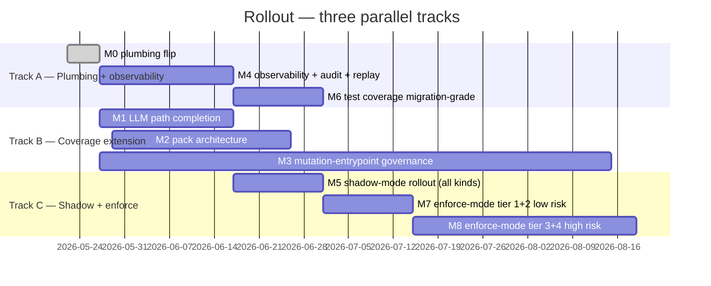

# 01 — Rollout Strategy

**Status:** Draft v0.1 — pending stakeholder review
**Owner:** Migration Planner (Claude)
**Last updated:** 2026-05-22
**Companion docs:** `02-milestones.md`, `03-blast-radius-analysis.md`, `../superseded/04-shadow-enforce-sequencing.md`, `../superseded/05-kill-switch-strategy.md`, `06-observability-requirements.md`, `07-production-safety-checklist.md`

---

## Executive summary

- **Three parallel tracks, never collapsed.** Track A (plumbing + observability) precedes everything; Track B (coverage extension over the ~150 mutation entrypoints catalogued in investigations 02–04) is the long pole; Track C (shadow → enforce sequencing) is gated by the other two.
- **Always shadow before enforce, never simultaneously.** A single intent kind is either `legacy` (current default), `shadow` (kernel runs but legacy is authoritative), or `enforce` (kernel is authoritative). No intent kind enters `enforce` without ≥7 days of shadow data showing zero `DECISION_KIND` or `PAYLOAD_REWRITE` divergence.
- **Per-intent-kind enforce flips, never bulk flips.** `IBX_KERNEL_ENFORCE=*` is forbidden in production. Each flip carries the intent kind name explicitly so the operator inventory matches the rollout log.
- **Default-deny is the destination, legacy-EXECUTE is the starting point.** Every intent kind walks the same path: `legacy → shadow → enforce`. The migration is complete when ≥95% of mutation entrypoints (`investigation/01–04`) are in `enforce` and no Prisma write outside a wrapped command service can pass CI.
- **Kill-switch-first, runbook-first.** No enforce flip ships without a tested, rehearsed rollback runbook that an on-call engineer can execute in ≤2 minutes (per `docs/ops/runbooks/01-stage-read-mutations.md`). Replay runs daily, before any enforce flip and after.

---

## Why three tracks (and not one waterfall)

Investigations 01–08 surface two structurally independent problems:

1. **The kernel is dormant.** Even where the framework is wired (LLM path), env vars are unset, `onToolIntent` is unwired, and no `MetricsSink` is installed (`investigation/06 §"Telemetry / metrics wiring"`). Until plumbing lands and observability is real, *no* enforce flip is safe — there is no signal to confirm the shadow window is clean.

2. **The kernel sees only the LLM-tool path.** 47 HTTP routes, ~50 Prisma mutation sites, 32 NATS/job entry points are 100% bypass (`investigation/02 §Totals`, `investigation/03 §Executive summary`, `investigation/04 §"Subscriber count summary"`). Extending coverage is the bulk of the work.

A pure sequential plan ("finish plumbing, then finish coverage, then start rollout") wastes calendar time and centralises risk at the end. A three-track plan lets observability harden in parallel with coverage extension, and lets the lowest-risk intent kinds enter shadow as soon as their entrypoint is wrapped.

### Track A — Plumbing + observability

Owns the boot sequence and the telemetry contract. Critical path: M0 (plumbing flip) → M4 (observability + audit + replay). Failures here block every enforce flip on every other track.

**Concrete deliverables:**

- `apps/api/src/plugins/kernel-bootstrap.ts` — calls `installPack(orderPolicyBundle)`, `validateEnforceConfig(knownIntents)`, `setMetricsSink(metricsSink)`, `setLearningSink(learningSink)` (per `investigation/06 §"Required to make the kernel flip-the-switch ready"`).
- `apps/api/src/plugins/kernel-metrics.ts` — PostHog + Sentry + Prometheus `MetricsSink` adapter emitting the names declared in `apps/web/src/domains/analytics/events.ts:107-114`.
- `apps/api/src/subscribers/audit-archiver.ts` — consumer for `ibatexas.audit.intent.decision.v1` writing to `@adjudicate/audit-postgres`.
- `packages/cli/src/commands/kernel.ts` — `ibx kernel status`, `ibx kernel replay`, `ibx kernel divergence`, `ibx kernel kill-switch enable/disable`.
- Env var stanza in `.env.example` + Terraform SSM secrets + `process-compose.yaml` propagation.

### Track B — Coverage extension

Wraps every mutation entrypoint in an `IntentEnvelope`, registered against a known intent kind, before the rollout can flip that intent to shadow.

**Concrete deliverables:**

- LLM-path completion (per `investigation/01 §"Gaps and recommendations"` items 1–5). Wire `onToolIntent`, reclassify `set_pix_details`, adopt `orderCapabilityPlanner`, remove `executeToolDirect` from the public export.
- API-route wrapping (per `investigation/02 §"Recommended sequencing"` API-1 through API-5). 47 routes, sequenced webhook → checkout → admin → subscriber.
- Domain-service envelope at method boundary (per `investigation/03 §"Recommended adjudication entry points"`). Single chokepoint per model.
- Subscriber + job envelopes with system-actor provenance (per `investigation/04 §"Architectural"` recommendation 2).
- Pack architecture: `@ibatexas/pack-orders`, `@ibatexas/pack-reservations`, `@ibatexas/pack-whatsapp`, `@ibatexas/pack-customer-onboarding` (per `investigation/05 §"Packs ibatexas should write"`).

### Track C — Shadow → enforce sequencing

The operator-facing track. Owns the per-intent-kind flip sequence, the divergence dashboards, and the kill switches.

**Concrete deliverables:**

- Per-intent shadow rollout (driven by `../superseded/04-shadow-enforce-sequencing.md`).
- Per-intent divergence dashboard (PostHog + Grafana, per `06-observability-requirements.md`).
- Per-intent kill switch surface (`../superseded/05-kill-switch-strategy.md`).
- Per-intent enforce flip with rehearsed rollback (`07-production-safety-checklist.md`).
- Daily replay job consuming the audit Postgres table (per `investigation/05 §"Capabilities ibatexas should adopt"` Tier 1 item 8).

---

## The shadow-before-enforce invariant

Every intent kind passes through these states, in order, exactly once:



**Rules:**

1. An intent kind must be in `IBX_KERNEL_SHADOW` for ≥7 days before it can be added to `IBX_KERNEL_ENFORCE`.
2. During shadow, divergence rates must satisfy the thresholds in `../superseded/04-shadow-enforce-sequencing.md` (typically `DECISION_KIND` = 0, `PAYLOAD_REWRITE` = 0, `BASIS_ONLY` < 5% for ≥7 consecutive days).
3. An intent kind moves from `enforce` back to `shadow` via the per-intent kill switch (`../superseded/05-kill-switch-strategy.md`). Rollback is reversible — no data loss, no schema change.
4. The transition from `legacy → shadow` is also a flip, but lower stakes: shadow does not change legacy behaviour. Shadow can be enabled as soon as the entrypoint is wrapped *and* observability is live.

**What "shadow" means concretely:**

- `adjudicateWithShadow(envelope, state, policy, legacy)` is called. The legacy decision (`EXECUTE` today, replaced by the legacy behaviour as the migration extends coverage) is the authoritative one; the kernel decision is recorded but not applied.
- The kernel `MetricsSink.recordShadowDivergence(event)` fires when `classifyDivergence(legacy, kernel)` returns anything other than `NONE`.
- The audit sink emits the kernel decision alongside the legacy decision, with `decision.kind` reflecting the kernel verdict and the audit record's outcome reflecting the legacy outcome.

**What "enforce" means concretely:**

- `adjudicate(envelope, state, policy)` is the only decision; the kernel verdict is authoritative.
- `REFUSE` / `REQUEST_CONFIRMATION` / `ESCALATE` / `DEFER` short-circuit the mutation.
- Audit record reflects the actual outcome.

The architectural codepath is already in place at `packages/llm-provider/src/llm-responder.ts:311-332` (per `investigation/01 §"Current flow"` step 7.2); the work is to extend it to non-LLM entrypoints and to make the env-var-driven gating actually fire.

---

## Per-intent-kind flips, never bulk flips

Bulk flips (`IBX_KERNEL_ENFORCE=*`) are forbidden in production because:

1. **Risk correlation.** A single bad guard in `order-policy-bundle.ts` would refuse every intent kind simultaneously. Per-intent flips contain the blast radius.
2. **Operator inventory matches reality.** Every audit, every dashboard, every alert is scoped to a known intent kind. `*` makes "what's enforced today?" un-answerable.
3. **Typo containment.** `validateEnforceConfig(knownIntents, env)` (per `investigation/05 §"@adjudicate/core/kernel"` capability list, line for `validateEnforceConfig`) only catches typos against the *known intents set*. A typo in a bulk flip silently passes.

The only acceptable bulk operation is `IBX_KERNEL_SHADOW=*` in staging — used for the 48h baseline before any intent kind enters production shadow. Staging is non-customer-facing, divergence is observability noise, not outage risk.

**Operator commands** (per the runbook conventions in `docs/ops/runbooks/01-stage-read-mutations.md` plus new CLI per `06-observability-requirements.md`):

```bash
# Enable shadow for one intent (production-safe)
ibx kernel shadow enable reservation.create
ibx svc restart api

# Promote to enforce after observation window (production-safe)
ibx kernel enforce enable reservation.create
ibx svc restart api

# Emergency rollback (per-intent, no redeploy needed)
ibx kernel kill-switch enable reservation.create
```

CLI is the contract — env-var-only operation is supported but the CLI mediates atomicity (read current set, append/remove, write back, verify against known intents).

---

## Default-deny: the destination

The migration is complete when `PolicyBundle.default = constant(decisionRefuse(...))` for every Pack, and `IBX_KERNEL_ENFORCE` contains every known mutating intent kind.

Today the policy bundle's default is implicit `EXECUTE` (per `investigation/06 §"CLAUDE.md rules vs code reality"` Rule #9 table). The migration sequence:

1. **Phase 1 — Default-EXECUTE explicitly.** Make the legacy behaviour visible: `PolicyBundle.default = constant(decisionExecute([basis("kernel", "legacy_default")]))`. No behaviour change; surfaces the gap.
2. **Phase 2 — Default-REFUSE in shadow.** Switch the default to refuse, run in shadow. Every "would-be refusal" emits a `DECISION_KIND` divergence event. Use this signal to find missing guards (we expected EXECUTE; the new default refused).
3. **Phase 3 — Default-REFUSE in enforce.** After Phase 2's divergence signal stabilises (every intent kind has an explicit guard producing the right decision), flip the default to REFUSE in enforce. From now on, *any new intent kind that isn't matched by a guard* refuses.

Phase 3 is the destination. It means: a new contributor can't introduce a mutation entrypoint without registering an intent and a guard. The bypass-detection CI test (`07-production-safety-checklist.md`) is the build-time enforcement of the same invariant.

---

## Kill-switch-first: every enforce flip carries a tested rollback

**The rule:** before any intent kind flips to `enforce`, the corresponding kill-switch path must be exercised in staging within the prior 7 days. No exceptions.

**Three layers of kill switch** (full detail in `../superseded/05-kill-switch-strategy.md`):

1. **Global** — `IBX_KILL_SWITCH=1` at boot, or `setKillSwitch(true, reason)` at runtime, or `POST /api/admin/kernel/kill-switch` from the operator console. Every intent refuses with `SECURITY/kill_switch_active`.
2. **Per-intent** — `createDistributedKillSwitchPubSub` per intent kind (per `investigation/05 §"Cross-replica coordination"`). Flips one kind from `enforce` back to `shadow` without a redeploy.
3. **Per-pack** — disables an entire Pack (e.g. `@ibatexas/pack-orders` off-line for incident response).

**Runbook coverage** matches kill-switch coverage. Stage runbooks 01–05 in `docs/ops/runbooks/` already exist; per `investigation/07 §"Runbooks status"` they are well-written but reference metrics and CLI that don't exist. Track A delivers the metrics + CLI; Track C rewrites the runbooks to match the actual emitted contract.

---

## Replay daily, before and after every enforce flip

**Daily replay** (cron-driven, runs at 02:00 UTC):

```bash
ibx kernel replay --since=24h --format=ci-line
```

Pulls the last 24 hours of audit records from Postgres, re-feeds each `(envelope, state)` to `adjudicate()`, compares the new decision to the historical one. Emits `kernel_replay_drift_total{class=<stable|improving|regressing|flapping>}` (per `06-observability-requirements.md`). Non-zero `regressing` or `flapping` blocks the next enforce flip.

**Before every enforce flip** (manual, part of `07-production-safety-checklist.md`):

```bash
ibx kernel replay --since=24h --intent-kind=<target> --format=operator
```

Confirms the target intent's shadow window produced deterministic decisions. A non-deterministic decision (same envelope + state → different decision) is a hard stop — the Pack has time-dependent or environment-dependent logic that must be made explicit.

**After every enforce flip** (within 24h, automated):

```bash
ibx kernel replay --since=24h --intent-kind=<just-flipped> --format=ci-line --strict
```

Confirms the post-flip 24h window matches the pre-flip 24h window decision-for-decision *for the historically observed envelopes*. New refusal patterns that didn't exist in shadow are flagged for review.

Replay infrastructure depends on `@adjudicate/audit-postgres.readAuditWindow` + `replayWithIntegrity` + `classifyReplayDrift` (per `investigation/05 §"Replay & integrity"`). All exist as framework primitives; Track A wires them into a CLI.

---

## Parallel-track sequencing



**Critical path** is M0 → M4 → M5 → M6 → M7 → M8. Track B is parallel except for M3, which spans most of the calendar and gates a few late-tier enforce flips.

---

## Decision-rights and ownership

| Decision | Owner | Surface |
|---|---|---|
| Promote intent from shadow to enforce | Migration lead + intent-kernel maintainer | `07-production-safety-checklist.md` sign-off |
| Engage global kill switch | On-call (any) | `POST /api/admin/kernel/kill-switch` |
| Engage per-intent kill switch | On-call (any) | `ibx kernel kill-switch enable <intent>` |
| Approve a new intent kind | Owner of the Pack that hosts it | Pack `intents` set + ADR |
| Approve a new mutation entrypoint | Code reviewer + bypass-detection CI gate | PR review + CI |
| Resume from kill-switched state | Migration lead | Post-mortem template (`../superseded/05-kill-switch-strategy.md`) |
| Approve enforce of a payment-touching intent | Migration lead + finance + ops lead | Pre-flight checklist sign-offs |
| Approve enforce of `customer.anonymize` | Migration lead + legal | Pre-flight checklist sign-offs |

---

## What gets explicitly NOT done

These show up in the master plan as out-of-scope and remain out-of-scope for the rollout:

- Replacing Medusa, NATS, Prisma, or the LLM SDK.
- Migrating to JetStream (recommended in `investigation/04 §Operational` but a separate workstream).
- Adopting `@adjudicate/anthropic.createAdjudicatedAgent` — recommended in `investigation/05 §Tier 2` but pushed to Phase 4 after the migration is complete.
- Operator console — `apps/console` adoption is a Phase 4 follow-on (`investigation/05 §Tier 4`).

The migration extends the architecture; it does not refactor it. A successful rollout is one where customer-facing behaviour is unchanged, but every mutation is adjudicated, audited, and replayable.

---

## What "done" looks like

For each intent kind in scope:

- [ ] Wrapped at its entrypoint with `buildEnvelope + adjudicate + audit emit`.
- [ ] Registered against a Pack with explicit `default` (no implicit EXECUTE).
- [ ] Has a guard for every legal state transition.
- [ ] Has a dashboard panel showing rate / latency / refusal breakdown (`06-observability-requirements.md` Dashboard 1).
- [ ] Has run in shadow ≥7 days with divergence below threshold (`../superseded/04-shadow-enforce-sequencing.md`).
- [ ] Has been flipped to enforce with the pre-flight checklist signed off.
- [ ] Has a per-intent kill switch tested in staging within the last quarter.
- [ ] Has the post-stage report filed at `docs/ops/runbooks/reports/<intent>-<date>.md`.

For the system overall:

- [ ] ≥95% of inventoried mutation entrypoints (`investigation/01–04`) flow through `adjudicate()`.
- [ ] Bypass-detection CI gate active and passing.
- [ ] Daily replay job running with drift class `stable` for ≥14 days.
- [ ] Default-deny in effect at the Pack layer.
- [ ] Audit pipeline lag p99 < 5s for 14+ days.
- [ ] No PII in audit (contract test green, daily NATS subject sample produces zero CPF/email/phone matches per `investigation/08 §"Top P0/P1 security gaps"` P0 #1).

---

## Open questions for the orchestrator

1. **Engineer count and pace.** The MASTER_PLAN.md cites "2-3 engineers for 4-5 months". The milestone breakdown in `02-milestones.md` assumes 3 engineers steady-state across tracks A/B/C. Confirm or reduce.
2. **Default-deny phase timing.** Phase 1 (explicit EXECUTE default) and Phase 3 (REFUSE default in enforce) are bookend states. Phase 2 (REFUSE default in shadow) is a divergence-discovery period — should we time-box it (e.g. 4 weeks) or wait for divergence to stabilise (open-ended)?
3. **Operator console adoption.** Phase 4 follow-on or in-scope for M8? The console (per `investigation/05 §"Console & web apps"`) reads from the same `@adjudicate/audit-postgres` table as the CLI, so once M4 lands the console is a deploy-and-go. Decision affects on-call UX during M7/M8.
