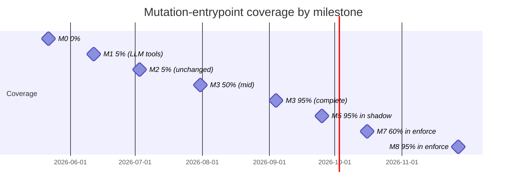
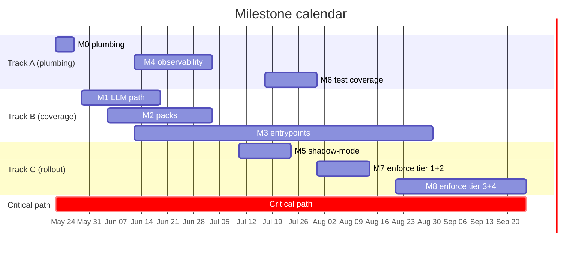

> ⚠️ **SUPERSEDED on 2026-05-24.** M0-M4 (plumbing, LLM-path completion, Pack architecture, mutation-entrypoint governance, observability + audit + replay) and M6 (test coverage migration-grade) were completed via the work-arc that produced the IBX-IGE v3.0 always-on cutover (`f3bea43`). M5 (shadow-mode rollout), M7 (tier 1+2 enforce), and M8 (tier 3+4 enforce) were abandoned — the cutover replaced staged rollout with always-on. For current state, see [`../audit-2026-05-24/CLOSEOUT-STATUS.md`](../audit-2026-05-24/CLOSEOUT-STATUS.md). Content preserved unchanged below as historical record.

---

# 02 — Milestones (M0–M8)

**Status:** Draft v0.1
**Owner:** Migration Planner
**Last updated:** 2026-05-22
**Companion docs:** `01-rollout-strategy.md`, `03-blast-radius-analysis.md`, `../superseded/04-shadow-enforce-sequencing.md`

---

## Executive summary

- **Nine milestones, three tracks** (A/B/C per `01-rollout-strategy.md`). M0–M2 land the chokepoint; M3 is the long pole; M4 makes shadow safe; M5–M6 prepare the rollout; M7–M8 execute it.
- **Coverage burn-down: 0% → 95%+** across M0 through M8, measured against the 150+ mutation entrypoints inventoried in `investigation/01–04`.
- **M0 is critical-path for everything.** Plumbing must land before any shadow flip; without it the runbook-cited PostHog events have no producer (`investigation/07 §"Observability stack"`).
- **M3 is the long pole.** 47 routes × 50 Prisma sites × 32 NATS/job handlers + a Pack-architecture migration. Sequenced webhook → checkout → admin → subscriber per `investigation/02 §"Recommended sequencing"`.
- **M7 and M8 are the only milestones where customer-facing behaviour can change.** Every other milestone is structural; M7/M8 carry the operational risk. Pre-flight checklist (`07-production-safety-checklist.md`) gates every flip.

---

## Milestone overview

| ID | Title | Weeks | Track | Blast radius | Blocks |
|---|---|---|---|---|---|
| M0 | Plumbing flip | 1 | A | None — dormant kernel | All other milestones |
| M1 | LLM-path completion | 2–4 | B | LLM mutation tools (5 of 35) | M5, M7 (LLM intent kinds) |
| M2 | Pack architecture | 3–6 | B | Pack registry only | M5 (per-pack rollout) |
| M3 | Mutation-entrypoint governance | 4–15 | B | 47 routes + 50 Prisma + 32 NATS/job | M5/M7 (non-LLM intent kinds) |
| M4 | Observability + audit + replay | 4–7 | A | Audit pipeline + replay tooling | M5 (no shadow without metrics) |
| M5 | Shadow-mode rollout (all intents) | 7–9 | C | Telemetry-only | M7 |
| M6 | Test coverage migration-grade | 8–10 | A | CI gates only | M7 |
| M7 | Enforce-mode rollout, tier 1 + 2 (low risk) | 10–12 | C | Customer-visible refusal possible | M8 |
| M8 | Enforce-mode rollout, tier 3 + 4 (high risk) | 13–18 | C | Customer + revenue + LGPD | None |

Wall-clock end-to-end: ~18 weeks (4–5 months) with 2–3 engineers.

---

## M0 — Plumbing flip

**Scope** (per `investigation/06 §"Required to make the kernel flip-the-switch ready"`):
1. Add env-var stanza to `.env.example` + Terraform SSM + `process-compose.yaml`.
2. Create `apps/api/src/plugins/kernel-bootstrap.ts` calling `installPack`, `validateEnforceConfig`, `setMetricsSink`, `setLearningSink`.
3. Wire `onToolIntent` from `runAgent` to `generateResponse` (per `investigation/01 §"Gaps and recommendations"` item 1).
4. Wire `startDeferResolverSubscriber` in `apps/api/src/index.ts` (per `investigation/02 §"Phase API-1"`).
5. Fix `resumeDeferredIntent` to actually re-execute the parked envelope (per `investigation/04 §"Architectural"` item 1).
6. Create `audit-archiver.ts` subscriber for `ibatexas.audit.intent.decision.v1` (per `investigation/06 §"P0-5"`).
7. `AuditRedactor` lands as boot-time wrapper around audit sink (per `investigation/08 §"Top P0/P1 security gaps"` P0 #1).

**Entry criteria:**
- Stakeholder approval of master plan + this milestone breakdown.
- `@adjudicate/audit-postgres` added to `apps/api/package.json` deps.
- Postgres migration for `intent_audit` table written and reviewed.

**Exit criteria:**
- [ ] Kernel boot prints `[kernel-bootstrap] installPack ok; validateEnforceConfig ok; metricsSink installed`.
- [ ] One adjudicated decision visible in `intent_audit` table.
- [ ] `audit_decision_executed` event visible in PostHog.
- [ ] `IBX_KERNEL_SHADOW=order.tool.propose` produces shadow decisions in audit stream.
- [ ] DEFER round-trip works in staging: park → publish `payment.status_changed` → resume → kernel re-executes envelope.
- [ ] Audit redactor strips CPF/email/phone before emit (contract test green).

**Owner-team:** Track A — 1 engineer, 5 working days (per `investigation/06 §"Effort estimate"`).

**Blast radius:** None. Kernel remains dormant for all intent kinds until M5 flips shadow.

**Blocking dependencies:** None.

**Kill-switch coverage:**
- Global `IBX_KILL_SWITCH` env var wired and tested.
- `setKillSwitch()` API callable from admin route.
- Audit-sink kill switch (fail-open on sink incident) wired.

**Observability requirements:**
- `kernel_decision_total{kind,decision,actor}` counter emitting to Prometheus.
- `kernel_audit_lag_seconds` histogram emitting (lag between decision and audit-postgres write).
- PostHog event `audit_decision_executed` firing on test traffic.

**Definition of done — acceptance tests:**
- [ ] `kernel-bootstrap.test.ts`: asserts `installPack` was called once, `validateEnforceConfig` warns on typos.
- [ ] `audit-redactor.test.ts`: asserts CPF/email/phone replaced with `[REDACTED]` in audit payload.
- [ ] `defer-roundtrip.test.ts`: parks an envelope, publishes `payment.status_changed`, asserts handler re-executes.
- [ ] `metrics-sink.test.ts`: asserts every kernel `recordDecision` produces a PostHog `track(audit_decision_executed)` call.
- [ ] Manual smoke: staging deployment with `IBX_KERNEL_SHADOW=order.tool.propose` produces audit-postgres rows for live WhatsApp traffic.

**Coverage after M0:** Still ~0% of mutation entrypoints adjudicated (kernel runs but in shadow only, on the LLM-tool path). What changes: the *capability* to adjudicate is live.

---

## M1 — LLM-path completion

**Scope** (per `investigation/01 §"Gaps and recommendations"`):
1. Wrap the four kernel-direct mutations (`addItemToCart`, `processCheckout`, `cancelOrderAction`, `regeneratePixAction`) in `IntentEnvelope` construction (per `investigation/01 §"Bypass paths discovered"` item 3).
2. Reclassify `set_pix_details` as READ_ONLY (the tool is pure-validation; per `investigation/01 §"Gaps and recommendations"` item 2).
3. Adopt `orderCapabilityPlanner` in `prompt-synthesizer.ts` and `llm-responder.ts` (item 3).
4. Remove `executeToolDirect` from public export, mark `@internal` (item 8).
5. Add `safePlan(planner, classification, pack)` runtime guard (per `investigation/05 §Tier 2` item 13).
6. Restore `schedule_follow_up` for non-OBJECTION reasons (item 6).
7. Remove dead `add_order_note` MUTATING classification or register handler (item 7).

**Entry criteria:**
- M0 complete.
- `@ibatexas/pack-orders` skeleton exists (created in M2 in parallel).

**Exit criteria:**
- [ ] All 8 LLM-callable MUTATING tools (per `investigation/01 §"Tool inventory"`) route through `adjudicate()` *and* their `onToolIntent` consumer actually executes the side effect.
- [ ] No MUTATING tool can be `executeToolDirect`-called from outside the LLM-provider package.
- [ ] `safePlan` blocks a synthetic test in which a MUTATING tool is added to the visible list.
- [ ] PIX checkout flow tests pass end-to-end (`set_pix_details` event injection works).

**Owner-team:** Track B — 1 engineer, 2–3 weeks.

**Blast radius:** LLM-driven mutations only. WhatsApp + web-chat surfaces. ~30–50% of mutation volume by request rate (per `investigation/02 §"Approximate adjudication coverage"`).

**Blocking dependencies:** M0 (env vars + sink installed).

**Kill-switch coverage:**
- Per-intent kill switch for each of 8 LLM intent kinds.
- `IBX_KILL_SWITCH=1` short-circuits all LLM-proposed intents.

**Observability requirements:**
- Per-intent counter on PostHog: one event name per intent kind.
- Sentry breadcrumb on every REFUSE with the refusal code.

**Definition of done — acceptance tests:**
- [ ] `tool-registry.test.ts`: extended to verify MUTATING tools route through `buildEnvelope + adjudicate`.
- [ ] `llm-responder-onintent.test.ts`: asserts `onToolIntent` receives the envelope on EXECUTE.
- [ ] `safe-plan.test.ts`: asserts mutating-tool leak is rejected at planner registration.
- [ ] `capability-planner-adoption.test.ts`: asserts `prompt-synthesizer` consults `Plan.allowedIntents`.

**Coverage after M1:** 8 of 150+ mutation entrypoints in shadow → ~5% by entry count, ~30% by request volume.

---

## M2 — Pack architecture

**Scope** (per `investigation/05 §"Packs ibatexas should write"`):
1. Migrate `packages/llm-provider/src/order-policy-bundle.ts` into `@ibatexas/pack-orders` (the lighthouse migration).
2. Author `@ibatexas/pack-reservations` (5 intents: create, confirm, cancel, reschedule, no_show).
3. Author `@ibatexas/pack-whatsapp` (3 intents: message.send, template.send, session.handover).
4. Author `@ibatexas/pack-customer-onboarding` (LGPD-relevant intents: customer.anonymize, customer.profile.update).
5. Adopt `@adjudicate/locales-pt-BR.portugueseRefusalMessages` for all refusal user-facing text (per `investigation/05 §Tier 0` item 1).
6. Wrap every Pack with `assertPackConformance + withBasisAudit + installPack` (per `investigation/05 §Tier 0` item 3).

**Entry criteria:**
- M0 complete.
- Pack layout convention agreed (per `investigation/05 §"Packs ibatexas should write"`: `types.ts`, `policies.ts`, `capabilities.ts`, `handlers.ts`, `refusals.ts`, `index.ts`).

**Exit criteria:**
- [ ] Four Packs exist as `packages/pack-*/` workspaces.
- [ ] `order-policy-bundle.ts` is deleted; `@ibatexas/pack-orders` provides the equivalent bundle.
- [ ] `installPack(ordersPack, reservationsPack, whatsappPack, customerOnboardingPack)` succeeds at boot.
- [ ] CI gate: `adjudicate analyze --pack @ibatexas/pack-orders` returns zero Tier-1 violations (per `investigation/05 §Tier 3` item 16).
- [ ] All kernel-emitted refusals are pt-BR via `localizeDecision`.

**Owner-team:** Track B — 1 engineer, 3–4 weeks. Can overlap with M1.

**Blast radius:** Pack registration changes. Behaviour is identical (Pack contents match the policy bundle's old contents) but `installPack` enforces conformance — a misconfigured Pack crashes at boot.

**Blocking dependencies:** M0.

**Kill-switch coverage:**
- Per-pack kill switch — disable an entire Pack via admin endpoint.
- Audit emission survives Pack-level failures.

**Observability requirements:**
- Pack name appears in audit record `policyVersion` field.
- `kernel_pack_install_total{pack}` counter on boot.

**Definition of done — acceptance tests:**
- [ ] `pack-orders.test.ts`: every intent in `@ibatexas/pack-orders` has at least one shadow scenario.
- [ ] `pack-conformance.test.ts`: `assertPackConformance(pack)` succeeds; mutating a Pack to violate (e.g. default-EXECUTE) makes it fail.
- [ ] `pt-br-localization.test.ts`: a sample REFUSE decision has pt-BR `refusal.userFacing` text.
- [ ] CI gate: `adjudicate analyze` runs on every Pack PR.

**Coverage after M2:** Still 5% by entry count (Packs don't add coverage; they restructure existing coverage). What changes: future intent kinds have a home.

---

## M3 — Mutation-entrypoint governance

**Scope** (the long pole, per `investigation/02 §"Recommended sequencing"`, `investigation/03 §"Recommended adjudication entry points"`, `investigation/04 §"Architectural"`):

| Phase | Scope | Effort |
|---|---|---|
| API-1 | Stripe webhook + Twilio webhook + DEFER subscriber wiring (3 routes) | 3–5 days |
| API-2 | Tool/HTTP route unification (6–8 routes: amend, checkout, etc.) | 5–8 days |
| API-3 | Admin surface (12 highest-blast routes: refund, force-cancel, waive, force-status) | 10–14 days |
| API-4 | Subscribers + 2 critical jobs (`payment-lifecycle`, `cart-intelligence:order.placed`, `pix-expiry-checker`, `stale-order-checker`) | 5–7 days |
| API-5 | Long tail (auth, notes, banner, analytics, schedule overrides) | 5 days |
| Domain-1 | `OrderCommandService` + `PaymentCommandService` envelope at method boundary | 3–5 days |
| Domain-2 | Consolidate 3 tool-side OrderProjection writers under OrderCommandService | 2–3 days |
| Domain-3 | `ReservationService` + `CustomerService.anonymizeCustomer` | 2–3 days |
| Domain-4 | Subscriber + job envelopes with system-actor provenance | 3–4 days |
| Medusa | `medusaAdjudicated()` HTTP-hop wrapper | 4–5 days |

Total: ~50–60 engineer-days. With 2 engineers parallel, ~6 weeks. Plus integration/test ramp.

**Entry criteria:**
- M0 complete.
- M2 has `@ibatexas/pack-orders` exporting the bundle.

**Exit criteria:**
- [ ] Every HTTP route in the `investigation/02` inventory wraps its mutation in `buildEnvelope + adjudicate`.
- [ ] Every subscriber + job builds a system-actor envelope before invoking a command service.
- [ ] Stripe webhook handlers (`payment_intent.succeeded`, `charge.refunded`, `charge.dispute.created`, `payment_intent.canceled`) emit envelopes.
- [ ] `OrderCommandService`, `PaymentCommandService`, `ReservationService`, `CustomerService.anonymizeCustomer` reject inputs that aren't `IntentEnvelope<*>`.
- [ ] CI gate: static analyzer flags any new Prisma write outside a wrapped command service.

**Owner-team:** Track B — 2 engineers, 10–12 weeks (the long pole; parallel sub-phases).

**Blast radius:** Every milestone phase touches a different surface; rollout is per-phase. Mid-flight rollback of one phase doesn't affect another. See `03-blast-radius-analysis.md`.

**Blocking dependencies:** M0 (audit pipeline), M2 (Pack to host intent kinds).

**Kill-switch coverage:**
- Bypass-detection CI gate ensures new code can't reintroduce direct Prisma writes.
- Per-intent kill switch covers every new intent kind added by M3.

**Observability requirements:**
- Each phase ships its dashboard panel (`06-observability-requirements.md`).
- Coverage metric: `kernel_entrypoint_coverage_ratio` (deployed entrypoints adjudicated / total inventoried).

**Definition of done — acceptance tests:**
- [ ] `webhook-stripe-adjudicated.test.ts`: every Stripe event type produces an envelope before mutation.
- [ ] `subscriber-cart-intelligence.test.ts`: `order.placed` handler envelopes `customer.preferences.update`, `loyalty.stamp.add`, `customer.order_item.record`.
- [ ] `command-service-boundary.test.ts`: calling `orderCmdSvc.transitionStatus` without an envelope throws.
- [ ] `bypass-detection.test.ts`: a synthetic test that writes to `prisma.payment` outside a command service fails CI.

**Coverage after M3:** ~95% of inventoried mutation entrypoints have an envelope wrapper. Shadow + enforce flips can proceed across the entire surface.

---

## M4 — Observability + audit + replay

**Scope** (per `investigation/05 §"Capabilities ibatexas should adopt"` Tier 1, `investigation/07 §"Recommendations"`):
1. Implement `MetricsSink` with three adapters: PostHog, Sentry, Prometheus (`/metrics` endpoint).
2. Wire `@adjudicate/audit-postgres.createPostgresSink` into `multiSink(console, nats, postgres)`.
3. Wrap with `persistentBufferedSink` for crash safety.
4. Build `ibx kernel status`, `ibx kernel replay`, `ibx kernel divergence` CLIs.
5. Daily replay cron job using `replayWithIntegrity + classifyReplayDrift`.
6. Audit redaction contract test (CI gate) — assert no CPF/email/phone in audit payload.

**Entry criteria:**
- M0 complete (audit pipeline structurally wired).

**Exit criteria:**
- [ ] `/metrics` endpoint on apps/api with all 6 metric names from `06-observability-requirements.md`.
- [ ] Postgres `intent_audit` table receiving rows for every adjudicated decision.
- [ ] `ibx kernel status` prints last 100 decisions + kill-switch state + parsed shadow/enforce sets.
- [ ] `ibx kernel replay --since=24h` runs daily via BullMQ cron and emits `kernel_replay_drift_total`.
- [ ] Audit redaction contract test green: synthetic payload with CPF returns `[REDACTED]` in stored record.

**Owner-team:** Track A — 1–2 engineers, 3–4 weeks.

**Blast radius:** Observability-only. Failure means dashboards are blank, but no mutation behaviour changes.

**Blocking dependencies:** M0.

**Kill-switch coverage:**
- Audit-sink kill switch (fail-open) for sink incidents.
- Replay job can be paused via BullMQ.

**Observability requirements:** Self.

**Definition of done — acceptance tests:**
- [ ] `metrics-sink-posthog.test.ts`: assert event emit semantics.
- [ ] `metrics-sink-prometheus.test.ts`: assert counter / histogram semantics.
- [ ] `postgres-sink.test.ts`: insert + read + verify row.
- [ ] `audit-redactor-contract.test.ts`: CI gate.
- [ ] `replay-drift-classification.test.ts`: stable / improving / regressing / flapping all reachable.

**Coverage after M4:** Coverage unchanged. What changes: the *signal* is live. M5 (shadow rollout) can now produce trustworthy data.

---

## M5 — Shadow-mode rollout (all intents)

**Scope:**
1. `IBX_KERNEL_SHADOW=*` in staging for 48h; verify no spurious divergence.
2. Per-intent shadow rollout in production, ordered by `../superseded/04-shadow-enforce-sequencing.md` tier.
3. Build per-intent enforce-readiness dashboard (`06-observability-requirements.md` Dashboard 2).
4. Tier 1 + 2 intents enter shadow first; Tier 3 + 4 enter after their Pack lands (M2 + M3 phase).

**Entry criteria:**
- M0 + M4 complete (observability stack live).
- Intent kind has its envelope wrapper deployed (M1, M2, or M3 phase).

**Exit criteria:**
- [ ] Every intent kind in scope is in `IBX_KERNEL_SHADOW`.
- [ ] All-intents dashboard shows traffic flowing.
- [ ] No intent kind has sustained `DECISION_KIND` divergence > 0 for > 24h.
- [ ] `validateEnforceConfig` returns empty `unknownShadow[]` (no typos).

**Owner-team:** Track C — 1 engineer + on-call rotation, 2–3 weeks.

**Blast radius:** Telemetry-only. Customer behaviour unchanged (legacy is authoritative).

**Blocking dependencies:** M0, M4, plus per-intent: M1/M2/M3 phase for that intent's entrypoint.

**Kill-switch coverage:** Already gated by M0 kill-switch infrastructure.

**Observability requirements:** Dashboard 2 (per-intent enforce-readiness) is the gate.

**Definition of done — acceptance tests:**
- [ ] Manual smoke: each intent kind has at least one shadow decision in `intent_audit` table within 48h.
- [ ] Dashboard 2 panel exists per intent kind.
- [ ] Replay over last 24h shadow window is drift-class `stable`.

**Coverage after M5:** ~95% of entrypoints in shadow; 0% in enforce.

---

## M6 — Test coverage migration-grade

**Scope** (per `investigation/07 §"Test categories — coverage matrix"`):
1. Kernel-contract test suite (one `describe` per intent kind; ≥60 cases).
2. Shadow-mode test for `adjudicateWithShadow`.
3. Enforce-mode test for REFUSE blocking.
4. DEFER round-trip integration test.
5. Bypass-detection test (CI gate).
6. Ledger fail-open/fail-safe tests.
7. Audit sink failure-modes test.

**Entry criteria:**
- M0 complete; all intent kinds known.
- M2 complete; Pack contents stabilised.

**Exit criteria:**
- [ ] CI gates: `pnpm test:kernel-contract` passes ≥90% (per master plan §Success criteria).
- [ ] Bypass-detection in CI: a synthetic mutation outside a wrapped service fails the build.
- [ ] Integration tests for every Pack.
- [ ] DEFER round-trip test runs end-to-end against ioredis-mock + NATS test stub.

**Owner-team:** Track A — 1 engineer, 2 weeks. Can run in parallel with M5.

**Blast radius:** CI-only. Failure means the gate doesn't fire; behaviour unchanged.

**Blocking dependencies:** M0, M2.

**Kill-switch coverage:** N/A — CI gate is itself a kill switch on bad PRs.

**Observability requirements:** `ci_test_coverage_kernel` reported per PR.

**Definition of done — acceptance tests:**
- [ ] `kernel-contract.test.ts` has tables for every intent kind in scope.
- [ ] `bypass-detection.test.ts` is in the default CI run.
- [ ] `defer-roundtrip.test.ts` runs against a local Redis + NATS test stack.

**Coverage after M6:** Test coverage at migration-grade. No production behaviour change.

---

## M7 — Enforce-mode rollout, tier 1 + 2 (low risk)

**Scope** (per `../superseded/04-shadow-enforce-sequencing.md`):
- Tier 1: `reservation.create`, `order.note.add`, `customer.preferences.update`, `whatsapp.message.send` (system actor).
- Tier 2: `order.item.add`, `cart.delivery.update`, `order.amend`, `reservation.modify`.

**Entry criteria** (per intent, per `07-production-safety-checklist.md`):
- M5: ≥7 days in shadow with divergence below threshold.
- M6: kernel-contract test green for the target intent.
- Kill switch tested in staging within last 7 days.
- On-call paged for awareness.
- Stakeholder sign-off (operations lead).

**Exit criteria:**
- [ ] All 8 Tier 1+2 intents in `IBX_KERNEL_ENFORCE`.
- [ ] 7-day post-flip watchlist clean per intent: tool-call success rate stable ±2%, no refusal-rate surprise.
- [ ] Post-stage report filed for each (`docs/ops/runbooks/reports/<intent>-<date>.md`).

**Owner-team:** Track C — Migration lead + on-call, 2–3 weeks (per intent, 1–2 days each plus 7-day soak).

**Blast radius:** Customer-visible refusal possible per intent. See `03-blast-radius-analysis.md` Tier 1+2 scenarios.

**Blocking dependencies:** M5 (shadow data), M6 (test coverage).

**Kill-switch coverage:** Per-intent kill switch tested and rehearsed per `../superseded/05-kill-switch-strategy.md`.

**Observability requirements:** Dashboard 1 + Dashboard 3 active; Sentry alerts wired per `06-observability-requirements.md`.

**Definition of done — acceptance tests:**
- [ ] Per-intent: pre-flight checklist signed off (`07-production-safety-checklist.md`).
- [ ] Per-intent: post-flip 24h watchlist clean.
- [ ] Per-intent: post-stage report filed.
- [ ] Aggregate: replay drift class `stable` over the 7d post-flip window.

**Coverage after M7:** 8 of 14 intent kinds enforced (~60%).

---

## M8 — Enforce-mode rollout, tier 3 + 4 (high risk)

**Scope** (per `../superseded/04-shadow-enforce-sequencing.md`):
- Tier 3: `order.cancel`, `payment.pix.regenerate`, `customer.profile.update`.
- Tier 4: `payment.refund.issue`, `payment.force.status`, `customer.anonymize`, `order.force.cancel`.

**Entry criteria** (per intent, beyond M7's):
- Tier 4 intents require sign-off from finance (payment) or legal (LGPD anonymize).
- Two-person on-call during flip.
- Customer-impact rollback plan documented and reviewed.
- Replay drift = 0 for last 24h (no exceptions; per master plan §Success criteria).
- Audit Postgres lag <5s p99 (master plan §Success criteria).

**Exit criteria:**
- [ ] All 7 Tier 3+4 intents in `IBX_KERNEL_ENFORCE`.
- [ ] 14-day post-flip clean per intent (master plan §Success criteria).
- [ ] LGPD anonymize: OTP re-verification + 24h grace period live (per `investigation/08 §"Top P0/P1 security gaps"` P0 #2).
- [ ] Stripe webhook adjudicated for refund / dispute events (`investigation/02 §P0`).

**Owner-team:** Track C — Migration lead + on-call + finance/legal partners, 4–5 weeks (per intent, 1 week soak each).

**Blast radius:** Revenue, LGPD compliance, customer trust. See `03-blast-radius-analysis.md` Tier 4 scenarios.

**Blocking dependencies:** M7, M3 (the long pole — most Tier 4 intents live in admin routes or webhooks; entrypoints land in M3).

**Kill-switch coverage:** Per-intent kill switch tested within last 24h before each Tier 4 flip.

**Observability requirements:**
- Dashboard 4 (audit pipeline health) green.
- Sentry alert wired for refund-rate spike.
- PagerDuty rotation includes finance contact for payment intents.

**Definition of done — acceptance tests:**
- [ ] Per-intent: pre-flight checklist + extended sign-offs.
- [ ] Per-intent: post-flip 14d watchlist clean.
- [ ] Aggregate: coverage ≥95% by entrypoint count (master plan §Success criteria).
- [ ] Aggregate: bypass-detection CI gate clean for ≥14 days.
- [ ] Aggregate: NATS audit lag <1s p99 for ≥14 days.

**Coverage after M8:** ≥95% of inventoried mutation entrypoints in enforce. Migration complete.

---

## Coverage burn-down

| Milestone | Shadow coverage | Enforce coverage | Notes |
|---|---|---|---|
| M0 | 0% | 0% | Plumbing only |
| M1 | 5% (LLM-mutating tools) | 0% | LLM path complete |
| M2 | 5% (unchanged) | 0% | Packs restructure existing coverage |
| M3 (mid) | 50% | 0% | Webhook + checkout phases complete |
| M3 (end) | 95% | 0% | All entrypoints wrapped |
| M4 | 95% | 0% | Observability live |
| M5 | 95% | 0% | All in shadow |
| M6 | 95% | 0% | CI gates live |
| M7 | 95% | ~60% | Tier 1 + 2 in enforce |
| M8 | 95% | ≥95% | Migration complete |

---

## Milestone calendar (parallel vs sequential)

Critical path (longest dependency chain):
M0 (5d) → M4 (21d) → M5 (14d) → M6 (14d) → M7 (14d) → M8 (35d) = **103 working days**, ~5 months.

The 80-day M3 runs in parallel with the critical path; it doesn't add wall-clock time *unless* a specific intent's entrypoint hasn't landed by its scheduled enforce flip — which the per-intent checklist gates.

---

## Acceptance for the migration overall

When all milestones are signed off:

- ≥95% of mutation entrypoints adjudicated (master plan §Success criteria).
- CI bypass-detection green.
- `IBX_KERNEL_ENFORCE` includes every mutating intent kind.
- Audit landed in Postgres; `audit.intent.decision.v1` NATS lag <1s p99.
- Daily replay job: 0 drifted decisions over last 7 days.
- Grafana dashboards live (1, 2, 3, 4 per `06-observability-requirements.md`).
- Kill switch verified in staging once per quarter.
- Kernel contract suite ≥90% pass rate.
- Pack tests + bypass-detection in CI; integration tests for every domain pack.
- Runbooks rewritten to reference real metrics and real kill-switch commands.
- Audit redaction contract test green; daily NATS subject sample produces zero CPF/email/phone matches.

---

## Open questions

1. **Should M5 wait for full M3 completion?** Current plan starts M5 progressively as M3 phases land. Alternative: hold M5 until M3 is complete, accept a 4–6 week longer wall-clock. The progressive approach has better risk profile but more orchestration cost.
2. **What if M3 finds a structural gap?** E.g. admin routes have a dual-auth model that doesn't fit the envelope shape. Buffer for "M3 surprises" is built into the calendar (M3 is 80d for ~60 days of work).
3. **Tier 4 intent ordering.** `customer.anonymize` is LGPD; should it go last for safety, or earlier to surface gaps? Current plan: last (it's irreversible). Open to reversal if legal review changes the calculus.
