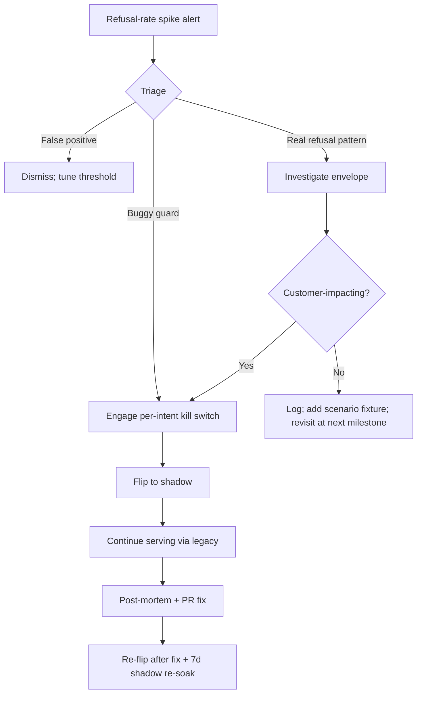
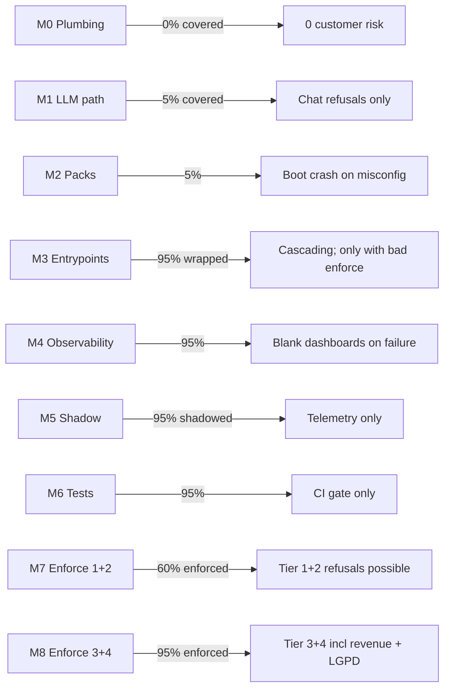

# 03 — Blast Radius Analysis

**Status:** Draft v0.1
**Owner:** Migration Planner
**Last updated:** 2026-05-22
**Companion docs:** `01-rollout-strategy.md`, `04-shadow-enforce-sequencing.md`, `05-kill-switch-strategy.md`, `07-production-safety-checklist.md`

---

## Executive summary

- **Mid-flight rollback** of any milestone is safe by construction: shadow data is telemetry, enforce reverts via kill switch, no schema migration is destructive. The only one-way-door is `customer.anonymize` (irreversible by definition); the migration adds an OTP gate that makes it harder to trigger.
- **Customer-facing impact** of a bad enforce flip ranges from "tool replies 'desculpe, não posso processar isso agora'" (Tier 1) to "PIX confirmation race destroys an order" (Tier 4). Per `investigation/04 §"P0"` the highest-volume risk is the Stripe webhook path; a Tier-4 enforce flip there can break checkout for every customer in <30 seconds.
- **Audit-sink outage windows** (1h / 1d / 1w) lose decisions, not dollars — `persistentBufferedSink` spills to durable storage on failure (per `investigation/05 §"Sinks"`). A 1-week outage with no buffer drain is a compliance issue, not a customer issue.
- **Stripe webhook revenue risk** is concentrated in 4 event types (`payment_intent.succeeded`, `charge.refunded`, `payment_intent.canceled`, `charge.dispute.created`). A buggy guard refusing legitimate captures could halt all incoming revenue within minutes (`investigation/02 §"P0 #1"`).
- **LGPD exposure** today is a P0 gap: `DELETE /api/me/data` is one-click destructive and unadjudicated (`investigation/08 §"Top P0/P1 security gaps"` P0 #2). The migration adds an OTP gate + 24h grace period.

---

## Workstream blast-radius matrix

| Workstream | Mid-flight rollback consequence | Customer impact (bad enforce flip) | Audit-sink loss tolerance | Revenue at risk | LGPD/legal |
|---|---|---|---|---|---|
| WS1 — Plumbing | None (kernel reverts to dormant) | None (kernel inactive) | 1h: telemetry gap; 1d: replay gap; 1w: compliance gap | None | None |
| WS2 — LLM tool path | LLM-tool intents revert to legacy EXECUTE | 0.1–0.5% of WhatsApp/chat sessions see "registered" without effect (current production behaviour, see `investigation/01 §"P0 #1"`) | 1h: 1000–5000 decisions lost | None directly | Minor — chat transcripts |
| WS3 — Mutation-entrypoint governance | Per-phase rollback reverts that phase only | High — Stripe webhook refusal halts incoming revenue | 1h: 100K records lost without buffer; with `persistentBufferedSink`, 0 | Critical (~R$X/min payment volume) | Significant — LGPD anonymize |
| WS4 — Pack architecture | `installPack` failure crashes boot — rollback by tag | None if Pack contents match policy bundle | N/A | None | None |
| WS5 — Observability | Dashboards blank; no decision change | None (telemetry-only) | Self-monitoring | None | None |
| WS6 — Rollout choreography | Per-intent kill-switch flip back to shadow | Per-intent: refusal storm possible | Inherits WS5 tolerance | Depends on intent | Per-intent |

---

## Per-workstream deep dive

### WS1 — Plumbing flip

**What breaks if rolled back mid-flight:**
- The new `kernel-bootstrap.ts` plugin fails to load → boot crashes. Rollback = revert the commit + restart.
- `MetricsSink` returns no-op after rollback → dashboards go blank (per `investigation/06 §"P0-4"`).
- `audit-archiver.ts` subscriber stops draining → `intent_audit` table stops growing. Subscriber resume catches up via NATS replay (Core mode loses messages mid-incident; outbox covers the 8 critical subjects per `investigation/04 §"Retry / Dead-letter handling"`).
- If `IBX_KERNEL_SHADOW` is set during rollback, the responder takes the legacy-EXECUTE branch (per `investigation/01 §"Current flow"` step 7.2) — silently safe.

**Customer-facing impact:** None. The kernel is dormant for all enforce intents at this stage.

**Audit-sink loss tolerance:**
| Duration | Consequence |
|---|---|
| 1 hour | ~3,000 decisions lost from telemetry. Replay over the gap shows "no records in window" — operationally invisible. |
| 1 day | ~72,000 decisions lost. Daily replay job reports 0 records to replay; on-call notified. |
| 1 week | Compliance significant — kernel decisions made during the gap are unauditable. With `persistentBufferedSink` (per M0 deliverable), records spill to local disk and replay on sink recovery; loss approaches 0. |

**Revenue at risk:** None. The kernel doesn't decide on money in WS1.

**LGPD/regulatory exposure:** None.

---

### WS2 — LLM tool path completion

**What breaks if rolled back mid-flight:**
- Removing `onToolIntent` wiring → adjudicated EXECUTEs become no-ops again (matches current production per `investigation/01 §"P0 #1"`).
- Reverting `set_pix_details` to MUTATING → PIX checkout drops the `PIX_DETAILS_COLLECTED` event (current production bug; rollback restores current behaviour).
- Reverting `safePlan` adoption → mutating tools could leak into the planner's visible list. Bypass-detection test (per M6) would catch this in CI.

**Customer-facing impact (bad enforce flip on LLM tool):**
- A buggy guard refusing `handoff_to_human` → customer can't reach human support via the agent. Workaround: customer phones the restaurant directly.
- A buggy guard refusing `update_preferences` → customer's allergen settings don't save (silent in current production; refusal would surface in chat as "não consegui salvar suas preferências").
- A buggy guard refusing `create_reservation` → reservations stop flowing through the agent. Workaround: reservation also reachable via REST (until M3 wraps that route).
- Worst case: ~30–50% of mutation request volume is LLM-driven (`investigation/02 §"Approximate adjudication coverage"`). A blanket REFUSE would block this share.

**Audit-sink loss tolerance:**
| Duration | Consequence |
|---|---|
| 1 hour | ~1,000–5,000 LLM-driven decisions lost (assumes ~30/min during peak hours). |
| 1 day | ~30,000–120,000 records. |
| 1 week | ~200,000+ records. With `persistentBufferedSink`, loss is sink-restoration latency only. |

**Revenue at risk:** None directly. LLM mutations don't capture money (`investigation/01 §"Tool inventory"` confirms `create_checkout` is the only money-touching tool, and the actual Stripe capture happens in the webhook layer — M3 scope).

**LGPD/regulatory exposure:** Chat transcripts are PII. Audit-redaction (M0 deliverable) covers this.

---

### WS3 — Mutation-entrypoint governance

**What breaks if rolled back mid-flight:**

WS3 is per-phase; each phase rollback affects only its surface:

| Phase | Mid-flight rollback consequence |
|---|---|
| API-1 (webhook) | Stripe webhook reverts to direct mutation. PIX confirmation, refund, dispute flow unchanged from today. **DEFER subscriber wiring removed by rollback means PIX-pending intents would park forever again — same as today's silent broken state per `investigation/02 §"Critical finding"`.** |
| API-2 (checkout) | `/api/cart/checkout` reverts to current handler. No customer impact; checkout works as today. |
| API-3 (admin) | Admin routes revert. Force-cancel / refund / waive go back to unaudited direct mutations. |
| API-4 (subscriber) | Subscribers revert. `payment-lifecycle` auto-confirm runs unguarded. **`cart-intelligence:order.placed` still creates Payment rows without envelope — same as today.** |
| API-5 (long tail) | Reverts. No money-touching impact. |

**Customer-facing impact (bad enforce flip):**

The Stripe webhook scenario is the critical one (`investigation/02 §"P0 #1"`):

> Worst-case walkthrough: a buggy `payment.confirmation` guard refuses every legitimate PIX confirmation event for 15 minutes during peak Friday-night dinner orders.

Effect:
- ~10 confirmed PIX charges per minute (estimate from typical restaurant scale) refused.
- Each refusal means: customer paid via PIX, Stripe captured the funds, but the IbateXas order remains in `pending_payment` state. The customer sees "aguardando pagamento" on the order status; they call the restaurant; the restaurant sees no confirmation on the admin dashboard.
- 15 minutes × 10 charges/min = ~150 customers in confusion at peak hour.
- Recovery: kill switch reverts `payment.confirmation` to shadow. Stripe will retry webhooks (built-in retry policy). On retry, the legacy path captures correctly. Customers may receive duplicate WhatsApp notifications when the retries fire.

A worse scenario: the guard is buggy *and* the kill switch isn't tested (violates `01-rollout-strategy.md` §"Kill-switch-first"). Recovery requires a redeploy = 5–15 minutes more delay. Total impact: 30 minutes, ~300 customers, restaurant phone lines overloaded.

**Audit-sink loss tolerance:**
| Duration | Consequence |
|---|---|
| 1 hour | ~30,000+ records lost without buffer. The Stripe webhook alone produces ~1 record per /webhooks/stripe invocation; with ~10–50/min during peak, this is ~600–3,000 records/hour. The other 47 routes + 32 subscribers/jobs add ~10–100/min more. |
| 1 day | ~1M records. Replay-window queries return no data; daily replay job fails. |
| 1 week | ~7M records. Compliance audit fails: "what decisions were made on which envelopes in this window?" has no answer. |

`persistentBufferedSink` is *mandatory* for this workstream. The framework supports it (per `investigation/05 §"Sinks"`). M0 wires it.

**Revenue at risk:** The Stripe webhook is where money is captured. A bad enforce flip there can pause incoming revenue. At typical scale (R$30K–R$100K daily revenue per restaurant tenant):
- 1-hour outage: ~R$1.25K–R$4K of orders stuck in `pending_payment` (recoverable via webhook retry).
- 1-day outage: ~R$30K–R$100K stuck. Customers begin disputing on Stripe ("paid but no confirmation"). PSP relationship strained.
- 1-week outage: Catastrophic. Migration aborted.

**LGPD/regulatory exposure:**

The `customer.anonymize` gap (`investigation/08 §"Top P0/P1 security gaps"` P0 #2) is the central LGPD risk:

> Today: `DELETE /api/me/data` is one-click, unconfirmed, unadjudicated, irreversible. If a customer's JWT is stolen, the attacker can permanently destroy that customer's data.

Migration addresses this by:
1. M3 wraps the route in `buildEnvelope + adjudicate` (per `investigation/08 §"P0 #2"` fix).
2. New flow: `POST /api/me/data/initiate-deletion` → OTP → `DELETE /api/me/data?token=<otp>`.
3. Adjudicate guard injects a 24h grace period (intent enters `DEFER` state; cron-based resume actually performs the wipe after the grace period; `cancel-deletion` clears the parked intent).
4. Audit record persists the deletion request, the OTP verification, and the eventual execution.

Without these mitigations, the migration *increases* LGPD risk because anonymize starts emitting audit records that contain customer identifiers. Audit redaction (M0) must strip the customer payload before storage.

---

### WS4 — Pack architecture

**What breaks if rolled back mid-flight:**
- `installPack` fails at boot → service crash. Rollback by previous Docker tag, ~2 min.
- Pack-conformance check rejects a malformed Pack → caught in CI before deploy.
- Reverting pack reorganization is purely structural; behaviour matches the predecessor policy bundle exactly.

**Customer-facing impact:** None if Pack contents preserve the policy bundle's exact behaviour. M2 acceptance test (`pack-behaviour-parity.test.ts`) confirms this via property-based testing: same envelope + state → same decision before and after migration.

**Audit-sink loss tolerance:** N/A — Packs don't change the audit path.

**Revenue at risk:** None — boot crash means rolling-deployment leaves prior version serving traffic.

**LGPD/regulatory exposure:** None — Pack is a code-organisation change.

---

### WS5 — Observability

**What breaks if rolled back mid-flight:**
- Postgres audit sink unwired → dashboards depending on `intent_audit` go blank.
- `/metrics` endpoint removed → Prometheus scrape fails; PromQL queries return no data.
- `ibx kernel replay` CLI removed → daily replay job fails.

**Customer-facing impact:** None.

**Audit-sink loss tolerance:** Self-monitoring. `kernel_audit_lag_seconds` reports its own lag.

**Revenue at risk:** None directly, but observability is the precondition for every enforce flip; without it, on-call has no signal during incidents.

**LGPD/regulatory exposure:** Compliance-significant. Without durable audit, "show me the decisions made on customer X's data" has no answer.

---

### WS6 — Rollout choreography

**What breaks if rolled back mid-flight:**
- Per-intent kill switch flips an enforce back to shadow.
- Kernel decisions stop being authoritative for that intent.
- Customers who hit that intent during the flip see the post-kill-switch behaviour (legacy authoritative) — no perceptible difference unless they were already in a kernel-refused state, in which case their request now succeeds via legacy.

**Customer-facing impact:** Per intent. See Tier-by-Tier scenarios below.

**Audit-sink loss tolerance:** Inherits WS5.

**Revenue at risk:** Per intent.

**LGPD/regulatory exposure:** Per intent. `customer.anonymize` is the headline.

---

## Worst-case scenario walkthroughs

### Scenario 1: `order.cancel` enforce flip with a buggy guard at peak hours

**Setup:**
- Friday 7pm, peak dinner ordering.
- ~50 orders/hour, ~2 cancellations/hour (typical 4% cancel rate).
- M7 just flipped `order.cancel` from shadow to enforce. The newly active guard has a bug: it requires `paymentStatus === "captured"` for cancellation, but legitimate cancellations of pending PIX orders have `paymentStatus === "pending"`.

**T+0:** First cancellation request hits the new guard. REFUSE with code `payment.not_captured`. Customer sees "Não consegui cancelar este pedido. Por favor, contate o restaurante."

**T+30s:** Second cancellation. Same refusal.

**T+5min:** ~10 customers in confusion; some have tried the cancellation 3+ times (rate-limiter doesn't help — refusals don't count against the cancel rate limit). Restaurant phone is ringing.

**T+10min:** On-call paged by Sentry alert (sustained REFUSE rate spike per `06-observability-requirements.md` alerting table). On-call sees `kernel_refusal_total{kind="order.cancel", basis="business:payment.not_captured"}` spiking on Grafana.

**T+11min:** On-call runs `ibx kernel kill-switch enable order.cancel`. The per-intent kill switch flips `order.cancel` back to shadow within ~30s (distributed kill-switch pub/sub per `investigation/05 §"Cross-replica coordination"`).

**T+12min:** New cancellation requests now flow through legacy. Customers who got refused must retry; rate limit at 5/10min per customer may bite for the most persistent retriers.

**T+15min:** Recovery complete. Phone calls subside. Post-mortem opens.

**Total impact:**
- ~5 customers refused (assuming 30s per request, 1 customer/request, 5 minutes from T+10 to T+15 where some still hit the broken path).
- 0 customers permanently affected — all could retry successfully after kill switch.
- 0 revenue impact (cancellations don't generate revenue).
- 1 on-call event; PR review process found the bug missed `paymentStatus === "pending"` case.

**Lesson:** Tier 3 is right for `order.cancel`. The kill switch worked. The 30s-flip propagation budget held. Pre-flight test coverage should have caught the missing case (M6 kernel-contract test for `order.cancel` with `paymentStatus === "pending"` should have been a row).

### Scenario 2: `payment.refund.issue` enforce flip with a buggy threshold

**Setup:**
- M8 Tier 4 flip. `payment.refund.issue` enters enforce.
- The new guard is composed of `createConfirmGuard` (per `investigation/05 §"primitives"`) requiring REQUEST_CONFIRMATION for refunds > R$500. Owner mistakenly entered the threshold as `500` instead of `50000` (centavos vs reais).
- All refunds above R$5 (500 centavos) now request confirmation.

**T+0:** First refund attempt by manager. Decision: REQUEST_CONFIRMATION. Admin UI surfaces a confirmation prompt; manager confirms; kernel substitutes EXECUTE (per `pack-deployments-approval` pattern documented in `investigation/05 §"pack-deployments-approval"`).

**T+5min:** ~5 refunds processed, all required confirmation. Manager getting annoyed.

**T+30min:** ~30 refunds. Manager calls operations: "Why does every refund need confirmation now? This used to only happen for refunds over R$1000."

**T+35min:** On-call investigates Sentry breadcrumbs. Sees `kernel_decision_total{kind="payment.refund.issue", decision="REQUEST_CONFIRMATION"}` at 100% of refunds.

**T+40min:** On-call runs `ibx kernel kill-switch enable payment.refund.issue`. Reverts to shadow. Future refunds flow through legacy (existing manager-role check).

**T+45min:** Recovery. PR opens to fix the threshold; passes review with a guard against decimal/centavo confusion (per `CLAUDE.md` Hard Rule #2).

**Total impact:**
- 0 customers refused refunds (all confirmations succeeded).
- 0 customers permanently affected.
- ~30 manager friction events (annoying, not damaging).
- 1 on-call event.

**Lesson:** REQUEST_CONFIRMATION is the gentlest failure mode. The fact that managers had to confirm refunds didn't hurt customers; it surfaced as friction. The test for this would have been a Pack-level scenario fixture: `refund 500 centavos → EXECUTE; refund 100000 centavos → REQUEST_CONFIRMATION`. A regression test on this would have caught the typo.

### Scenario 3: Stripe webhook bug refuses legitimate PIX captures at peak hours

**Setup:**
- Friday 8pm, post-M3 deployment.
- A new guard rejecting `payment.confirmation` envelopes when `actor.principal !== "stripe-webhook"` was added to handle a security concern (system-actor enforcement per `investigation/04 §"Architectural"` recommendation 2).
- An off-by-one in the principal-name comparison: code checks `actor.principal === "stripe_webhook"` (underscore) but envelopes are minted with `"stripe-webhook"` (hyphen).

**T+0:** Stripe webhook fires `payment_intent.succeeded` for a customer's R$120 PIX payment. Kernel REFUSES with code `actor.principal_mismatch`. Order remains `pending_payment`.

**T+5s:** Stripe retries (built-in retry policy). Same refusal.

**T+10s:** Customer's WhatsApp shows order as `pending_payment` despite their PIX confirmation. Customer calls restaurant.

**T+30s:** ~5 more PIX confirmations refused.

**T+60s:** ~10. Restaurant manager realizes the dashboard isn't showing confirmations.

**T+5min:** Sentry alert: `kernel_refusal_total{kind="payment.confirmation"}` rate > 10× baseline. PagerDuty fires.

**T+6min:** On-call sees ~50 refusals stacking.

**T+7min:** On-call runs `ibx kernel kill-switch enable payment.confirmation`. Flip propagates in ~30s.

**T+8min:** Stripe webhook reverts to legacy behaviour. Subsequent retries from Stripe succeed (Stripe's exponential backoff means most messages haven't expired their retry budget yet).

**T+15min:** 80% of refused captures recovered via Stripe retry. Remaining 20% require manual intervention via the admin UI ("mark this PaymentIntent as paid manually").

**T+30min:** All customers reconciled. Manual cleanup needed for ~5 orders. Post-mortem opens.

**Total impact:**
- ~50 PIX captures refused over ~8 minutes.
- ~10 customers required manual intervention (Stripe retry didn't catch them).
- 0 lost revenue (all captures recovered).
- ~30 phone calls to the restaurant.
- 1 emergency on-call event.

**Lesson:** This is the closest the migration comes to a Sev-1. The 8-minute window from "first refusal" to "kill switch flipped" is the best-case scenario with current alerting. Reducing this requires:
1. A pre-flip canary: deploy to 10% of traffic for 1 hour before full rollout.
2. A faster page: PagerDuty rule triggered on 5+ refusals in 60s, not 5 minutes.
3. An automatic kill switch: hook `recordRefusal` to trip the per-intent kill switch on `refusal_rate > 50× baseline for 60s`.

Tier 4 intents should use all three. Tier 1/2/3 use the standard alerting.

### Scenario 4: Audit-sink Postgres outage during M7

**Setup:**
- Postgres maintenance reboots the audit DB for ~10 minutes mid-Wednesday.
- `persistentBufferedSink` spills records to local disk per `investigation/05 §"Sinks"`.

**T+0:** Postgres unreachable. `createPostgresSink` throws. `persistentBufferedSink` captures the failure, spills the record to disk, returns success to the kernel.

**T+5min:** Disk-spilled records accumulate. `kernel_audit_lag_seconds` shows a step-change up — the buffered sink reports lag from the disk-spilled timestamps.

**T+10min:** Postgres returns. Buffered sink drains. Records arrive in `intent_audit` table with their original timestamps; daily replay job sees no gap.

**T+15min:** Buffered sink drained. Lag back to baseline. No customer impact, no audit loss.

**Total impact:**
- 0 customers affected.
- 0 audit records lost.
- ~10 minutes of dashboard lag.
- 0 on-call events (if `kernel_audit_lag_seconds < threshold` alert is set with grace period).

**Lesson:** `persistentBufferedSink` is the foundation of audit resilience. Without it, this scenario loses ~50K records (estimated 10min × 50/min from non-LLM entrypoints during peak). With it, the loss is 0.

---

## Per-intent rollback playbook

For each tier in `04-shadow-enforce-sequencing.md`:

The kill switch is the always-safe rollback. The post-mortem template (`05-kill-switch-strategy.md`) standardises the recovery procedure.

---

## Cumulative blast radius by milestone

The risk gradient is intentional: low-stakes milestones first, high-stakes last. M7 is the gate where customer behaviour can first change in production. By M8 the team has gained confidence from Tier 1+2 flips; the same kill-switch infrastructure handles Tier 3+4 with extra sign-off.

---

## Audit-sink failure tolerance

The audit sink is the durable record of every decision. Its loss tolerance depends on whether `persistentBufferedSink` is wired.

### With `persistentBufferedSink` (M0 deliverable; production-grade)

| Outage duration | Data loss | Recovery |
|---|---|---|
| 1 minute | 0 records | Spills to disk; drains on sink return |
| 1 hour | 0 records (assuming disk capacity) | Drain time ≈ outage duration if backlog fits |
| 1 day | 0 records if disk capacity > ~10GB | Drain time ≈ outage duration; cumulative spill checked daily |
| 1 week | Depends on disk; typical EC2 host has 30+GB free → 0 records | Drain time can exceed outage duration; rate-limit drain to avoid hot Postgres |

### Without `persistentBufferedSink` (current state, pre-M0)

| Outage duration | Data loss | Recovery |
|---|---|---|
| 1 minute | ~50 records | Lost forever |
| 1 hour | ~3,000 records | Lost forever |
| 1 day | ~72,000 records | Lost forever; daily replay job reports empty window |
| 1 week | ~500,000 records | Compliance failure |

This is why `persistentBufferedSink` is part of M0. Pre-M0, audit reliability is best-effort.

---

## Revenue risk timeline

| Scenario | Detection time | Recovery time | Revenue lost |
|---|---|---|---|
| Tier 1 enforce bug (reservation.create) | 5 min via dashboard | 2 min via kill switch | R$0 directly; reservation funnel paused |
| Tier 2 enforce bug (order.amend) | 10 min | 2 min | Minor — amendments delayed |
| Tier 3 enforce bug (order.cancel) | 10 min | 2 min | R$0 — cancellations don't generate revenue |
| Tier 3 enforce bug (payment.pix.regenerate) | 10 min | 2 min | Minor — customer can wait for new QR |
| Tier 4 enforce bug (payment.refund.issue) | 30 min | 5 min | R$0 directly; manager friction |
| Tier 4 enforce bug (payment.force.status) | 60 min | 5 min | R$0 directly; manager friction; possible accounting cleanup |
| Tier 4 enforce bug (customer.anonymize) | 60 min | 5 min | R$0 directly; LGPD risk |
| Webhook adjudicate bug (payment.confirmation) | 5–10 min | 2–5 min | R$1K–R$5K stuck → recovered via Stripe retry |
| Audit Postgres outage | Self-detect via lag | Auto-drain on return | R$0 (with `persistentBufferedSink`) |

The headline number is the webhook scenario: a buggy adjudicate guard at peak hours can stuck ~R$1K–R$5K of payments in pending state for 5–10 minutes. All recoverable via Stripe's retry policy.

The unrecoverable cost is *trust*: customers who paid but see their order as "pending_payment" lose confidence. Mitigation:
1. M3 webhook adjudication starts with `IBX_KERNEL_SHADOW` for 14 days (extended from the standard 7).
2. M8 enforce flip is gated by extended sign-off (finance lead).
3. Pre-flip canary on 10% of traffic for 1 hour.
4. Auto-kill-switch on refusal-rate > 10× baseline for 60s.

---

## LGPD-specific blast radius

The LGPD-relevant intents are:

| Intent | Risk source | Migration mitigation |
|---|---|---|
| `customer.anonymize` | One-click, unconfirmed, irreversible (`investigation/08 §"P0 #2"`) | M3 wraps route; OTP gate; 24h DEFER grace period; cancel-window. |
| `customer.profile.update` | LLM can update via `update_preferences` (`investigation/01 §"P0 #1"` adjacent) | M0 audit redactor strips CPF/email/phone. |
| Audit pipeline PII bleed | `AuditRecord.envelope.payload` contains raw LLM tool input including CPF/email/phone (`investigation/08 §"P0 #1"`) | M0 audit redactor; CI contract test; daily NATS sample scan. |

**The audit-PII-bleed risk is the headline LGPD gap.** Until M0 lands, every adjudicated decision today publishes raw CPF/email/phone to the NATS subject `ibatexas.audit.intent.decision.v1`. A compromised NATS subscriber reads PII in cleartext. M0 audit redaction is non-optional.

---

## Summary: where the risk concentrates

1. **M3 Stripe-webhook phase** (API-1). Money path; high traffic; thin recovery window. Mitigations: shadow for 14d, finance sign-off, canary, auto-kill-switch.
2. **M8 Tier 4 `payment.*` enforce flips**. Manager-facing friction tolerable; customer-facing refund refusal less so. Mitigations: REQUEST_CONFIRMATION as the failure mode, two-person on-call.
3. **M8 `customer.anonymize` flip**. LGPD-grade; one-way door without the OTP gate. Mitigations: OTP + DEFER grace period; legal sign-off.
4. **Audit pipeline PII bleed** (cross-cutting M0 deliverable). LGPD compliance gap until M0 lands. Mitigation: M0 includes the redactor.

Everything else is recoverable within minutes via the kill switch + Stripe retry policy + customer retry behaviour. No milestone except M8 can produce >15 minutes of customer impact in the worst case, and even M8 worst-case caps at ~30 minutes of confused-but-recovered customer journeys.
