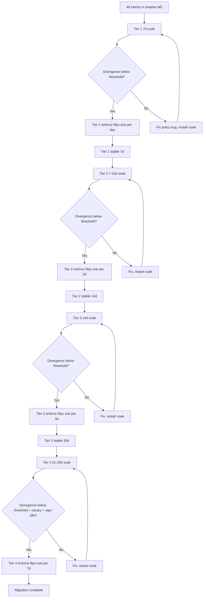
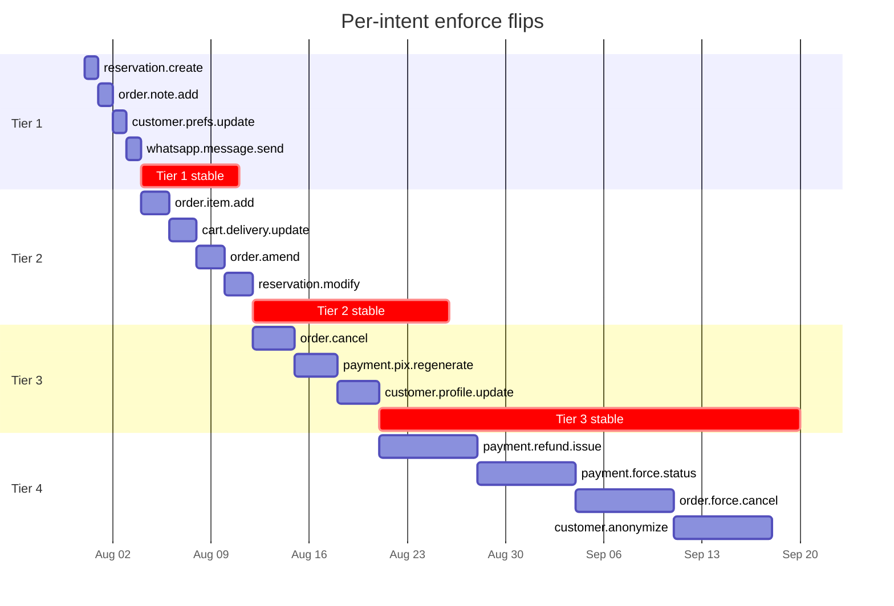

# 04 — Shadow → Enforce Sequencing

**Status:** Draft v0.1
**Owner:** Migration Planner
**Last updated:** 2026-05-22
**Companion docs:** `01-rollout-strategy.md` (the shadow-before-enforce invariant), `03-blast-radius-analysis.md` (scenario impact), `05-kill-switch-strategy.md` (rollback), `07-production-safety-checklist.md` (pre-flight)

---

## Executive summary

- **14 intent kinds, four tiers, ordered by ascending blast radius.** Tier 1 are reversible / idempotent / non-financial; Tier 4 touch money, force-states, and LGPD. No intent in Tier 4 enters enforce until Tier 1–3 have soaked for ≥30 days.
- **Per-intent shadow minimum 7 days.** Stretch to 14 days for payment-touching or LGPD-touching intents. Stretch to 21 days for `customer.anonymize` (irreversibility risk).
- **Divergence thresholds are stratified.** Tier 1 tolerates higher `BASIS_ONLY` drift (vocabulary changes); Tier 4 demands `DECISION_KIND` = 0 *and* `PAYLOAD_REWRITE` = 0 *and* `BASIS_ONLY` < 1% for the full window.
- **Each intent has a named rollback owner.** Tier 1 = on-call rotation; Tier 2 = on-call + migration lead; Tier 3 = on-call + migration lead + product owner; Tier 4 = on-call + migration lead + finance/legal.
- **Dashboard URLs are placeholders.** Real URLs land when M4 deploys the Grafana dashboards; this doc names them.

---

## Tier classification rationale

The tiers map to the recommendation in `01-rollout-strategy.md` §"Per-intent-kind flips, never bulk flips" and the blast-radius gradient in `03-blast-radius-analysis.md` §"Cumulative blast radius by milestone".

Classification criteria, in priority order:

1. **Reversibility.** Can a bad refusal be retried successfully? Higher reversibility = lower tier.
2. **Money flow.** Does the mutation move money? Money = higher tier.
3. **External commitments.** Does the mutation commit IbateXas to a third party (Stripe, customer)? Yes = higher tier.
4. **LGPD/regulatory.** Does the mutation touch PII or destroy customer data? Yes = highest tier.
5. **Volume.** High-volume mutations get a higher tier (more customers affected per minute of bad flip).

### Tier 1 — Low risk, enforce first

Idempotent, reversible, low-volume, no money, no external commitment.

| Intent kind | Source surface (investigation refs) | Why Tier 1 |
|---|---|---|
| `reservation.create` | LLM tool + `POST /api/reservations` (`investigation/02 §Customer-facing`) | Reservations are reversible (cancellable). No money commitment until checkin. |
| `order.note.add` | LLM tool + `POST /api/orders/:id/notes` (`investigation/02 §Customer-facing`) | Free text appended; no state change. Even a bad refusal just means the note doesn't save. |
| `customer.preferences.update` | LLM tool `update_preferences` (`investigation/01 §"Tool inventory"`) | Toggles on a customer record; reversible (set them again); even a bad refusal leaves customer's allergens intact (safe-by-default). |
| `whatsapp.message.send` (system actor) | NATS subscribers, jobs (`investigation/04 §Payment`) | Notification sends. Bad refusal = customer doesn't get a status WhatsApp; they can still check via the app. |

### Tier 2 — Cart/order updates, reservation mods

Customer-visible but reversible. Volume higher than Tier 1.

| Intent kind | Source surface | Why Tier 2 |
|---|---|---|
| `order.item.add` | LLM tool `add_to_cart` + Stripe webhook PIX cart-completion (`investigation/04 §"Order domain"`) | Cart is pre-checkout state. Bad refusal = customer can't add; they retry. No money flow yet. |
| `cart.delivery.update` | HTTP route `PATCH /api/orders/:id/address` (`investigation/02 §Customer-facing`) | Address change. Reversible. |
| `order.amend` | LLM tool `amend_order` + `POST /api/orders/:id/amend/batch` (`investigation/02 §Customer-facing`) | Order amendment, before final fulfillment. Reversible (re-amend or cancel). |
| `reservation.modify` | LLM tool `modify_reservation` + `PATCH /api/reservations/:id` | Slot-locked operation but recoverable (cancel + recreate). |

### Tier 3 — Order cancel, PIX regenerate, customer profile

Higher-stakes state transitions. Cancellation and PIX regen are reversible only with effort.

| Intent kind | Source surface | Why Tier 3 |
|---|---|---|
| `order.cancel` | LLM tool `cancel_order` + `POST /api/orders/:id/cancel` (`investigation/02 §Customer-facing`) | Customer-initiated cancellation. State transition. Bad refusal = customer can't cancel; calls restaurant. |
| `payment.pix.regenerate` | LLM tool `regenerate_pix` + `POST /api/orders/:id/payment/regenerate-pix` | New PIX QR. Time-sensitive (current QR expires in ~1h). Bad refusal = customer can't pay; order risks expiry. |
| `customer.profile.update` | OTP verify, WhatsApp upsert (`investigation/02 §Customer-facing`) | Customer record update (name change, etc.). Bad refusal = customer's profile doesn't update. |

### Tier 4 — High risk, enforce last

Money flow, force-states, LGPD. Highest-tier intents enter enforce only after Tier 1–3 have soaked for ≥30 days.

| Intent kind | Source surface | Why Tier 4 |
|---|---|---|
| `payment.refund.issue` | `POST /api/admin/orders/:id/payment/refund` (`investigation/02 §Admin`, MANAGER+) | Money out. Real-money external commitment. |
| `payment.force.status` | `PATCH /api/admin/orders/:id/payment/status` (OWNER) | Force-set arbitrary payment status. Highest-blast admin action. |
| `customer.anonymize` | `DELETE /api/me/data` (`investigation/02 §Customer-facing`) | LGPD-irreversible PII wipe. |
| `order.force.cancel` | `POST /api/admin/orders/:id/force-cancel` (MANAGER+) | Bypass policy cancel. Affects fulfillment, refunds, customer relationship. |

---

## Per-tier rollout parameters

### Tier 1 parameters

| Parameter | Value |
|---|---|
| Shadow duration (min) | 7 days |
| Shadow duration (target) | 7 days |
| Divergence threshold — `DECISION_KIND` | = 0 |
| Divergence threshold — `PAYLOAD_REWRITE` | = 0 |
| Divergence threshold — `BASIS_ONLY` | < 5% rolling 24h |
| Per-intent flip cadence | 1 intent per day max |
| On-call coverage | Standard rotation |
| Sign-off required | Ops lead |

Tier 1 absorbs vocabulary upgrades (`BASIS_ONLY` higher than later tiers) because the existing legacy behaviour is loose on basis codes (per `docs/ops/runbooks/01-stage-read-mutations.md` §"Expected divergence patterns"); kernel-emitted vocabulary is intentionally more controlled.

### Tier 2 parameters

| Parameter | Value |
|---|---|
| Shadow duration (min) | 7 days |
| Shadow duration (target) | 10 days |
| Divergence threshold — `DECISION_KIND` | = 0 |
| Divergence threshold — `PAYLOAD_REWRITE` | = 0 |
| Divergence threshold — `BASIS_ONLY` | < 3% rolling 24h |
| Per-intent flip cadence | 1 intent every 2 days |
| On-call coverage | Standard rotation |
| Sign-off required | Ops lead + migration lead |

### Tier 3 parameters

| Parameter | Value |
|---|---|
| Shadow duration (min) | 10 days |
| Shadow duration (target) | 14 days |
| Divergence threshold — `DECISION_KIND` | = 0 |
| Divergence threshold — `PAYLOAD_REWRITE` | = 0 |
| Divergence threshold — `BASIS_ONLY` | < 2% rolling 24h |
| Per-intent flip cadence | 1 intent every 3 days |
| On-call coverage | Standard rotation + migration lead paged |
| Sign-off required | Ops lead + migration lead + product owner |

### Tier 4 parameters

| Parameter | Value |
|---|---|
| Shadow duration (min) | 14 days |
| Shadow duration (target) | 21 days (`customer.anonymize` target 28 days) |
| Divergence threshold — `DECISION_KIND` | = 0 (no exceptions) |
| Divergence threshold — `PAYLOAD_REWRITE` | = 0 (no exceptions) |
| Divergence threshold — `BASIS_ONLY` | < 1% rolling 24h |
| Per-intent flip cadence | 1 intent per week max |
| On-call coverage | Two-person on-call (per `docs/ops/runbooks/04-stage-financial-mutations.md` template) |
| Sign-off required | Ops lead + migration lead + finance (payment) or legal (LGPD) |
| Pre-flip canary | 10% traffic for 1 hour before full rollout |
| Auto-kill-switch | Triggered on refusal-rate > 10× baseline for 60s |

---

## Tier 1 — detailed per-intent specs

### `reservation.create`

**Entry surface:**
- LLM tool `create_reservation` (`investigation/01 §"Tool inventory"`)
- HTTP route `POST /api/reservations` (`investigation/02 §Customer-facing`)
- Pack: `@ibatexas/pack-reservations`

**Shadow duration:** 7 days minimum.

**Divergence threshold:** `DECISION_KIND` = 0, `PAYLOAD_REWRITE` = 0, `BASIS_ONLY` < 5%.

**Dashboard URL:** `https://grafana.ibatexas/d/kernel-reservation-create` (TODO: deploy in M4).

**Rollback owner:** On-call rotation, escalate to migration lead.

**Rollback command:**
```bash
ibx kernel kill-switch enable reservation.create
```

**Pre-flight checks** (extend `07-production-safety-checklist.md`):
- [ ] Reservation availability lookup (`check_table_availability`) returns same data as legacy.
- [ ] `TimeSlot.reservedCovers` counter behaviour preserved.
- [ ] LLM-flow + HTTP-flow both shadowed (per `investigation/03 §"Recommended adjudication entry points"` reservation row).

**Customer-facing failure mode** (per `03-blast-radius-analysis.md`): customer sees "Não consegui criar sua reserva" in WhatsApp. Workaround: phone the restaurant.

---

### `order.note.add`

**Entry surface:**
- LLM tool `add_order_note` (currently dead-registered; cleanup per `investigation/01 §"P2"`)
- HTTP route `POST /api/orders/:id/notes` (customer-side)
- Admin route `POST /api/admin/orders/:id/notes` (staff-side)
- HTTP route `POST /api/cart/checkout` (best-effort note persist, `investigation/03 §"apps/api/src/"`)

**Shadow duration:** 7 days.

**Divergence threshold:** Per-tier.

**Dashboard URL:** `https://grafana.ibatexas/d/kernel-order-note-add` (TODO).

**Rollback owner:** On-call rotation.

**Pre-flight:**
- [ ] `add_order_note` tool registration cleaned up (M1 deliverable).
- [ ] All four entry surfaces (LLM, customer HTTP, admin HTTP, checkout best-effort) shadow simultaneously.

**Customer-facing failure mode:** Note doesn't save. Customer doesn't realize unless they check the order detail page.

---

### `customer.preferences.update`

**Entry surface:**
- LLM tool `update_preferences` (`investigation/01 §"Tool inventory"`)
- (No HTTP route; LLM-only today)

**Shadow duration:** 7 days.

**Divergence threshold:** Per-tier.

**Dashboard URL:** `https://grafana.ibatexas/d/kernel-customer-preferences-update` (TODO).

**Rollback owner:** On-call rotation.

**Pre-flight:**
- [ ] Allergen list integrity preserved across kernel + legacy (must be `string[]` per `CLAUDE.md` Hard Rule #1).
- [ ] Pack `@ibatexas/pack-customer-onboarding` published with `customer.preferences.update` intent.

**Customer-facing failure mode:** Customer's allergen preferences don't save. Risk: customer expects allergen filter but it doesn't apply to subsequent searches. **Allergen safety is `CLAUDE.md` Hard Rule #1**; rollback must be immediate.

---

### `whatsapp.message.send` (system actor)

**Entry surface:**
- NATS subscribers (`cart-intelligence`, `payment-lifecycle`, `handoff-subscriber` per `investigation/04 §"API process"`)
- BullMQ jobs (`pix-expiry-monitor`, `reservation-reminder`, `proactive-engagement`, `hesitation-nudge`)
- The fan-out `notification.send` subject is the chokepoint (per `investigation/04 §"Critical finding"` and `investigation/04 §"P0 #6"`)

**Shadow duration:** 7 days.

**Divergence threshold:** Per-tier.

**Dashboard URL:** `https://grafana.ibatexas/d/kernel-whatsapp-message-send` (TODO).

**Rollback owner:** On-call rotation.

**Pre-flight:**
- [ ] `body` field templated, not free-form (per `investigation/04 §"P0 #6"` mitigation).
- [ ] Pack `@ibatexas/pack-whatsapp` exports `whatsapp.message.send` intent with system-actor taint policy.

**Customer-facing failure mode:** Customer doesn't receive a notification. Worst case: customer doesn't know their PIX expired and doesn't reorder. Volume: high (~50+ notifications/hour at peak).

---

## Tier 2 — detailed per-intent specs

### `order.item.add`

**Entry surface:**
- LLM tool `add_to_cart` (LLM-callable in cart state)
- HTTP route `POST /api/cart/:id/line-items` + variants (sync, PATCH, DELETE)
- Stripe webhook PIX cart-completion (`investigation/04 §Order domain`)

**Shadow duration:** 7 days minimum, 10 days target.

**Divergence threshold:** Tier 2.

**Dashboard URL:** `https://grafana.ibatexas/d/kernel-order-item-add` (TODO).

**Rollback owner:** On-call rotation + migration lead.

**Pre-flight:**
- [ ] Variant lookup integrity preserved.
- [ ] Allergen check applied on add (Hard Rule #1).
- [ ] Cart ownership assertion preserved (`investigation/08 §"Cross-customer leak risk"`).

**Customer-facing failure mode:** Customer can't add to cart. Retry typically succeeds (item-add is idempotent at the cart level).

---

### `cart.delivery.update`

**Entry surface:**
- HTTP route `PATCH /api/orders/:id/address`
- HTTP route `PATCH /api/orders/:id/type`
- LLM tool `change_delivery_address` (currently bypasses `OrderCommandService` per `investigation/03 §"Bypass shape #2"`)
- LLM tool `switch_order_type` (same bypass)

**Shadow duration:** 7 days minimum.

**Divergence threshold:** Tier 2.

**Dashboard URL:** `https://grafana.ibatexas/d/kernel-cart-delivery-update` (TODO).

**Rollback owner:** On-call + migration lead.

**Pre-flight:**
- [ ] OrderProjection version-counter preserved across both write paths (M3 Domain-2 consolidates writers; per `investigation/03 §"P0 #2"`).
- [ ] Delivery-zone lookup integrity preserved.

**Customer-facing failure mode:** Customer can't change delivery address mid-order. Workaround: cancel + reorder (Tier 3 intent — itself adjudicated by then).

---

### `order.amend`

**Entry surface:**
- LLM tool `amend_order`
- HTTP route `POST /api/orders/:id/amend/batch` (sequenced amendments)
- HTTP route `POST /api/orders/:id/amend` (legacy single-amend)

**Shadow duration:** 10 days.

**Divergence threshold:** Tier 2.

**Dashboard URL:** `https://grafana.ibatexas/d/kernel-order-amend` (TODO).

**Rollback owner:** On-call + migration lead.

**Pre-flight:**
- [ ] Sequenced amend ordering preserved (no race conditions).
- [ ] PIX regeneration cascade preserved when amend changes total (M3 wiring).
- [ ] Note: amend is currently effectively disabled (per `investigation/01 §"Tool inventory"` row for `amend_order`); rollout includes restoring this capability.

**Customer-facing failure mode:** Customer can't amend; workaround is cancel + recreate (Tier 3).

---

### `reservation.modify`

**Entry surface:**
- LLM tool `modify_reservation`
- HTTP route `PATCH /api/reservations/:id`

**Shadow duration:** 7 days minimum.

**Divergence threshold:** Tier 2.

**Dashboard URL:** `https://grafana.ibatexas/d/kernel-reservation-modify` (TODO).

**Rollback owner:** On-call + migration lead.

**Pre-flight:**
- [ ] `TimeSlot.reservedCovers` decrement+increment atomicity preserved.
- [ ] Slot lookup ordering correct under concurrent modifies.

**Customer-facing failure mode:** Customer can't modify reservation. Cancel + recreate (also Tier 3).

---

## Tier 3 — detailed per-intent specs

### `order.cancel`

**Entry surface:**
- LLM tool `cancel_order`
- HTTP route `POST /api/orders/:id/cancel` (customer-initiated)
- Background job `stale-order-checker` (system-initiated, per `investigation/04 §"P0 #4"`)
- Stripe webhook `payment_intent.canceled` cascade
- NATS subscriber `payment-lifecycle` auto-cancel on refunded (`investigation/04 §"P0 #2"`)

**Shadow duration:** 14 days.

**Divergence threshold:** Tier 3.

**Dashboard URL:** `https://grafana.ibatexas/d/kernel-order-cancel` (TODO).

**Rollback owner:** On-call + migration lead + product owner.

**Pre-flight:**
- [ ] PONR (point-of-no-return) check preserved across all 5 entry surfaces.
- [ ] Refund cascade rules unchanged.
- [ ] Background `stale-order-checker` shadow data clean for 14 days separately.
- [ ] `payment-lifecycle` auto-cancel shadow data clean for 14 days separately.

**Customer-facing failure mode:** Customer cancellation refused → customer calls restaurant. Per the scenario in `03-blast-radius-analysis.md §Scenario 1`, recovery is ~10 minutes via kill switch.

---

### `payment.pix.regenerate`

**Entry surface:**
- LLM tool `regenerate_pix`
- HTTP route `POST /api/orders/:id/payment/regenerate-pix`

**Shadow duration:** 14 days.

**Divergence threshold:** Tier 3.

**Dashboard URL:** `https://grafana.ibatexas/d/kernel-payment-pix-regenerate` (TODO).

**Rollback owner:** On-call + migration lead + product owner.

**Pre-flight:**
- [ ] Per-customer 3/h rate limit preserved.
- [ ] Per-order 5-total rate limit preserved.
- [ ] Old PIX QR cancellation propagates to Stripe.
- [ ] `regenerationCount` increment idempotent.

**Customer-facing failure mode:** Customer's current PIX is expiring; can't generate a new one. Workaround: cancel order + reorder (Tier 3 itself).

---

### `customer.profile.update`

**Entry surface:**
- HTTP route `POST /api/auth/verify-otp` (customer name on first OTP)
- WhatsApp `customerSvc.upsertFromWhatsApp` (auto-create on first message)
- LLM tool `update_preferences` (adjacent; covered in Tier 1)

**Shadow duration:** 14 days.

**Divergence threshold:** Tier 3.

**Dashboard URL:** `https://grafana.ibatexas/d/kernel-customer-profile-update` (TODO).

**Rollback owner:** On-call + migration lead + product owner.

**Pre-flight:**
- [ ] Phone-keyed customer upsert idempotent.
- [ ] Customer creation rate-limit (100/min global) preserved.
- [ ] WhatsApp side-channel auth preserved.

**Customer-facing failure mode:** New customer can't sign up via WhatsApp. Volume: low (most customers exist already). Workaround: phone-based signup at the restaurant.

---

## Tier 4 — detailed per-intent specs

### `payment.refund.issue`

**Entry surface:**
- HTTP route `POST /api/admin/orders/:id/payment/refund` (MANAGER+ only)
- Stripe webhook `charge.refunded` (auto-cascade)

**Shadow duration:** 21 days.

**Divergence threshold:** Tier 4. `DECISION_KIND` = 0, `PAYLOAD_REWRITE` = 0, `BASIS_ONLY` < 1%.

**Dashboard URL:** `https://grafana.ibatexas/d/kernel-payment-refund-issue` (TODO).

**Rollback owner:** On-call (two-person) + migration lead + finance.

**Pre-flight (extends Tier 3):**
- [ ] Finance sign-off on the policy bundle's refund-threshold (REQUEST_CONFIRMATION > R$500 = 50000 centavos — guard against Hard Rule #2 violation, per `03-blast-radius-analysis.md §Scenario 2`).
- [ ] `refundableAmount` arithmetic preserved.
- [ ] Stripe webhook adjudication separately green for 14 days.
- [ ] PII redaction confirmed on `refund_reason` field.
- [ ] Pre-flip canary on 10% traffic for 1 hour.
- [ ] Auto-kill-switch armed (refusal-rate > 10× baseline → kill).

**Customer-facing failure mode:** Manager can't issue refund. Customer waits longer. Operational friction; not customer-facing directly except via delay.

---

### `payment.force.status`

**Entry surface:**
- HTTP route `PATCH /api/admin/orders/:id/payment/status` (OWNER only — highest blast)

**Shadow duration:** 21 days.

**Divergence threshold:** Tier 4.

**Dashboard URL:** `https://grafana.ibatexas/d/kernel-payment-force-status` (TODO).

**Rollback owner:** On-call (two-person) + migration lead + finance + Owner role.

**Pre-flight:**
- [ ] Pack guard requires explicit `reason` field on every force-state envelope.
- [ ] Owner role taint policy: only `principal === "user"` with `actor.role === "OWNER"` taint.
- [ ] Audit pipeline retention extended to ≥1 year for force-state envelopes.
- [ ] Every legal payment-state transition mapped in the Pack.

**Customer-facing failure mode:** Owner can't override payment status. Used for cleanup of stuck orders; low-volume operation. Workaround: support ticket to ops (now adjudicated through ESCALATE).

---

### `customer.anonymize`

**Entry surface:**
- HTTP route `DELETE /api/me/data` (`investigation/02 §Customer-facing`)
- Service `CustomerService.anonymizeCustomer` (`investigation/03 §"P0 #4"`)

**Shadow duration:** 28 days.

**Divergence threshold:** Tier 4.

**Dashboard URL:** `https://grafana.ibatexas/d/kernel-customer-anonymize` (TODO).

**Rollback owner:** On-call (two-person) + migration lead + legal + privacy officer.

**Pre-flight:**
- [ ] OTP re-verification gate live (per `investigation/08 §"P0 #2"` mitigation).
- [ ] 24h DEFER grace period live; cancel-deletion endpoint working.
- [ ] LGPD compliance review signed by legal.
- [ ] Audit retention for `customer.anonymize` records = 5 years (regulatory requirement).
- [ ] Replay capability over 5-year window tested.

**Customer-facing failure mode:** Customer can't anonymize. Worst case: regulatory complaint. Workaround: manual ops process within 5 business days.

---

### `order.force.cancel`

**Entry surface:**
- HTTP route `POST /api/admin/orders/:id/force-cancel` (MANAGER+)
- Subscriber `payment-lifecycle` auto-cancel-on-refund (system-actor)

**Shadow duration:** 21 days.

**Divergence threshold:** Tier 4.

**Dashboard URL:** `https://grafana.ibatexas/d/kernel-order-force-cancel` (TODO).

**Rollback owner:** On-call + migration lead + product owner + finance (if mid-fulfillment).

**Pre-flight:**
- [ ] Refund cascade rules preserved.
- [ ] Reservation slot release (if order was a reservation deposit) preserved.
- [ ] Notification to customer preserved.

**Customer-facing failure mode:** Manager can't force-cancel an order. Workaround: manual ops escalation. Customer may see "order stuck" for longer.

---

## Sequencing diagram



The cadence is deliberate: each tier hardens the kill-switch and rollback discipline before the next tier inherits those operational habits.

---

## Calendar example (3 engineers, starting M5 = July 10)



Total enforce phase: ~12 weeks (Tier 1+2+3+4 with soak windows). Aligns with M7 (~2 weeks) + M8 (~10 weeks).

---

## Divergence-threshold rationale

Why the thresholds tighten by tier:

- **Tier 1 `BASIS_ONLY` < 5%:** Tier 1 hits low-risk surfaces; basis-code vocabulary upgrades are expected (per `docs/ops/runbooks/01-stage-read-mutations.md` §"Expected divergence patterns"). 5% drift is the natural rate of "kernel basis vocab is more controlled than legacy".
- **Tier 4 `BASIS_ONLY` < 1%:** At the high-stakes tier, any basis-code drift must be reviewed individually. 1% is the floor of "unexplained drift" we accept; anything above triggers investigation per the per-tier alert thresholds in `06-observability-requirements.md`.
- **`DECISION_KIND` = 0 always:** A kernel that disagrees with legacy on the decision *kind* is either (a) more correct than legacy (the legacy bug we want to fix), or (b) wrong. In shadow, we can't tell which. So zero — investigate every event before flipping. This matches `docs/ops/runbooks/01-stage-read-mutations.md` §"Go/no-go for ENFORCE".
- **`PAYLOAD_REWRITE` = 0 always:** A kernel that rewrites the payload behind the legacy's back is changing the actual mutation. Always investigate.

---

## Per-intent dashboard contract

Each intent's dashboard panel must show (per `06-observability-requirements.md` Dashboard 2):

1. **Decision rate** — `kernel_decision_total{kind=<intent>}` over 7d, 24h, 1h.
2. **Decision breakdown** — pie of `EXECUTE / REFUSE / DEFER / REQUEST_CONFIRMATION / ESCALATE / REWRITE`.
3. **Latency p50/p95/p99** — `kernel_decision_latency_seconds{kind=<intent>}`.
4. **Divergence count** — `kernel_shadow_divergence_total{kind=<intent>}` partitioned by class (`BASIS_ONLY / DECISION_KIND / PAYLOAD_REWRITE`).
5. **Refusal-rate trend** — `kernel_refusal_total{kind=<intent>}` rolling 24h.
6. **Audit-lag** — `kernel_audit_lag_seconds{kind=<intent>}` p99.
7. **Last 50 audit records** — table link.

Without these six widgets per intent kind, the pre-flight checklist cannot be signed.

---

## Per-intent rollback drill cadence

Each intent's kill switch must be tested in staging:

- **Tier 1+2:** within the prior 30 days.
- **Tier 3:** within the prior 14 days.
- **Tier 4:** within the prior 7 days. Two-person drill.

Drill procedure (per `07-production-safety-checklist.md` quarterly chaos schedule):
1. Engage the kill switch in staging while a synthetic traffic generator drives ~10 requests/min of the target intent.
2. Observe: kill-switch propagation < 30s; refusal rate goes to 0 after propagation.
3. Disengage kill switch; observe: refusal rate returns to pre-kill baseline.
4. Re-engage; observe: behaviour repeatable.
5. Generate post-drill report.

---

## Open questions

1. **`order.cancel` overlap:** the intent is reachable from 5 surfaces (LLM, customer HTTP, stale-order job, Stripe webhook cascade, payment-lifecycle subscriber). Each has different actor + state. Should the *system-actor* surfaces (job, cascade, subscriber) be a separate intent kind (`order.cancel.system`) with its own enforce flip? Current plan treats them as one kind; could split if shadow data shows actor-conditional divergence.
2. **`customer.anonymize` shadow window:** 28 days is conservative. Some teams would push to 90 days given the irreversibility. Current plan: 28 days, extendable on legal review.
3. **Stripe-webhook adjudication is cross-cutting** across many intents (`order.placed`, `payment.confirmation`, `order.canceled`, `order.refunded`). Should the webhook be flipped to enforce *per Stripe event type* (separate flips for `payment_intent.succeeded` vs `charge.refunded`) or as a unit? Current plan treats each Stripe event as binding to its own intent kind; per-event flips give finer-grained kill-switch control.
