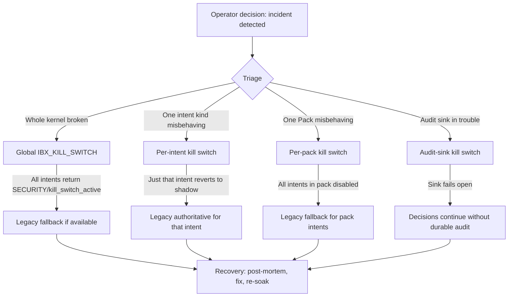

> ⚠️ **SUPERSEDED on 2026-05-23.** This document describes machinery that was DELETED by the IBX-IGE v3.0 always-on cutover (commit `f3bea43`). The kernel is now unconditionally authoritative — there is no shadow mode, no enforce env-var gating, and no kill-switch surface. For current state, see [`../audit-2026-05-23/SYNTHESIS.md`](../audit-2026-05-23/SYNTHESIS.md). This file is kept as historical record only.

---

# 05 — Kill Switch Strategy

**Status:** Draft v0.1
**Owner:** Migration Planner
**Last updated:** 2026-05-22
**Companion docs:** `01-rollout-strategy.md` §"Kill-switch-first", `04-shadow-enforce-sequencing.md` (per-intent rollback), `07-production-safety-checklist.md` (pre-flight)

---

## Executive summary

- **Four kill switches, four layers.** Global (everything refuses to legacy fallback), per-intent (one intent kind reverts to shadow), per-pack (one Pack disabled), audit-sink (audit fails open during sink incident). Each maps to a primitive in `@adjudicate/audit` per `investigation/05 §"Cross-replica coordination"`.
- **Propagation budget: 30 seconds.** From operator command to enforced-state-change everywhere, ≤30s via `createDistributedKillSwitchPubSub` (sub-100ms pub/sub propagation plus restart-safety polling).
- **All four switches share one runbook.** Engage → verify → investigate → fix → re-soak → resume. The post-mortem template is standardised.
- **Two surfaces: admin endpoint + CLI.** Admin endpoint requires role + audit + Sentry event. CLI requires role check via dev-ops bastion. No silent-flip mechanism.
- **Quarterly chaos test.** Every quarter, on-call drills the kill switch in staging against synthetic traffic. Drill failure blocks the next enforce flip cycle.

---

## The four kill switches



---

## Switch 1 — Global kill switch

**Primitive:** `setKillSwitch(active, reason)` from `@adjudicate/core/kernel` (per `investigation/05 §"@adjudicate/core"` capabilities table).

**Activation surfaces:**

1. **Boot env var.** `IBX_KILL_SWITCH=1` at process start. Kernel boots in killed state; every adjudicate call returns `SECURITY/kill_switch_active` refusal. Per `investigation/06 §"Env var surface"`.
2. **Admin endpoint.** `POST /api/admin/kernel/kill-switch` (spec below). Calls `setKillSwitch(true, reason)`.
3. **CLI.** `ibx kernel kill-switch enable --global --reason "<message>"`. Calls the admin endpoint over HTTPS.
4. **Distributed propagation.** `createDistributedKillSwitchPubSub` watches a Redis key + pub/sub channel. Once any replica calls `setKillSwitch`, all replicas mirror the state within ~100ms (Redis pub/sub) or within poll interval (2s default, configurable via `pollMs`).

**Behaviour when engaged:**

- Every `adjudicate(envelope, state, policy)` returns `Decision { kind: "REFUSE", refusal: { kind: "SECURITY", code: "kill_switch_active", userFacing: "Sistema temporariamente indisponível. Tente novamente em alguns minutos." } }`.
- Audit sink still emits records (with `decision.kind: "REFUSE"`).
- Metrics: `kernel_refusal_total{kind, basis: "kernel:kill_switch_active"}` spikes.
- Customer-facing: every mutating intent surfaces "Sistema temporariamente indisponível". Read-only intents (per `TOOL_CLASSIFICATION.READ_ONLY` in `investigation/01 §"Tool inventory"`) continue working — they don't pass through `adjudicate()`.

**Disengage:**

```bash
ibx kernel kill-switch disable --global
# or
curl -X POST $API_URL/api/admin/kernel/kill-switch \
  -H "Authorization: Bearer $ADMIN_KEY" \
  -d '{"active": false}'
```

**Use cases:**

- Catastrophic bug in `adjudicate()` itself (every intent refuses).
- Audit pipeline catastrophically corrupting records.
- Suspected security incident requiring immediate mutation freeze.
- Pre-deployment safety: deploy a new version with `IBX_KILL_SWITCH=1`, verify health, then disengage.

**Side effect on the rest of the system:**

Mutations through routes/subscribers/jobs that *don't* go through `adjudicate()` continue. The global kill switch only stops the kernel-authority path. After M3 lands, this means *almost everything* is killed; before M3 lands, only LLM-tool intents are killed (the rest are legacy direct mutations).

---

## Switch 2 — Per-intent kill switch

**Primitive:** `createDistributedKillSwitchPubSub` configured per intent kind (per `investigation/05 §"Cross-replica coordination"`).

**Activation surfaces:**

1. **Admin endpoint.** `POST /api/admin/kernel/kill-switch` with `scope: "intent"`, `target: "<intent_kind>"`. Body: `{ active: true, scope: "intent", target: "order.cancel", reason: "Refusal-rate spike at 19:35" }`.
2. **CLI.** `ibx kernel kill-switch enable <intent_kind>` / `ibx kernel kill-switch disable <intent_kind>`.
3. **Automatic.** A future `auto-kill` rule (per `03-blast-radius-analysis.md §Scenario 3`) trips the per-intent switch when refusal rate exceeds a configured multiplier. M7+ deliverable.

**Behaviour when engaged:**

The target intent kind is removed from the live `IBX_KERNEL_ENFORCE` set in-memory (via the distributed kill-switch state slot in `RuntimeContext` per `investigation/05 §"@adjudicate/core/kernel"` table). The next call to `isEnforced(intentKind, env)` for that kind returns `false`. The responder falls into the shadow branch (per `investigation/01 §"Current flow"` step 7.2).

Effect:
- Adjudication still runs (still in shadow).
- Legacy decision is authoritative again.
- Divergence events still emit (telemetry continues).
- No customer-facing refusal from the kernel for this intent.

**Disengage:**

```bash
ibx kernel kill-switch disable order.cancel
```

The intent kind returns to the enforce set; kernel decisions become authoritative again.

**Use cases (per `03-blast-radius-analysis.md`):**

- Sentry alert fires for sustained REFUSE rate on one intent kind.
- Post-mortem identifies a missing guard scenario; need to revert this kind without redeploy.
- Canary period detects unexpected refusals.

**Side effect:**

Just that one intent kind. Other kinds in `IBX_KERNEL_ENFORCE` continue to be enforced. The migration timeline is unaffected — the only thing that changes is that *this* intent kind needs another shadow cycle before re-enforcing.

---

## Switch 3 — Per-pack kill switch

**Primitive:** Pack registration includes an `enabled` flag managed via the same `createDistributedKillSwitchPubSub` mechanism, keyed by pack ID instead of intent kind.

**Activation surfaces:**

1. **Admin endpoint.** `POST /api/admin/kernel/kill-switch` with `scope: "pack"`, `target: "<pack_id>"`. Example: `{ active: true, scope: "pack", target: "@ibatexas/pack-orders", reason: "Pack v0.4 introduced a guard regression" }`.
2. **CLI.** `ibx kernel kill-switch enable --pack @ibatexas/pack-orders`.

**Behaviour when engaged:**

Every intent kind whose `kind` belongs to the target Pack is removed from the enforce set simultaneously. The Pack's `policy` field is effectively replaced with a passthrough policy bundle (`{ default: constant(decisionExecute([basis("kernel", "pack_disabled")])) }`).

Audit records continue, marked with `policyVersion: "<pack-id>:disabled"`.

**Disengage:**

```bash
ibx kernel kill-switch disable --pack @ibatexas/pack-orders
```

**Use cases:**

- Pack-level bug (e.g. `pack-orders` v0.4 introduces a regression across multiple intents).
- Rollback after a Pack version bump without a redeploy.
- Coordinated rollback of a domain (e.g. "all reservation intents" during a reservation-specific incident).

**Side effect:**

All intents in the pack revert to legacy. Other packs continue. Useful when the bug is suspected to be Pack-wide.

---

## Switch 4 — Audit-sink kill switch (fail-open)

**Primitive:** `multiSinkLossy` instead of `multiSinkStrict` for the audit pipeline, plus a runtime toggle (per `investigation/05 §"Sinks"`).

**Activation surfaces:**

1. **Admin endpoint.** `POST /api/admin/kernel/kill-switch` with `scope: "audit-sink"`, `target: "postgres" | "nats" | "all"`.
2. **CLI.** `ibx kernel kill-switch enable --audit-sink postgres`.
3. **Automatic.** `recordSinkFailure` exceeds a threshold (per `investigation/05 §"@adjudicate/core/kernel"` `MetricsSink` capability) → auto-toggle to lossy mode.

**Behaviour when engaged:**

- The targeted sink (`postgres`, `nats`, or `all`) is skipped on audit emit.
- `persistentBufferedSink` continues to spill to disk (per M0 deliverable).
- Kernel decisions continue without delay; durability is degraded.
- Metric: `kernel_audit_sink_failures_total{sink}` reports the engaged sinks.

**Disengage:**

```bash
ibx kernel kill-switch disable --audit-sink postgres
```

`persistentBufferedSink` drains its disk buffer to the sink that was just re-enabled. Drain rate is rate-limited per `investigation/05 §"Sinks"` `persistentBufferedSink` capability.

**Use cases:**

- Postgres maintenance window.
- NATS broker outage.
- Disk pressure during normal operations.

**Side effect:**

Decisions continue. Durable audit lags. Compliance posture: temporarily degraded but recoverable (`persistentBufferedSink` ensures no record loss).

---

## Admin endpoint specification

**`POST /api/admin/kernel/kill-switch`**

**Auth:** Staff JWT with `role: "OWNER"` *or* `x-admin-key` header (timing-safe comparison, per `investigation/08 §"Staff/admin"`). Note: `MANAGER` role is intentionally insufficient — engaging a kill switch is an Owner-level operation.

**Request body:**

```json
{
  "active": true,
  "scope": "global" | "intent" | "pack" | "audit-sink",
  "target": "<intent_kind | pack_id | sink_name>",
  "reason": "<free-form human-readable reason; required>",
  "expiresInSeconds": 3600
}
```

`target` is required for `scope: intent | pack | audit-sink`. `expiresInSeconds` is optional; if provided, the switch auto-disengages after the TTL.

**Response (success):**

```json
{
  "ok": true,
  "scope": "intent",
  "target": "order.cancel",
  "active": true,
  "engagedAt": "2026-05-22T19:35:21.123Z",
  "engagedBy": "staff:UUID-OF-OWNER",
  "expiresAt": "2026-05-22T20:35:21.123Z",
  "propagationStatus": "broadcast_sent",
  "auditRecordId": "audit-uuid"
}
```

**Response (failure):**

```json
{
  "ok": false,
  "error": "validation",
  "detail": "target=order.foo is not a known intent kind; check validateEnforceConfig"
}
```

**Side effects on success:**

1. Calls `setKillSwitch(true, reason)` (global) or the appropriate distributed kill-switch handle (per-intent / per-pack / audit-sink).
2. Emits a Sentry event with tag `event: "kernel.kill_switch.engaged"` and breadcrumb of the request.
3. Emits an audit record on the audit pipeline: special intent kind `kernel.kill_switch.toggle` with the request body as payload (audit redactor leaves `reason` intact but redacts any PII-like substrings).
4. Logs to pino at `level: "warn"` with correlation id from Fastify.
5. Publishes NATS event `ibatexas.kernel.kill_switch.v1` for any downstream listener.

**`GET /api/admin/kernel/kill-switch`**

Returns current state:

```json
{
  "global": { "active": false, "reason": null },
  "perIntent": [
    { "intent": "order.cancel", "active": false }
  ],
  "perPack": [
    { "pack": "@ibatexas/pack-orders", "active": false }
  ],
  "auditSink": [
    { "sink": "postgres", "active": false }
  ]
}
```

Aggregates state across all replicas via the Redis-backed distributed kill-switch store.

---

## CLI specification

The `ibx kernel kill-switch` subcommand (delivered in M4 per `02-milestones.md`):

```bash
# Global
ibx kernel kill-switch enable --global --reason "Suspected security incident"
ibx kernel kill-switch disable --global

# Per-intent
ibx kernel kill-switch enable order.cancel --reason "Refusal-rate spike"
ibx kernel kill-switch disable order.cancel

# Per-pack
ibx kernel kill-switch enable --pack @ibatexas/pack-orders --reason "Pack v0.4 regression"
ibx kernel kill-switch disable --pack @ibatexas/pack-orders

# Per-sink
ibx kernel kill-switch enable --audit-sink postgres --reason "DB maintenance"
ibx kernel kill-switch disable --audit-sink postgres

# Status
ibx kernel kill-switch status
ibx kernel kill-switch status --json

# With TTL
ibx kernel kill-switch enable order.cancel --reason "Soak" --expires 1h
```

**Implementation (current — W3 D1 + W7-O3):** The CLI today writes the Redis flag directly via `createKillSwitchStore` (`packages/cli/src/commands/kernel.ts` `runKillSwitchEnable`); the M4-era plan to route the CLI through the admin endpoint over HTTPS was downgraded in W7-O3 because the threat models diverged. The CLI surface exists for solo-on-call emergencies and INTENTIONALLY bypasses the two-person rule applied by the admin endpoint — see `docs/adjudicate-migration/correctness-remediation/W7-DECISIONS-ops.md` §O3 for the rationale. The CLI requires either an interactive TTY confirmation prompt (typing `engajar agora`) or `--yes-i-am-solo-on-call` for CI / pager scripts; Sentry breadcrumb metadata stamps `bypass: "two_person_rule"`, `surface: "cli"`, `bypassMode: "tty_prompt" | "flag"` so an incident review can correlate. For scheduled flips and drills, operators MUST use the admin endpoint.

**Output format (default):**

```
[ibx kernel kill-switch] enable order.cancel
  reason: Refusal-rate spike
  target: order.cancel (intent)
  propagation: broadcast sent (~100ms)
  status: active
  expires: never
  auditRecord: audit-uuid
  engagedBy: staff:UUID-OF-OWNER
```

**Output format (--json):**

```json
{
  "ok": true,
  "scope": "intent",
  "target": "order.cancel",
  "active": true,
  "engagedAt": "2026-05-22T19:35:21.123Z",
  "propagationStatus": "broadcast_sent"
}
```

---

## Recovery procedure after kill-switch use

This is the standardised playbook for every kill-switch event:

### Step 1 — Engage (≤2 minutes from alert)

1. On-call receives alert (PagerDuty, Sentry, or direct customer report).
2. Triage: which switch? (Global if symptom is broad; per-intent if narrow; per-pack if domain-specific; audit-sink if dashboards lag.)
3. Engage via CLI: `ibx kernel kill-switch enable <scope> [<target>] --reason "<one-line summary>"`.
4. Confirm propagation: `ibx kernel kill-switch status` shows the switch active across all replicas.

### Step 2 — Verify (≤5 minutes)

5. Refresh dashboards (`06-observability-requirements.md` Dashboard 1).
6. Confirm refusal rate is dropping (legacy is now authoritative for the affected intent/pack).
7. Confirm no new customer complaints arriving in the support inbox.
8. Confirm replay job is paused or behaving correctly (kill switch in audit-sink case may affect replay timing).

### Step 3 — Investigate (within 24h)

9. Pull the last 100 audit records for the affected intent from `intent_audit`.
10. Identify the divergence: what envelope shape triggered the bad refusal?
11. Compare with the scenario fixtures used in shadow soak — was this case missing?
12. Identify the Pack code change responsible (git blame on the relevant Pack file).

### Step 4 — Replay diverged decisions (within 24h)

```bash
ibx kernel replay --since=24h --intent-kind=<affected> --format=operator > replay-report.md
```

13. Each diverged decision: classify as "kernel-correct" (legacy was wrong; this is a P2 cleanup) or "kernel-wrong" (must fix).
14. For "kernel-wrong" cases: customer-impacting? File support tickets for any customer who experienced a refused mutation; rollback any side effects (e.g. emit a "we're sorry, here's a R$15 credit" follow-up).

### Step 5 — Fix and re-soak (within 1 week)

15. PR with the fix.
16. Add a regression scenario fixture to the Pack tests (catches the same case next time).
17. Deploy the fix.
18. Re-enable shadow (`ibx kernel shadow enable <intent>`).
19. Soak for the tier's full duration (Tier 4 = 21 days).
20. Re-flip to enforce per the standard checklist.

### Step 6 — Post-mortem (within 1 week)

File at `docs/ops/runbooks/post-mortems/<date>-<intent>.md` with this template:

```markdown
# Post-mortem: <intent kind> kill-switch event on <date>

## Summary

- Engaged at: <ISO timestamp>
- Disengaged at: <ISO timestamp>
- Duration: <minutes>
- Switch used: <global/intent/pack/audit-sink>
- Target: <intent_kind | pack_id | sink_name>
- Operator: <staff name>
- Reason: <one-line>

## Customer impact

- Customers affected: <count>
- Worst-case duration of impact per customer: <minutes>
- Revenue at risk: <R$X / R$0>
- Refunds / credits issued: <count, total amount>

## Root cause

- Pack code at fault: <file:line>
- Reason the bug wasn't caught: <missing test? missing scenario? off-by-one?>

## Timeline

- T+0: <event>
- T+1m: <event>
- ...

## What worked

- <e.g. kill-switch propagation < 30s>
- <e.g. dashboard surfaced the issue within 5 min>

## What didn't

- <e.g. test fixtures missed the case>
- <e.g. alert threshold too high>

## Action items

- [ ] PR to fix root cause: <link>
- [ ] PR to add regression scenario: <link>
- [ ] PR to tighten alert threshold: <link>
- [ ] Update <runbook | dashboard | doc>: <which>

## Sign-offs

- On-call lead: <name>
- Migration lead: <name>
- Intent owner: <name>
```

---

## Quarterly chaos test

Every quarter, on-call drills each switch:

### Drill 1 — Global kill switch

**Cadence:** Quarterly.
**Scope:** Staging only.
**Procedure:**
1. Run synthetic traffic generator (10 req/s of mixed intents) for 10 minutes.
2. Engage global kill switch via CLI: `ibx kernel kill-switch enable --global --reason "Quarterly drill"`.
3. Observe: refusal rate goes to 100% within 30s.
4. Wait 5 minutes; confirm no replica is stuck.
5. Disengage: `ibx kernel kill-switch disable --global`.
6. Observe: refusal rate returns to baseline within 30s.

**Pass criteria:** Propagation < 30s in both directions; no replica stuck; metric counters reflect the toggle.

**Failure:** Block the next M7+ enforce flip; investigate.

### Drill 2 — Per-intent kill switch

**Cadence:** Quarterly per active intent kind in enforce.
**Scope:** Staging.
**Procedure:** As Drill 1 but with `enable <intent_kind>` and `disable <intent_kind>`.

**Pass criteria:** Same.

### Drill 3 — Per-pack kill switch

**Cadence:** Quarterly per registered Pack.
**Scope:** Staging.

**Pass criteria:** Same.

### Drill 4 — Audit-sink kill switch (fail-open)

**Cadence:** Quarterly.
**Scope:** Staging.
**Procedure:**
1. Run synthetic traffic at 10 req/s.
2. Engage audit-sink kill switch for `postgres`.
3. Observe: `kernel_audit_sink_failures_total{sink="postgres"}` stays at 0 (no failures *because* sink is bypassed).
4. Observe: `persistentBufferedSink` spills to disk.
5. Disengage; observe: disk buffer drains to Postgres within 60s.

**Pass criteria:** Disk buffer drains to durable sink within expected time; no records lost; row count in `intent_audit` matches expected.

### Drill 5 — Shadow → enforce roundtrip

**Cadence:** Quarterly.
**Scope:** Staging.
**Procedure:**
1. Take an intent kind currently in shadow.
2. Flip to enforce: `ibx kernel enforce enable <intent>`.
3. Generate 5 minutes of synthetic traffic.
4. Engage per-intent kill switch.
5. Observe: intent returns to shadow within 30s.
6. Generate another 5 minutes; confirm legacy behaviour resumes.

**Pass criteria:** Full roundtrip succeeds; metrics reflect each transition.

### Drill 6 — Pack rollback

**Cadence:** Quarterly.
**Scope:** Staging.
**Procedure:**
1. Deploy a synthetic-broken version of a Pack to staging.
2. Engage per-pack kill switch.
3. Observe: Pack-level disable propagates within 30s.
4. Roll back the Pack deploy.
5. Disengage; observe: normal behaviour resumes.

**Pass criteria:** Pack-level isolation works without cross-pack collateral damage.

---

## Auditability of kill-switch events

Every kill-switch toggle (engage or disengage) produces three durable records:

1. **Audit record** on the `intent_audit` table. The toggle itself is an envelope of kind `kernel.kill_switch.toggle` with payload `{ scope, target, active, reason, engagedBy }`. Adjudicated by a passthrough Pack that always EXECUTEs (so the audit captures the operator action without blocking it).
2. **Sentry event** with tag `event: "kernel.kill_switch.engaged"` (or `..._disengaged`). Includes operator identity, scope, target, reason. Sentry retention is 90 days per the org settings.
3. **NATS event** on `ibatexas.kernel.kill_switch.v1`. Subscribers include the operator console (TODO: M8+ adoption) and the daily ops digest job.

The 90-day Sentry retention is the floor for routine investigation. The Postgres audit table is the long-term record (retention per migration's audit policy — typically 1 year, extended to 5 years for Tier 4 LGPD intents).

`analyzeKillSwitchTimeline` (per `investigation/05 §"Replay & integrity"`) gives a closed-vocabulary summary of toggle history: `stable / single_incident / recurring_incidents / storm`. Used quarterly to detect drift in operational discipline (a `storm` classification means the kill switch is being used as a band-aid rather than a last resort).

---

## Authorisation matrix

| Scope | Required role | Notes |
|---|---|---|
| Global | OWNER | Highest blast radius. Requires explicit confirmation prompt in CLI ("Are you sure? Type 'I confirm kernel-wide kill' to continue."). |
| Per-intent | OWNER | Lower blast but still incident-level. MANAGER cannot trigger. |
| Per-pack | OWNER | Same reasoning. |
| Audit-sink | OWNER or `x-admin-key` | Operational maintenance is sometimes needed off-hours; allow the API key path for scheduled DB maintenance. |
| Status read | MANAGER, OWNER, ATTENDANT | Anyone with admin access can read state. |

A future change could lower per-intent to MANAGER if Tier 1+2 incidents are common enough to warrant. Initial deployment keeps it Owner-only to prevent accidental usage.

---

## Failure modes of the kill switch itself

The kill switch is critical infrastructure; its failure modes:

| Failure | Consequence | Mitigation |
|---|---|---|
| Redis pub/sub down | Distributed propagation slow (falls back to 2s poll) | Poll fallback per `investigation/05 §"Cross-replica coordination"`. |
| Redis cluster offline | Distributed kill switch can't propagate; in-process kill switch only works for the replica processing the request | Manual: ssh to each replica, `kill -HUP <pid>` after setting `IBX_KILL_SWITCH=1`. Painful but recoverable. |
| Admin endpoint down (API not serving) | Can't engage via HTTP | Direct env-var update + replica restart (procedure in `docs/ops/runbooks/01-stage-read-mutations.md` §Rollback). |
| Kill switch state stuck (state slot corrupted) | Replica won't disengage | `_resetDefaultRuntimeContext()` test helper at boot; restart replica to clear state. |
| Sentry down | No alerts firing | Dashboards (Grafana) remain; on-call sees the symptom there. |
| Audit pipeline down + audit-sink kill engaged | Decisions continue without record | Acceptable — that's the fail-open. Replay catches up when sink returns. |

**The kill switch must be tested with each replica having Redis-pub-sub access.** A single-replica deployment loses 50% of the kill switch's value; this is why staging uses 2+ replicas.

---

## What the kill switch does NOT do

For clarity:

- **It does not roll back data.** A bad enforce that caused refusals leaves the customer's state unchanged (because nothing wrote). A bad enforce that caused incorrect EXECUTEs (theoretically a Pack regression rewriting payloads) needs data rollback separately. The kill switch buys time; it doesn't undo writes.
- **It does not stop legacy path mutations.** During M3, many entrypoints still go to legacy. The global kill switch only stops kernel-authoritative paths. To stop *all* mutations, take the API offline (`ibx svc stop api`).
- **It does not bypass audit.** Kill-switched decisions still audit (as REFUSE with `kill_switch_active` basis). The audit record IS the record of the incident.
- **It does not bypass the rate limiter.** A customer who's been refused N times will still hit the per-customer rate limit (e.g. cancel-rate of 5/10min in `investigation/02 §Customer-facing` for `/cancel`). Workaround: customer waits; on-call doesn't override rate limits during incidents (per the secure-by-default principle).

---

## Open questions

1. **Should per-intent auto-kill-switch be enabled by default?** Mitigates the "8-minute detection window" from `03-blast-radius-analysis.md §Scenario 3`, but introduces risk of false-positive auto-trips. Current plan: opt-in per intent in M8; defaults off.
2. **Should we expose kill-switch status on a public health endpoint?** Currently OWNER-only via admin. A read-only status endpoint at `/health/kernel` would let monitoring tools detect kernel state. Trade-off: information leak vs. observability.
3. **How do we coordinate kill switches with the `apps/console` operator UI?** Per `investigation/05 §"apps/console"`, the console has a `KillSwitchPanel` and `EmergencyDialog`. Adoption decision (M8 follow-on per `01-rollout-strategy.md`) determines whether the CLI is the long-term primary surface or just the fallback.
