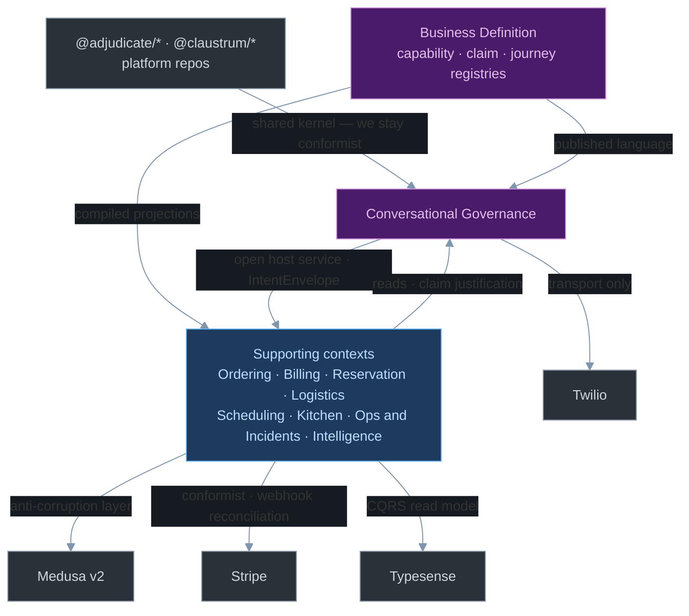

# High-Level Design — IbateXas

> **Status:** current as of 2026-07-23, verified against `dev`.
> **Scope:** the whole system at the architectural altitude — subdomains, bounded contexts, the
> context map, the governance stack a conversational turn crosses, and where the
> [Language Engine 2.0 program](./language-engine-2.md) lands on that map.
> **Supersedes:** [`bounded-contexts.md`](./bounded-contexts.md) as the DDD view of record. That
> document describes a commerce system with an agent attached; the system is now a governed
> conversational runtime with commerce underneath it, and several of its contexts, entities and
> rules no longer exist.
> **Companions:** [`README.md`](../README.md) (module map, "where is X"),
> [`domain-model.md`](./domain-model.md) (Prisma entities + NATS events),
> [`CLAUDE.SDD.md`](../../../CLAUDE.SDD.md) (the claims-runtime constraint system — authoritative
> where it and this document disagree).

---

## 1. What the system is

A restaurant is run entirely through two conversational planes. Customers order on one; the owner
and staff run the store on the other. Both planes are the same runtime, and in that runtime **the
model never has authority**: it is a semantic parser that selects and parameterizes from a closed
registry, and every consequence — every mutation, every factual sentence — is decided by code that
can be tested.

That inversion is the architecture. Everything else is subordinate to it.

```mermaid
%%{init: {'theme':'base','themeVariables':{'fontSize':'14px','lineColor':'#7f96ad','textColor':'#d7dde3','titleColor':'#d7dde3','edgeLabelBackground':'#161b22','clusterBkg':'#191226','clusterBorder':'#3a4048'}}}%%
graph TD
  CUST["Customer plane<br/>WhatsApp · web chat"]
  OPS["Ops plane<br/>staff thread"]
  COND["claustrum Conductor<br/>one Capsule per turn"]

  subgraph MODEL["The model's half — proposes, never decides"]
    PARSE["Parser<br/>picks one capability from a closed<br/>registry and fills its slots"]
  end

  subgraph CODE["Code's half — decides, always"]
    KERN["Kernel<br/>authority over doing"]
    CLAIM["Claims kernel<br/>authority over saying"]
    EXEC["Adjudicated mutation<br/>— or an audited refusal"]
    REND["Template render from<br/>validated claims<br/>— or an honest unknown"]
  end

  REPLY["What the person receives"]

  CUST --> COND
  OPS --> COND
  COND --> PARSE
  PARSE -->|"IntentEnvelope · taint UNTRUSTED"| KERN
  PARSE -->|"question spans"| CLAIM
  KERN --> EXEC
  CLAIM --> REND
  EXEC --> REPLY
  REND --> REPLY

  style CUST fill:#1a3a2a,stroke:#4caf50,color:#c8e6c9
  style OPS fill:#1a3a2a,stroke:#4caf50,color:#c8e6c9
  style COND fill:#1e3a5f,stroke:#64b5f6,color:#bbdefb
  style PARSE fill:#3d3115,stroke:#ffca28,color:#ffe082
  style KERN fill:#4a1a6b,stroke:#ce93d8,color:#e1bee7
  style CLAIM fill:#4a1a6b,stroke:#ce93d8,color:#e1bee7
  style EXEC fill:#1e3a5f,stroke:#64b5f6,color:#bbdefb
  style REND fill:#1e3a5f,stroke:#64b5f6,color:#bbdefb
  style REPLY fill:#1a3a2a,stroke:#4caf50,color:#c8e6c9
  style MODEL fill:#241d0d,stroke:#8a6d1f
  style CODE fill:#191226,stroke:#6b3f85
```

Amber is the only part of the runtime that cannot be trusted, and it is one box. Purple is where
authority lives, and there are two of them — one over *doing*, one over *saying*. That asymmetry is
the whole design.

*Design of record. Today the claims half is live on the customer plane only — see §3.*

**Two paths, not one.** Path A is direct REST from the web and admin UIs. Path B is the
conversational turn. They share domain logic and diverge only in who decides: on Path A the caller
decides and the route validates; on Path B the kernel decides and the model only proposes. This
document is mostly about Path B, because that is where the design investment is.

---

## 2. Subdomain classification

The single most important correction to the old document: **commerce is not the core domain.**
Products, carts, orders and payment rails are generic — bought from Medusa and Stripe and wrapped.
What no vendor supplies, and what all the hard engineering is spent on, is the governed turn.

| Subdomain | Class | Why | Where it lives |
|---|---|---|---|
| **Conversational governance** — adjudication, claims, rendering | **Core** | The reason the system can be trusted with a real restaurant. Nothing off-the-shelf provides it. | `apps/api/src/claustrum/`, `@adjudicate/*`, `@claustrum/*` |
| **Business definition** — capabilities, claims, journeys, aliases | **Core** *(emerging — LE2)* | The versioned definition every derived surface compiles from. Today it is partly assembled, partly scattered. | `packages/packs-composed/`, becoming `@ibatexas/catalog` |
| Ordering · Billing · Reservation | Supporting | Restaurant-specific rules on top of generic primitives (amend ladders, PIX lifecycle, waitlists). | `packages/pack-*`, `packages/domain` |
| Logistics · Scheduling · Kitchen | Supporting | Zones, hours, holidays, recipes, specials — the store's own facts. | `packages/domain`, `packages/tools` |
| Ops & Incidents · Intelligence | Supporting | Running the restaurant by message; profiles, reviews, alerts. | `packages/pack-ops`, `packages/domain` |
| Identity | Generic | Phone-as-identity via Twilio Verify OTP. | Twilio + `packages/domain` |
| Catalog / cart / order primitives | Generic | Medusa v2. | `apps/commerce` |
| Payment rails | Generic | Stripe + PIX. | Stripe, `@adjudicate/pack-payments-pix` |
| Search | Generic | Typesense as a read model. | `packages/tools/src/typesense/` |
| Messaging transport · Analytics | Generic | Twilio, PostHog. | routes + `apps/web` |

The practical consequence: generic subdomains are reached **only** through anti-corruption layers,
and we stay conformist with them. Core subdomains carry our own model and our own tests, and no
external vendor's shape is allowed to leak into them.

---

## 3. The governance stack

A conversational turn crosses a fixed sequence of layers. Each one narrows what is still possible.
This is the system's spine — read it top to bottom and you know what the runtime does.

| # | Layer | What it decides | Live today | Language Engine 2.0 |
|---|---|---|---|---|
| 0 | **Ingress** | Which plane, which actor, which session | `chat.ts`, `whatsapp-webhook.ts`, `admin/ops-chat.ts` | Alias resolution before parse (ticket 25) |
| 1 | **Funnel** | Whether the model runs at all | — *(every turn calls the model)* | L0 social templates, L1 memoization, L2 scoped parse (07 · 09 · 08) |
| 2 | **Parser** | Which capability, which parameters | `createIbatexasPlanner`; sees exactly one mutating tool, `express_intent` | Wire constraints + envelope salvage (06 · 03) |
| 3 | **Envelope** | The proposal's provenance and taint | `IntentEnvelope`, `taint: UNTRUSTED`, actor stamped at composition | Provenance-marked salvage (03) |
| 4 | **Kernel** | Whether the mutation happens | `adjudicate()` — always authoritative, no flag, no shadow, no kill switch | Per-activity adjudication inside journeys (20) |
| 5 | **Journey** | How a multi-step plan is composed | — *(one verb per turn)* | Authored journeys + executor (20–24) |
| 6 | **Investigator** | What was actually read | `ibatexas-investigator.ts` | Ops plane gains it (11) |
| 7 | **Claims kernel** | Which assertions are true enough to say | 17 runtime claim types; `VALIDATED / UNKNOWN / REFUSED` | New types: coverage, ops, coupon, episodic, pairings (02 · 12 · 19 · 27 · 29) |
| 8 | **Renderer** | The exact words a person receives | `renderer-from-claims.ts` — pure template filler over a slot grammar | Ops plane converges; raw prose deleted (13) |
| 9 | **Audit + trace** | What can be reconstructed afterwards | console + NATS + Postgres; `turn_trace`, `intent_audit`, durable wire capture | Catalog version + funnel tier stamping (14 · 07) |

**Two authorities, not one.** Layer 4 governs *doing*; layer 7 governs *saying*. They are separate
kernels with separate registries, and conflating them is the most common misreading of this system.
An answer can be refused while an action succeeds, and vice versa.

### Current asymmetry between the planes

| | Customer plane | Ops plane |
|---|---|---|
| Kernel adjudication | Yes | Yes — plus `staffRoleGuard` + role matrix |
| Claims pipeline | Yes (`ENABLE_CLAIMS_PIPELINE`; ON in dev, prod flip pending) | **No** — factual answers on the empty-plan path are raw model prose |
| Tool registry | 20 chat-drivable capabilities | Separate ops registry (`@ibatexas/pack-ops`) |
| Actor | `principal: "llm"`, conversation session | `principal: "user"`, `admin:${staffId}`, role-carrying |

That "No" is the wound Language Engine 2.0 exists to close. It is a mechanism gap, not an audience
gap: the ops plane is not less trusted, it is less *governed*, and any digit-free factual assertion
passes through it unchecked.

---

## 4. Bounded contexts

Eleven contexts. Each lists its aggregates, the invariants it owns, and where its code is. An
invariant listed here is one that cannot be violated from outside the context.

### 4.1 Conversational Governance — **core**

**Owner:** `apps/api/src/claustrum/` + `apps/api/src/claustrum-bootstrap.ts` (composition root)
**Upstream shared kernel:** `@adjudicate/*` and `@claustrum/*`, published from the platform repos

| Aggregate | Root | Notes |
|---|---|---|
| Turn | `Capsule` | Opened per turn by the Conductor; carries actor, state, telemetry |
| IntentEnvelope | `kind` + `payload` | The only way a mutation is ever proposed |
| Decision | kernel verdict | `EXECUTE / REFUSE / REQUEST_CONFIRMATION / ESCALATE / DEFER / REWRITE` |
| ClaimSet | claim type + justification | `VALIDATED / UNKNOWN / REFUSED`; terminals `RENDER / UNKNOWN / ESCALATE / CLARIFY` |
| TurnTrace | turn id | Stage records — the observability contract |

**Invariants**
- The model has zero state-mutation authority; it sees exactly one mutating tool and never an
  internal tool id.
- The kernel is always authoritative — no env gating, no shadow mode, no kill switch.
- No customer-facing sentence is authored by a probabilistic model on a claims-engaged path. Every
  rendered proposition maps 1:1 to an independently validated claim.
- Soundness and consistency are guaranteed; correctness and completeness are bounded — degrade to
  `UNKNOWN` / `ESCALATE` / `CLARIFY`, never to a confident wrong answer.
- `fulfillment-claimed` is permanently unearnable. `payment-settled` excludes refunds.
- Arrow direction is `adjudicate → claustrum → ibatexas`, never backward.

### 4.2 Business Definition — **core, emerging**

**Owner today:** `packages/packs-composed/src/capability-definitions/` — one authored
`definitions.ts` plus twelve generators that compile it into rosters, auth levels, refusal codes,
planner allow-lists and tool maps. `toolRosterDrift()` runs fail-closed at boot.
**Owner after LE2:** `@ibatexas/catalog` (tickets 14–18, 25–26)

| Aggregate | Root | Notes |
|---|---|---|
| CapabilityDefinition | `kind` | 58 kinds — 20 chat-drivable, 38 identity-only |
| ClaimDefinition | claim type | 17 runtime types; 37-row / 40-name design vocabulary |
| *(LE2)* JourneyDefinition | journey id | Hand-authored activity graph with declared compensators |
| *(LE2)* AliasEntry | surface form | `pep` → canonical entity; unknown alias → `CLARIFY` |
| *(LE2)* PairingEdge | pair | `goes_well_with`; allergen and dietary edges are compile errors |

**Invariants**
- The catalog is the source of *definition*, never the seat of *runtime authority*. Kernel, policy
  bundles and money thresholds stay code with tests.
- Hand-authored TypeScript only — no CMS, no runtime mutation, until the schema survives five real
  journeys unchanged.
- *(LE2)* An inconsistent catalog fails to build; a dangling external reference blocks boot.

### 4.3 Ordering

**Owner:** `@ibatexas/pack-orders` + `packages/domain` (`OrderProjection`, `OrderStatusHistory`,
`OrderEventLog`, `CustomerOrderItem`, `OrderNote`) over Medusa carts/orders

**Invariants** — prices are integer centavos, never floats · allergens are an explicit array, never
inferred · status transitions follow a forward-only validated matrix and publish NATS events · money
governance is threshold-banded per Inv 11, not a universal confirm gate · the amend ladder routes
authenticated traffic to three granular kinds, not the legacy composite.

### 4.4 Billing

**Owner:** `packages/domain` (`Payment`, `PaymentStatusHistory`, `FiscalDocument`) +
`@ibatexas/pack-payments` + the frozen `@adjudicate/pack-payments-pix` lighthouse pack

**Invariants** — exactly one active non-terminal payment per order, enforced by application guard
*and* partial unique index · retry creates a new row, never mutates a terminal one · Stripe is
authoritative for PaymentIntent lifecycle; reconciliation guards cover idempotency, terminal state,
out-of-order events and ownership · optimistic concurrency via `version` · PIX expiry does not
cancel the order · every completed order emits an NF-e (Brazilian tax law).

### 4.5 Reservation

**Owner:** `@ibatexas/pack-reservations` + `packages/domain` (`Table`, `TimeSlot`, `Reservation`,
`ReservationTable`, `Waitlist`)

**Invariants** — `reservedCovers` is an atomic counter; overbooking is impossible by construction ·
reservations require identity · a no-show releases the table after 15 minutes · a reservation may
span multiple tables.

### 4.6 Logistics

**Owner:** `packages/domain` (`DeliveryZone`, `Address`) + `packages/tools/src/catalog/estimate-delivery.ts`

**Invariants** — fees are zone-based, not distance-calculated · CEP is validated before a delivery
order is confirmed · admin zone edits invalidate the Redis cache immediately.

> **Known gap.** The zone data, the admin screen and a working estimator all exist, but no
> conversational surface reaches them — the estimator is advertised as a read tool and never
> executed. This is the defect that produced the ungrounded *"sim, entregamos em Ibaté"* and it is
> closed by LE2 ticket 02 (customer plane) and ticket 13 (ops plane).

### 4.7 Scheduling

**Owner:** `packages/domain` (`WeeklySchedule`, `Holiday`, `ScheduleOverride`) +
`schedule-date-resolver.ts`, `closed-hours.ts`

**Invariants** — holiday-aware resolution is the only source of open/closed truth · an unconfigured
holiday abstains rather than guessing · a date-anchored question suppresses the "open now"
companion claim · the closed-hours backstop is belt-and-suspenders behind the claim, not a
substitute for it.

### 4.8 Kitchen

**Owner:** `packages/domain` (`Ingredient`, `Recipe`, `RecipeIngredient`, `DailySpecial`)

**Invariants** — recipe composition never implies an allergen or dietary claim; implications are
forbidden by ratified policy and, after LE2 ticket 16, are a compile error · `product.availability.set`
(86-ing an item) is a governed ops kind restricted to `OWNER` and `MANAGER`.

### 4.9 Ops & Incidents

**Owner:** `@ibatexas/pack-ops` + `packages/domain` (`OpsAlert`, `ConversationIncident`, `Staff`,
`StaffShift`) + `apps/api/src/routes/admin/`

**Invariants** — the ops LLM surface is the Conductor itself, never a generic intent endpoint ·
staff authority is carried by `actor.role` plus the `admin:` session namespace, never by taint and
never derived from model output · the actor is captured from the authenticated JWT at ingress and
injected at composition · role enforcement is layered: route preHandler → capability planner →
`staffRoleGuard` + matrix → per-kind pack guards.

### 4.10 Identity

**Owner:** Twilio Verify (OTP) + `packages/domain` (`Customer`, `Staff`, `Address`,
`CustomerPreferences`, `CustomerBroadcastConsent`, `LoyaltyAccount`) + Redis sessions

**Invariants** — phone is the primary identifier for both customers and staff; there is no password
and no second auth provider · `Customer` and `Staff` are separate models, not a discriminated type ·
LGPD deletion runs through the existing anonymization path · Redis keys are always built with `rk()`
so `APP_ENV` namespacing cannot be bypassed.

### 4.11 Intelligence

**Owner:** `packages/domain` (`Review`, `LlmTokenUsage`, `AgentRun`, `AgentRedTeamRun`) +
`packages/tools/src/intelligence/`

**Invariants** — recommendations never surface out-of-stock items, items outside their availability
window, or items matching a stated allergen · allergens are only ever set explicitly by the customer ·
reviews are requested once per order, 30 minutes after delivery · a rating ≤ 2 escalates to staff.

> **LE2 addition.** Session-close summarization becomes the *sole* writer of the customer profile,
> with supersession semantics and validity windows (ticket 27). Memory supplies warmth and pointers;
> facts of record are always re-read from authoritative projections.

### 4.12 Conversation Archive

**Owner:** Redis hot path → NATS CDC → Postgres (`Conversation`, `ConversationMessage`)

**Invariants** — Redis is the hot path the runtime reads; Postgres archival is best-effort and its
failure never blocks a turn · the archiver is idempotent under NATS redelivery · customer FK uses
`SetNull` so analytics survive an LGPD deletion.

---

## 5. Context map

Relationships, in DDD terms. The pattern on each edge is the part that matters — it says what
happens when the other side changes.

The eight supporting contexts share one relationship to governance, so they appear as one node —
a context map shows distinct relationship *patterns*, and eight identical edges are one pattern.
Purple is core, blue is supporting, slate is not ours.

**Reading the edges**

- **Conformist to the platform repos.** `@adjudicate/*` and `@claustrum/*` are versioned npm
  dependencies from separate repos. We do not fork them; we upgrade by bumping a pin. Their
  contracts are the contracts.
- **Published language, not shared database.** Contexts communicate through `IntentEnvelope` kinds
  and NATS events (31 published subjects, `domain.action`), never by reaching into each other's
  tables. `@ibatexas/intent-kinds` *is* the published language, and `toolRosterDrift()` enforces
  that the roster matches it.
- **Anti-corruption layer around Medusa.** Every Medusa call goes through `packages/tools` mappers
  and, on the write side, the `medusaAdjudicated` egress wrapper — a deliberately distinct
  governance layer from intent adjudication, not a duplicate of it.
- **CQRS toward Typesense.** Typesense is a read projection of the Medusa catalog, rebuilt by
  `ibx db reindex`. It answers search; it never holds truth.
- **Business Definition is upstream of everything.** Today it publishes compiled rosters at build
  time. After LE2 it publishes the parser roster, retrieval index, feasibility predicates, executor
  config, render tables and eval goldens — all from one versioned root.

---

## 6. Ubiquitous language

The terms below have precise meanings. Using them loosely is how designs drift.

| Term | Means | Does **not** mean |
|---|---|---|
| **Plane** | Which conversation a turn belongs to — customer or ops | A trust level |
| **Capability** | A registered `kind` the parser may select | A function the model can call directly |
| **IntentEnvelope** | A *proposal* to mutate, with actor + taint | A command |
| **Adjudication** | The kernel deciding whether a mutation happens | Validation |
| **Claim** | A typed assertion with justification and a verdict | A sentence |
| **Terminal** | `RENDER / UNKNOWN / ESCALATE / CLARIFY` | An error |
| **Render** | Filling a slot grammar from validated claims | Generating text |
| **Taint** | Payload provenance | Actor authority |
| **Projection** | A freshly-read view of authoritative state | A cache |
| *(LE2)* **Tier** | Which funnel level answered — L0 / L1 / L2 | A quality level |
| *(LE2)* **Journey definition** | A hand-authored catalog activity graph | The `packages/journeys` acceptance framework |

> **Naming collision.** `packages/journeys` is the acceptance-test framework that drives utterances
> and asserts outcomes. LE2 introduces catalog *journey definitions* and a journey runtime. Two
> different things share the word, and one tests the other. The spec offers `roteiros` for the
> catalog artifact; the choice should be made before ticket 20 opens, not after five tickets have
> written `journey` into runtime code, compiler diagnostics and traces.

---

## 7. Where Language Engine 2.0 lands

The program does not add a context. It does four structural things to the map above.

**1 · It closes the plane asymmetry (§3).** The ops plane gains the investigator, claim planner,
claims kernel, renderer and safe-unknown gate. The raw-prose branch is deleted by convergence, not
patched — by owner decision there is no stopgap, which means the ops plane stays ungoverned until
tickets 11–13 land. *(Tickets 11 · 12 · 13)*

**2 · It inserts a funnel above the parser (layer 1).** Today every turn calls the model against the
full roster. After: social utterances answer from templates with zero completions, byte-identical
repeats replay a memoized parse, and everything else is parsed against three to five plausible
capabilities with full-roster fallback so coverage can never regress. Every tier ships behind an
evaluation harness that scores parsing — refusals included — before and after each change.
*(Tickets 05 · 07 · 08 · 09)*

**3 · It promotes Business Definition to a real context (§4.2).** One versioned catalog package,
a fail-closed compiler that turns whole error classes into build failures, and boot reconciliation
that refuses to start on a dangling external reference. Every turn stamps its catalog version into
the trace, which — with the existing durable wire capture — completes deterministic turn replay.
*(Tickets 14–18 · 25 · 26)*

**4 · It adds a composition layer between parser and kernel (layer 5).** Multi-step requests are met
by hand-authored journeys: the model selects and parameterizes, never composes. The executor
pre-checks feasibility from claims, asks for one whole-journey confirmation with grounded amounts,
adjudicates each activity through the kernel, and runs declared compensators on failure. A journey
instance pins the catalog shape it started under but adjudicates against current policy, so a policy
change bites immediately even mid-journey. *(Tickets 19–24)*

**Explicitly out of scope**, and load-bearing as such: answer caching in any form, a general
knowledge-graph/RAG layer, model-authored plans, a catalog CMS or any runtime catalog mutation,
allergen or dietary renders, and an inference-engine swap.

**Review findings** on this program — including the boot-refuse blast radius, the L1 cache key, and
the dependency edge that makes the journey chain six deep — are recorded separately and are not
part of the design of record until the owner rules on them.

---

## 8. Invariants that must never break

The compiled list. Everything above is explanation; this is the contract.

1. The LLM has zero state-mutation authority.
2. The kernel is always authoritative — no flag, no shadow mode, no kill switch.
3. Every mutation is an `IntentEnvelope`; every decision is audited to console, NATS and Postgres.
4. No customer-facing sentence is authored by a probabilistic model on a claims-engaged path.
5. Degrade to `UNKNOWN` / `ESCALATE` / `CLARIFY` — never to a confident wrong answer.
6. Allergens are always an explicit array. Never inferred, never implied by a recipe or a pairing.
7. Prices are integer centavos.
8. Staff authority comes from `actor.role` plus the `admin:` namespace — never from taint, never
   from model output.
9. Redis keys are built with `rk()`; user-facing text is pt-BR; config comes from `process.env`.
10. Contexts communicate through published language — intent kinds and NATS events — never by
    reaching into each other's storage.
11. *(LE2)* The catalog defines; it never holds runtime authority.
12. *(LE2)* Cache the parse, never the answer.

---

## 9. Document map

| Need | Go to |
|---|---|
| Module map, ports, "where is X", how to run X | [`../README.md`](../README.md) |
| Prisma entities, NATS event catalogue | [`domain-model.md`](./domain-model.md) |
| Claims-runtime constraint system (authoritative) | [`../../../CLAUDE.SDD.md`](../../../CLAUDE.SDD.md) |
| Agent tools — auth level, inputs, outputs | [`agent-tools.md`](./agent-tools.md) |
| Ops plane decision of record | [`../ops-actor-surface.md`](../ops-actor-surface.md) |
| Build-time drift gates | [`fe4-drift-gates.md`](./fe4-drift-gates.md) |
| Order/billing decision matrix | [`order-billing-decision-matrix.md`](./order-billing-decision-matrix.md) |
| ADRs | [`../decisions.md`](../decisions.md) |
| The forward program | [`language-engine-2.md`](./language-engine-2.md) |
| Prior DDD view (superseded) | [`bounded-contexts.md`](./bounded-contexts.md) |
