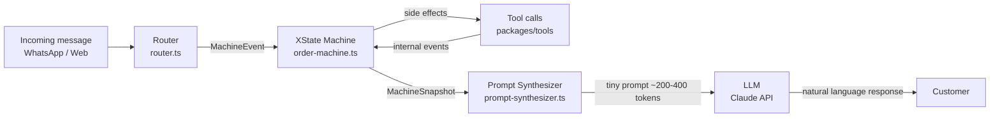
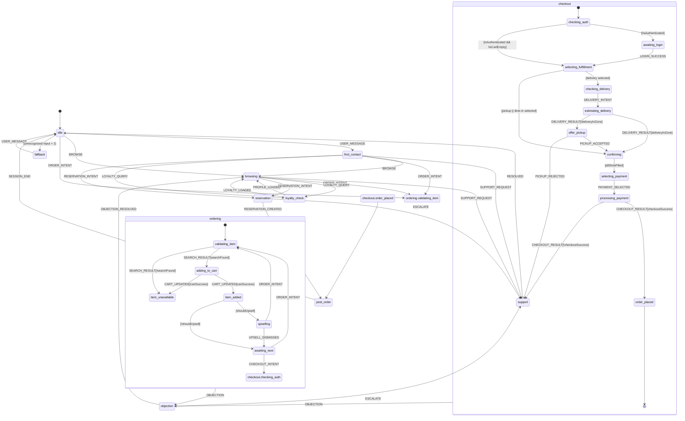

# Hybrid State-Flow Architecture

The IbateXas WhatsApp/Web chatbot is driven by a **4-layer pipeline** built on XState v5. This document describes why the architecture exists, how each layer behaves, and where every file lives.

---

## Why We Moved Away from Monolithic Prompts

The original approach sent a single large system prompt (~3,400 tokens) on every turn containing the full menu, business rules, cart state, customer profile, and ordering logic. This caused three compounding problems:

1. **Cost.** Every turn burned the full token budget regardless of what the customer was actually doing.
2. **Hallucination surface.** The LLM had both the facts and the authority to act on them. It could invent stock levels, generate prices, or skip checkout validation.
3. **Untestable control flow.** Branching logic lived inside prose instructions. There was no way to unit-test whether the agent would ask for auth before checkout or enforce the cart-is-not-empty guard.

The Hybrid State-Flow architecture separates concerns cleanly:

- **Business decisions** are made by the XState machine (deterministic, testable).
- **Natural language generation** is the only job the LLM has.
- **Context sent to the LLM** is a small synthesized prompt (~200–400 tokens) that describes only the current state.

---

## Architecture Overview



**Router** classifies the raw message text into a `MachineEvent` using keyword regex — it does not call the LLM. The **Machine** transitions state, runs guards, and fires actions that call domain tools. Tool results return as internal events. The **Prompt Synthesizer** maps the resulting machine snapshot to a minimal prompt. The **LLM** receives only that prompt and produces the customer-facing response.

The LLM never makes business decisions. It never calls cart or checkout tools directly.

---

## State Diagram



---

## Machine Events

All events flow through the machine. Internal events (returned by tool actions) are never sent by the LLM or the customer.

| Event | Origin | Key payload fields |
|---|---|---|
| `USER_MESSAGE` | Customer input | `text: string`, `sessionId: string`, `channel: "whatsapp" \| "web"` |
| `BROWSE` | Router | `query?: string` |
| `ORDER_INTENT` | Router | `rawText: string` |
| `CHECKOUT_INTENT` | Router | — |
| `LOYALTY_QUERY` | Router | — |
| `RESERVATION_INTENT` | Router | `date?: string`, `partySize?: number` |
| `SUPPORT_REQUEST` | Router | `reason?: string` |
| `PAYMENT_SELECTED` | Router | `method: "pix" \| "card" \| "cash"` |
| `UPSELL_DISMISSED` | Router | — |
| `DELIVERY_INTENT` | Router | `cep: string` |
| `PICKUP_ACCEPTED` | Router | `pickupTime?: string` |
| `PICKUP_REJECTED` | Router | — |
| `OBJECTION` | Router | `text: string` |
| `OBJECTION_RESOLVED` | Router | — |
| `ESCALATE` | Router | `reason?: string` |
| `SESSION_END` | Router | — |
| `RESERVATION_CREATED` | Router | `reservationId: string` |
| `SEARCH_RESULT` | Internal (action) | `products: Product[]`, `found: boolean` |
| `CART_UPDATED` | Internal (action) | `success: boolean`, `cart: Cart` |
| `DELIVERY_RESULT` | Internal (action) | `deliverable: boolean`, `zone?: string`, `fee?: number`, `estimatedMinutes?: number` |
| `CHECKOUT_RESULT` | Internal (action) | `success: boolean`, `orderId?: string`, `paymentMethod?: string`, `pixQrCode?: string` |
| `PROFILE_LOADED` | Internal (action) | `profile: CustomerProfile` |
| `LOYALTY_LOADED` | Internal (action) | `balance: number`, `tier: string` |
| `LOGIN_SUCCESS` | Internal (action) | `customerId: string`, `token: string` |

---

## Guard Conditions

Guards are pure functions evaluated synchronously. They read only from the machine context — no async I/O.

| Guard | Logic | Data source |
|---|---|---|
| `isAuthenticated` | `ctx.customerId !== null` | Machine context, set by `LOGIN_SUCCESS` |
| `isWhatsApp` | `ctx.channel === "whatsapp"` | Machine context, set at session start |
| `canCheckout` | `!isCartEmpty && isAuthenticated` | Derived from context fields |
| `isCartEmpty` | `ctx.cart.items.length === 0` | Machine context, synced by `CART_UPDATED` |
| `allSlotsFilled` | `ctx.fulfillment.type !== null && (type !== "delivery" \|\| ctx.fulfillment.addressId !== null)` | Machine context |
| `shouldUpsell` | `ctx.cart.items.length < 3 && ctx.upsellSuggestions.length > 0` | Machine context |
| `searchFound` | `event.found === true && event.products.length > 0` | `SEARCH_RESULT` event payload |
| `cartSuccess` | `event.success === true` | `CART_UPDATED` event payload |
| `deliveryInZone` | `event.deliverable === true` | `DELIVERY_RESULT` event payload |
| `checkoutSuccess` | `event.success === true` | `CHECKOUT_RESULT` event payload |

---

## Actions (Side Effects)

Actions are fired on state entry or transitions. Each action calls one tool from `@ibatexas/tools`, then sends an internal event back to the machine.

| Action | Trigger | Tool called | Internal event sent |
|---|---|---|---|
| `searchProducts` | Entry: `ordering.validating_item` | `search_products` | `SEARCH_RESULT` |
| `addItemToCart` | Entry: `ordering.adding_to_cart` | `add_to_cart` | `CART_UPDATED` |
| `fetchUpsells` | Entry: `ordering.item_added` | `get_also_added` | — (stored in context) |
| `estimateDelivery` | Entry: `checkout.estimating_delivery` | `estimate_delivery` | `DELIVERY_RESULT` |
| `submitCheckout` | Entry: `checkout.processing_payment` | `create_checkout` | `CHECKOUT_RESULT` |
| `loadCustomerProfile` | Entry: `first_contact` (authenticated) | `get_customer_profile` | `PROFILE_LOADED` |
| `loadLoyaltyBalance` | Entry: `loyalty_check` | `get_loyalty_balance` | `LOYALTY_LOADED` |
| `persistSnapshot` | Any state transition | Redis write | — |
| `publishCartEvent` | On `CART_UPDATED[success]` | NATS `cart.item_added` | — |
| `publishOrderEvent` | On `CHECKOUT_RESULT[success]` | NATS `order.placed` | — |

---

## Prompt Synthesizer Map

The synthesizer (`packages/llm-provider/src/prompt-synthesizer.ts`) reads the current machine state and context, then builds a minimal prompt from named sections (`packages/llm-provider/src/prompt-sections.ts`). The LLM never receives the full business ruleset — only what is relevant to the current state.

| State | Sections included | Approximate tokens |
|---|---|---|
| `idle` | greeting, channel_context | ~60 |
| `first_contact` | greeting, profile_summary, opening_offer | ~120 |
| `browsing` | catalog_context, profile_summary, available_products | ~200–300 |
| `ordering.validating_item` | search_result, out_of_stock_notice? | ~80 |
| `ordering.adding_to_cart` | cart_confirmation, item_details | ~80 |
| `ordering.item_added` | cart_summary, upsell_prompt? | ~100 |
| `ordering.item_unavailable` | unavailable_notice, alternatives | ~100 |
| `ordering.upselling` | upsell_suggestions, cart_summary | ~120 |
| `ordering.awaiting_next` | cart_summary, next_action_prompt | ~80 |
| `checkout.checking_auth` | auth_required_notice | ~60 |
| `checkout.awaiting_login` | otp_prompt | ~60 |
| `checkout.selecting_fulfillment` | fulfillment_options, cart_summary | ~120 |
| `checkout.checking_delivery` | cep_request | ~40 |
| `checkout.estimating_delivery` | delivery_estimate | ~80 |
| `checkout.offer_pickup` | out_of_zone_notice, pickup_offer | ~100 |
| `checkout.confirming` | order_summary, total_with_fee | ~150 |
| `checkout.selecting_payment` | payment_options | ~80 |
| `checkout.processing_payment` | processing_notice | ~40 |
| `checkout.order_placed` | order_confirmation, payment_instructions? | ~150 |
| `post_order` | followup_prompt, review_request? | ~80 |
| `reservation` | reservation_flow, slot_options | ~150 |
| `loyalty_check` | loyalty_balance, tier_summary | ~100 |
| `objection` | objection_handling | ~80 |
| `support` | handoff_notice | ~60 |
| `fallback` | clarification_request | ~60 |

Total per-turn token budget: **200–400 tokens** vs the prior ~3,400 tokens. Token savings exceed 88% on average turns.

---

## Tools Available by State

Cart and checkout tools are invoked exclusively by machine actions. They are **never exposed to the LLM**. The LLM's tool list is restricted per state.

| State | LLM-accessible tools |
|---|---|
| `idle` | — |
| `first_contact` | `get_recommendations` |
| `browsing` | `search_products`, `get_product_details`, `get_nutritional_info`, `get_recommendations`, `get_also_added` |
| `ordering.*` | `get_product_details`, `get_nutritional_info`, `check_inventory` |
| `checkout.selecting_fulfillment` | — |
| `checkout.offer_pickup` | — |
| `checkout.confirming` | `apply_coupon` |
| `checkout.selecting_payment` | — |
| `checkout.order_placed` | `check_order_status` |
| `post_order` | `check_order_status`, `get_recommendations`, `submit_review` |
| `reservation` | `check_table_availability`, `create_reservation`, `modify_reservation`, `cancel_reservation`, `get_my_reservations`, `join_waitlist` |
| `loyalty_check` | `get_customer_profile` |
| `support` | `handoff_to_human`, `check_order_status`, `cancel_order` |
| `objection` | `get_product_details`, `get_recommendations` |
| `fallback` | — |

Machine-controlled tools (never exposed to LLM): `add_to_cart`, `update_cart`, `remove_from_cart`, `create_checkout`, `estimate_delivery`.

---

## Redis Persistence

The machine snapshot is serialized to Redis on every state transition so that a WhatsApp session can resume across process restarts, webhook retries, and horizontal scaling.

**Key pattern:** `wa:machine:{sessionId}` (uses `rk()` from `@ibatexas/tools`)

**TTL:** 24 hours — matches the typical WhatsApp session window. Shorter than the 48-hour guest session TTL so that stale machine state does not block re-entry.

**Serialization contract:**

```
{
  "state": "checkout.selecting_payment",
  "context": {
    "sessionId": "sess_abc123",
    "customerId": "cust_xyz",
    "channel": "whatsapp",
    "cart": { "items": [...], "subtotal": 8900 },
    "fulfillment": { "type": "delivery", "addressId": "addr_1" },
    "upsellSuggestions": [],
    "lastMessageAt": "2026-03-27T14:00:00Z"
  },
  "history": ["idle", "first_contact", "browsing", "ordering.validating_item", ...]
}
```

**Persistence handler:** `packages/llm-provider/src/machine/persistence.ts`

On session resume, the machine is rehydrated with `createActor(orderMachine, { snapshot })`. If no snapshot exists, the machine starts from `idle`.

**Failure handling:** If Redis is unavailable (circuit breaker open), the machine runs in-memory for the current turn and logs a warning. The snapshot is not written. On next turn, the machine restarts from `idle` — a degraded but safe fallback.

---

## Code References

| File | Role |
|---|---|
| `packages/llm-provider/src/machine/order-machine.ts` | XState machine definition — states, transitions, guards, actions |
| `packages/llm-provider/src/machine/types.ts` | `MachineContext`, `MachineEvent` union, `MachineState` type |
| `packages/llm-provider/src/machine/guards.ts` | All guard functions (pure, no I/O) |
| `packages/llm-provider/src/machine/actions.ts` | All action implementations (async tool calls + internal event dispatch) |
| `packages/llm-provider/src/machine/persistence.ts` | Snapshot serialization/deserialization via `rk()` + Redis |
| `packages/llm-provider/src/router.ts` | Keyword regex classifier — raw text → `MachineEvent` |
| `packages/llm-provider/src/prompt-synthesizer.ts` | State snapshot → minimal prompt string |
| `packages/llm-provider/src/prompt-sections.ts` | Named prompt section builders |
| `packages/llm-provider/src/agent.ts` | Top-level pipeline: Router → Machine → Synthesizer → LLM |
| `packages/llm-provider/src/tool-registry.ts` | Per-state tool allow-list enforcement |
