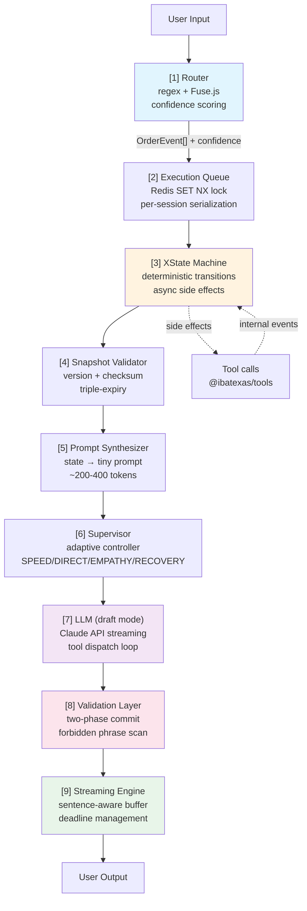
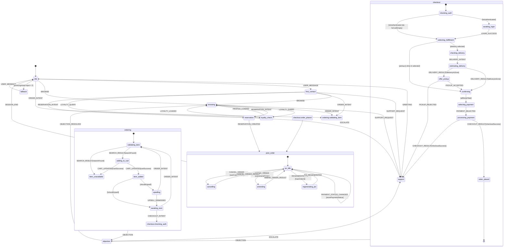

# Hybrid State-Flow Architecture

The IbateXas WhatsApp/Web chatbot is driven by a **10-layer deterministic pipeline** built on XState v5, with verified execution, adaptive runtime, and observability. This document describes why the architecture exists, how each layer behaves, and where every file lives.

---

## Design Principles

1. **Business decisions** are made by the XState machine (deterministic, testable).
2. **Natural language generation** is the LLM's only job — it never transitions state.
3. **Context sent to the LLM** is a small synthesized prompt (~200–400 tokens/turn, 88% savings vs monolithic).
4. **Every confirmation is verified** — the LLM cannot tell the user "order confirmed" unless a tool actually succeeded.
5. **Sessions are zero-trust** — signed HMAC tokens, distributed locks, triple-expiry lifecycle.
6. **Failures are contained** — circuit breakers, deterministic fallbacks, graceful truncation.
7. **Zero-Trust LLM** — the LLM is a semantic parser with zero authority. It proposes intents; the Machine decides and executes. Mutating tools are physically blocked from LLM execution via a discriminated union gate in the tool registry.

---

## Architecture Overview (10-Layer Pipeline)

```
User Input
   |
   v
[1] Router (deterministic + confidence scoring)
   |  keyword regex + Fuse.js fuzzy matching
   |  outputs: OrderEvent[] with confidence 0.0-1.0
   v
[2] Execution Queue (per-session serialization)
   |  Redis SET NX lock (WhatsApp: agent lock + heartbeat)
   |  (Web: distributed lock + heartbeat, 30s TTL)
   v
[3] State Machine (XState v5)
   |  deterministic transitions, guards, async side effects
   |  LLM FORBIDDEN from triggering transitions
   v
[4] Snapshot Validator (versioned + checksummed)
   |  version check, SHA-256 checksum, triple-expiry:
   |    - sliding (30min idle)
   |    - absolute (4h max)
   |    - deploy (version mismatch)
   v
[5] Prompt Synthesizer (state -> tiny prompt)
   |  state-specific template + cart summary + menu
   |  state-gated tool filtering (checkout = NO tools)
   v
[6] Supervisor (adaptive runtime controller)
   |  pure heuristics (<50ms), no LLM call
   |  modes: SPEED / DIRECT / EMPATHY / RECOVERY
   |  confidence-gated: >=0.8 all, >=0.5 tone only, <0.5 ignore
   v
[7] LLM (draft mode when tools available)
   |  Claude API with streaming
   |  post-checkout: deterministic fallback if LLM fails
   v
[8] Validation Layer (two-phase language commit)
   |  BUFFER text when tools are in play
   |  if stop_reason=tool_use: DISCARD pre-tool text
   |  if stop_reason=end_turn: VALIDATE against forbidden phrases, COMMIT
   |  forbidden: "pedido cancelado/confirmado/registrado" before tool result
   v
[9] Streaming Engine (sentence-aware + abortable)
   |  TTFB: 800ms typing indicator
   |  Soft deadline: 2.5s (compress responses)
   |  Hard deadline: 4s (abort + "..." truncation marker)
   |  Partial-text guard: no franken-responses
   v
User Output
```



---

## State Diagram



---

## Machine Events

All events flow through the machine. Internal events (returned by tool actions) are never sent by the LLM or the customer.

| Event | Origin | Key payload fields |
|---|---|---|
| `USER_MESSAGE` | Customer input | `text: string`, `sessionId: string`, `channel: "whatsapp" \| "web"` |
| `BROWSE` | Router | `query?: string` |
| `ORDER_INTENT` | Router | `rawText: string` |
| `CHECKOUT_INTENT` | Router | — |
| `LOYALTY_QUERY` | Router | — |
| `RESERVATION_INTENT` | Router | `date?: string`, `partySize?: number` |
| `SUPPORT_REQUEST` | Router | `reason?: string` |
| `PAYMENT_SELECTED` | Router | `method: "pix" \| "card" \| "cash"` |
| `UPSELL_DISMISSED` | Router | — |
| `DELIVERY_INTENT` | Router | `cep: string` |
| `PICKUP_ACCEPTED` | Router | `pickupTime?: string` |
| `PICKUP_REJECTED` | Router | — |
| `OBJECTION` | Router | `text: string` |
| `OBJECTION_RESOLVED` | Router | — |
| `ESCALATE` | Router | `reason?: string` |
| `SESSION_END` | Router | — |
| `RESERVATION_CREATED` | Router | `reservationId: string` |
| `SEARCH_RESULT` | Internal (action) | `products: Product[]`, `found: boolean` |
| `CART_UPDATED` | Internal (action) | `success: boolean`, `cart: Cart` |
| `DELIVERY_RESULT` | Internal (action) | `deliverable: boolean`, `zone?: string`, `fee?: number`, `estimatedMinutes?: number` |
| `CHECKOUT_RESULT` | Internal (action) | `success: boolean`, `orderId?: string`, `paymentMethod?: string`, `pixQrCode?: string` |
| `PROFILE_LOADED` | Internal (action) | `profile: CustomerProfile` |
| `LOYALTY_LOADED` | Internal (action) | `balance: number`, `tier: string` |
| `LOGIN_SUCCESS` | Internal (action) | `customerId: string`, `token: string` |
| `CANCEL_ORDER_RESULT` | Internal (kernel) | `success: boolean`, `message: string` |
| `AMEND_ORDER_RESULT` | Internal (kernel) | `success: boolean`, `message: string` |
| `PIX_REGENERATED` | Internal (kernel) | `success: boolean`, `pixQrCodeText?: string` |

---

## Guard Conditions

Guards are pure functions evaluated synchronously. They read only from the machine context — no async I/O.

| Guard | Logic | Data source |
|---|---|---|
| `isAuthenticated` | `ctx.customerId !== null` | Machine context, set by `LOGIN_SUCCESS` |
| `isWhatsApp` | `ctx.channel === "whatsapp"` | Machine context, set at session start |
| `canCheckout` | `!isCartEmpty && isAuthenticated` | Derived from context fields |
| `isCartEmpty` | `ctx.cart.items.length === 0` | Machine context, synced by `CART_UPDATED` |
| `allSlotsFilled` | `ctx.fulfillment.type !== null && (type !== "delivery" \|\| ctx.fulfillment.addressId !== null)` | Machine context |
| `shouldUpsell` | `ctx.cart.items.length < 3 && ctx.upsellSuggestions.length > 0` | Machine context |
| `searchFound` | `event.found === true && event.products.length > 0` | `SEARCH_RESULT` event payload |
| `cartSuccess` | `event.success === true` | `CART_UPDATED` event payload |
| `deliveryInZone` | `event.deliverable === true` | `DELIVERY_RESULT` event payload |
| `checkoutSuccess` | `event.success === true` | `CHECKOUT_RESULT` event payload |
| `canCancelOrder` | `ctx.orderId !== null && ctx.lastAction !== "cancelled"` | Machine context |
| `canAmendOrder` | `ctx.orderId !== null && ctx.lastAction !== "cancelled"` | Machine context |
| `hasOrderId` | `ctx.orderId !== null` | Machine context |

---

## Actions (Side Effects)

Actions are fired on state entry or transitions. Each action calls one tool from `@ibatexas/tools`, then sends an internal event back to the machine.

| Action | Trigger | Tool called | Internal event sent |
|---|---|---|---|
| `searchProducts` | Entry: `ordering.validating_item` | `search_products` | `SEARCH_RESULT` |
| `addItemToCart` | Entry: `ordering.adding_to_cart` | `add_to_cart` | `CART_UPDATED` |
| `fetchUpsells` | Entry: `ordering.item_added` | `get_also_added` | — (stored in context) |
| `estimateDelivery` | Entry: `checkout.estimating_delivery` | `estimate_delivery` | `DELIVERY_RESULT` |
| `submitCheckout` | Entry: `checkout.processing_payment` | `create_checkout` | `CHECKOUT_RESULT` |
| `loadCustomerProfile` | Entry: `first_contact` (authenticated) | `get_customer_profile` | `PROFILE_LOADED` |
| `loadLoyaltyBalance` | Entry: `loyalty_check` | `get_loyalty_balance` | `LOYALTY_LOADED` |
| `persistSnapshot` | Any state transition | Redis write | — |
| `publishCartEvent` | On `CART_UPDATED[success]` | NATS `cart.item_added` | — |
| `publishOrderEvent` | On `CHECKOUT_RESULT[success]` | NATS `order.placed` | — |

---

## Prompt Synthesizer Map

The synthesizer (`packages/llm-provider/src/prompt-synthesizer.ts`) reads the current machine state and context, then builds a minimal prompt from named sections (`packages/llm-provider/src/prompt-sections.ts`). The LLM never receives the full business ruleset — only what is relevant to the current state.

| State | Sections included | Approximate tokens |
|---|---|---|
| `idle` | greeting, channel_context | ~60 |
| `first_contact` | greeting, profile_summary, opening_offer | ~120 |
| `browsing` | catalog_context, profile_summary, available_products | ~200–300 |
| `ordering.validating_item` | search_result, out_of_stock_notice? | ~80 |
| `ordering.adding_to_cart` | cart_confirmation, item_details | ~80 |
| `ordering.item_added` | cart_summary, upsell_prompt? | ~100 |
| `ordering.item_unavailable` | unavailable_notice, alternatives | ~100 |
| `ordering.upselling` | upsell_suggestions, cart_summary | ~120 |
| `ordering.awaiting_next` | cart_summary, next_action_prompt | ~80 |
| `checkout.checking_auth` | auth_required_notice | ~60 |
| `checkout.awaiting_login` | otp_prompt | ~60 |
| `checkout.selecting_fulfillment` | fulfillment_options, cart_summary | ~120 |
| `checkout.checking_delivery` | cep_request | ~40 |
| `checkout.estimating_delivery` | delivery_estimate | ~80 |
| `checkout.offer_pickup` | out_of_zone_notice, pickup_offer | ~100 |
| `checkout.confirming` | order_summary, total_with_fee | ~150 |
| `checkout.selecting_payment` | payment_options | ~80 |
| `checkout.processing_payment` | processing_notice | ~40 |
| `checkout.order_placed` | order_confirmation, payment_instructions? | ~150 |
| `post_order` | followup_prompt, review_request? | ~80 |
| `reservation` | reservation_flow, slot_options | ~150 |
| `loyalty_check` | loyalty_balance, tier_summary | ~100 |
| `objection` | objection_handling | ~80 |
| `support` | handoff_notice | ~60 |
| `fallback` | clarification_request | ~60 |

Total per-turn token budget: **200–400 tokens** vs the prior ~3,400 tokens. Token savings exceed 88% on average turns.

---

## Tools Available by State

Cart and checkout tools are invoked exclusively by machine actions. They are **never exposed to the LLM**. The LLM's tool list is restricted per state.

| State | LLM-accessible tools |
|---|---|
| `idle` | — |
| `first_contact` | `get_recommendations` |
| `browsing` | `search_products`, `get_product_details`, `get_nutritional_info`, `get_recommendations`, `get_also_added` |
| `ordering.*` | `get_product_details`, `get_nutritional_info`, `check_inventory` |
| `checkout.selecting_fulfillment` | — |
| `checkout.offer_pickup` | — |
| `checkout.confirming` | `apply_coupon` |
| `checkout.selecting_payment` | — |
| `checkout.order_placed` | `check_order_status` |
| `post_order` | `check_order_status`, `check_payment_status`, `get_loyalty_balance`, `search_products` |
| `reorder` | `get_order_history`, `search_products` |
| `reservation` | `check_table_availability`, `get_my_reservations` |
| `loyalty_check` | `get_customer_profile` |
| `support` | `check_order_status` |
| `objection` | `get_product_details`, `get_recommendations` |
| `fallback` | — |

Machine-controlled tools (never exposed to LLM): `add_to_cart`, `update_cart`, `remove_from_cart`, `create_checkout`, `estimate_delivery`, `cancel_order`, `amend_order`, `regenerate_pix`, `reorder`, `create_reservation`, `modify_reservation`, `cancel_reservation`, `join_waitlist`, `submit_review`, `update_preferences`, `handoff_to_human`, `schedule_follow_up`, `set_pix_details`, `apply_coupon`.

---

## Redis Persistence

The machine snapshot is serialized to Redis on every state transition so that a WhatsApp session can resume across process restarts, webhook retries, and horizontal scaling.

**Key pattern:** `wa:machine:{sessionId}` (uses `rk()` from `@ibatexas/tools`)

**TTL:** 24 hours — matches the typical WhatsApp session window. Shorter than the 48-hour guest session TTL so that stale machine state does not block re-entry.

**Serialization contract:**

```
{
  "state": "checkout.selecting_payment",
  "context": {
    "sessionId": "sess_abc123",
    "customerId": "cust_xyz",
    "channel": "whatsapp",
    "cart": { "items": [...], "subtotal": 8900 },
    "fulfillment": { "type": "delivery", "addressId": "addr_1" },
    "upsellSuggestions": [],
    "lastMessageAt": "2026-03-27T14:00:00Z"
  },
  "history": ["idle", "first_contact", "browsing", "ordering.validating_item", ...]
}
```

**Persistence handler:** `packages/llm-provider/src/machine/persistence.ts`

On session resume, the machine is rehydrated with `createActor(orderMachine, { snapshot })`. If no snapshot exists, the machine starts from `idle`.

**Failure handling:** If Redis is unavailable, `persistMachineState` retries once. If both attempts fail, the error is re-thrown to the caller (kernel executor) so it can emit a warning to the consumer. The machine does NOT silently lose state.

---

## Layer Details

### Layer 1: Router (Deterministic + Confidence)

**File:** `packages/llm-provider/src/router.ts`

The router classifies raw message text into `OrderEvent[]` using keyword regex and Fuse.js fuzzy matching. It never calls the LLM.

**Confidence scoring:**
- Exact regex match: `confidence: 1.0`
- Fuse.js fuzzy match: `confidence: 1 - fuseScore` (Fuse returns 0 = perfect, 1 = worst)
- UNKNOWN_INPUT fallback: `confidence: 0.0`

**Fast path detection:** Complete orders like "costela 500g retirada pix" emit `[ADD_ITEM, SET_FULFILLMENT, SET_PAYMENT, CHECKOUT_START]` in a single pass — the machine reaches `post_order` in one turn.

---

### Layer 2: Execution Queue (Per-Session Serialization)

**Files:** `apps/api/src/streaming/execution-queue.ts`, `apps/api/src/whatsapp/session.ts`

Prevents concurrent agent runs that corrupt session history.

| Channel | Mechanism | Key | TTL |
|---------|-----------|-----|-----|
| WhatsApp | `SET NX` + 10s heartbeat | `{env}:wa:agent:{phoneHash}` | 30s |
| Web | `SET NX` + 10s heartbeat | `{env}:web:agent:{sessionId}` | 30s |

Both channels use ownership-based lock release (Lua conditional DEL with UUID lock values) to prevent cascading lock breaches.

**WhatsApp extras:** 2s debounce batches rapid messages; post-lock re-check catches messages that arrived during agent execution.

---

### Layer 3: Session Security (Zero-Trust)

**File:** `packages/tools/src/session/signed-claims.ts`

Web sessions use HMAC-SHA256 signed tokens:

```
token = sessionId.customerId.issuedAt.HMAC_SHA256(payload, SECRET)
```

- POST handler verifies `x-session-token` header before running agent
- Redis ownership check prevents session hijacking
- Tokens expire after 24 hours
- Timing-safe comparison prevents timing attacks

**Env var:** `SESSION_HMAC_SECRET`

---

### Layer 4: Snapshot Validator (Versioned + Checksummed)

**File:** `packages/llm-provider/src/machine/persistence.ts`

Machine snapshots are wrapped with metadata:

```json
{
  "version": 1,
  "checksum": "sha256(context)[0:16]",
  "persistedAt": "2026-03-30T...",
  "createdAt": "2026-03-30T...",
  "snapshot": { "value": "ordering.awaiting_next", "context": {...} }
}
```

**Triple-expiry model:**

| Rule | Threshold | Action |
|------|-----------|--------|
| Idle | 30min since `persistedAt` | Discard snapshot |
| Absolute | 4h since `createdAt` | Force reset |
| Deploy | `version !== SNAPSHOT_VERSION` | Discard snapshot |
| Corruption | Checksum mismatch | Discard + log anomaly |

**Recovery UX:** When a stale snapshot had cart items, the agent yields a friendly message: "Sua sessao anterior expirou, mas estou aqui pra te ajudar de novo!"

**Legacy handling:** Snapshots without a wrapper (pre-upgrade) are silently discarded.

**Context migration:** On snapshot load, the context is merged with `createDefaultContext()` to fill any fields added by schema evolution. This prevents `undefined` values from bypassing guards that check for `null`.

---

### Layer 5: Prompt Synthesizer

**File:** `packages/llm-provider/src/prompt-synthesizer.ts`

Maps machine state + context to a minimal prompt (~200-400 tokens). See the [Prompt Synthesizer Map](#prompt-synthesizer-map) section below for the full state-to-prompt mapping.

**Vocabulary gates (anti-hallucination):**
- Empty cart: "NUNCA diga 'pedido registrado', 'pedido encaminhado', 'confirmacao em instantes'"
- Post-order: "NUNCA confirme cancelamento ou alteracao antes do resultado da ferramenta"
- PIX: "OBRIGATORIO: inclua o codigo PIX copia-e-cola COMPLETO"
- Closed hours: "NUNCA aceite encomenda fresca para outro horario"

**Zero-authority prompts:** All system prompts use "translator/presenter" language, never "executor" language. The LLM is instructed: "Você NÃO executa ações — o sistema processa tudo automaticamente." No "CHAME" (call) directives for mutating tools. Read-only tools use "consulte" (consult).

---

### Layer 6: Supervisor (Adaptive Runtime Controller)

**File:** `packages/llm-provider/src/supervisor.ts`

Pure heuristics (<50ms, no LLM call). Selects an operating mode that modifies the synthesized prompt.

| Mode | Trigger | Verbosity | Example |
|------|---------|-----------|---------|
| EMPATHY_MODE | First contact + new customer, or frustration detected | 1.0 | "Seja caloroso e acolhedor" |
| RECOVERY_MODE | `fallbackCount >= 2` | 1.0 | "Reconecte com o cliente" |
| DIRECT_MODE | Cart + all slots filled, or `latency < 2s` | 0.5-0.7 | "Va direto ao ponto" |
| SPEED_MODE | High momentum + short msg, or `latency < 1s`, or 1-word msg | 0.5-0.6 | "Seja mais conciso" |

**Confidence-gated modifier application:**
- `>= 0.8`: Apply all modifiers (tone + verbosity)
- `>= 0.5`: Apply tone adjustment only
- `< 0.5`: Ignore modifiers entirely

**Failure safe:** If supervisor throws, the system continues with default SPEED_MODE.

---

### Layer 7: LLM (Draft Mode)

**File:** `packages/llm-provider/src/llm-responder.ts`

Multi-turn tool use loop with max 5 turns and 3 retries per tool.

**When tools are available in buffered states** (`post_order`, `reorder`): LLM output goes to an internal buffer instead of streaming live. This is the "draft" phase of the two-phase commit.

**When no tools are available** (e.g., checkout states): Text streams live with zero TTFB penalty.

**Post-checkout fallback:** If LLM fails after a successful checkout, a deterministic confirmation message is generated from the machine context. The customer always gets their order number.

**Token budget:** 100K tokens/day per session. Mid-checkout sessions bypass the budget gate.

**Zero-Trust tool classification:**
- READ_ONLY tools (15): execute immediately when LLM calls them. Results returned to LLM.
- MUTATING tools (19): `executeTool()` returns `{ kind: "intent" }` instead of executing. The LLM receives "intent_registered" — the kernel handles execution deterministically.

**Tool intent bridge:** `packages/llm-provider/src/tool-registry.ts` — `TOOL_CLASSIFICATION` constant classifies all 34 tools. `executeTool()` gates on classification; `executeToolDirect()` is for kernel-only use.

---

### Layer 8: Validation Layer (Two-Phase Language Commit)

**File:** `packages/llm-provider/src/validation-layer.ts`

**Draft → Validate → Commit pipeline:**

1. **Draft:** When tools are available, LLM text goes to buffer (not streamed).
2. **Validate:** On `stop_reason`:
   - `tool_use`: Discard buffer (pre-tool hallucination). Log warning.
   - `end_turn`: Scan buffer against forbidden phrase regex. Strip violations. Commit clean text.
3. **Commit:** Only validated text is streamed to the consumer.

**Forbidden phrases by state:**

| State | Forbidden |
|-------|-----------|
| `post_order` | "pedido cancelado/alterado/confirmado/registrado/finalizado/encaminhado/enviado", "cancelamento/alteracao confirmada" |
| `ordering.*` | "pedido registrado/confirmado/finalizado/encaminhado", "confirmacao em instantes" |

**No-tools fast path:** When the state has zero available tools (checkout, idle), buffering is skipped entirely. No TTFB penalty.

---

### Layer 9: Streaming Engine (Sentence-Aware + Abortable)

**File:** `packages/llm-provider/src/orchestrator.ts`

Wraps the entire pipeline with latency management:

| Deadline | Threshold | Behavior |
|----------|-----------|----------|
| TTFB | 800ms | Emit "So um instante..." typing indicator |
| Soft | 2.5s | Flag for response compression (future: reduce `max_tokens`) |
| Hard | 4.0s | `Promise.race` — abort pipeline, yield truncation marker |

**Hard deadline behavior:**
- If text already emitted: yield `"..."` + `done` (truncation marker)
- If no text emitted: yield state-aware deterministic fallback

**Partial-text guard:** If text was already streamed before the deadline, the orchestrator does NOT append a fallback message. A partial response is better than a frankenresponse.

---

### Observability Layer

**Files:** `packages/tools/src/tracing/trace.ts`, `packages/tools/src/replay/store.ts`

**Distributed tracing:**
- Every pipeline run gets a `traceId` (12-char UUID)
- Spans track: router, kernel, synthesizer, LLM, tool execution
- Trace summaries persisted to Redis: `{env}:trace:{traceId}` (1h TTL)

**Deterministic replay:**
- Full pipeline input/output captured: message, state, synthesized prompt, tool calls, LLM output
- Stored in Redis: `{env}:replay:{traceId}` (24h TTL)
- Enables post-mortem bug reproduction

**Contract violation logging:**
- Forbidden phrase attempts logged with state, text, and pattern
- Pre-tool text discards logged with truncated content

---

## Redis Keys (Complete)

| Key | Type | TTL | Layer |
|-----|------|-----|-------|
| `{env}:session:{sessionId}` | List | 24-48h | Session store |
| `{env}:session:owner:{sessionId}` | String | 24h | Session security |
| `{env}:session:lastActivity:{sessionId}` | String | 24h | Idle rotation (web) |
| `{env}:web:agent:{sessionId}` | String (NX) | 30s | Execution queue (web) |
| `{env}:wa:agent:{phoneHash}` | String (NX) | 30s | Execution queue (WhatsApp) |
| `{env}:wa:phone:{phoneHash}` | Hash | 24h | WhatsApp session |
| `{env}:wa:debounce:{phoneHash}` | String (NX) | 2s | Message batching |
| `{env}:wa:dedup:{hash}` | String (NX) | 5min | Message deduplication |
| `{env}:wa:machine:{sessionId}` | String (JSON) | 24h | Machine snapshot (versioned) |
| `{env}:cart:active:session:{sessionId}` | String | 24h | Active cart binding |
| `{env}:llm:tokens:{sessionId}` | String (counter) | 24h | Token budget |
| `{env}:trace:{traceId}` | String (JSON) | 1h | Pipeline traces |
| `{env}:replay:{traceId}` | String (JSON) | 24h | Replay entries |

---

## Code References

| File | Role |
|---|---|
| **Pipeline orchestration** | |
| `packages/llm-provider/src/agent.ts` | Top-level 10-layer pipeline orchestrator |
| `packages/llm-provider/src/orchestrator.ts` | Streaming engine — TTFB, soft/hard deadlines, truncation |
| `packages/llm-provider/src/llm-responder.ts` | LLM streaming loop — draft mode, tool dispatch, fallbacks |
| `packages/llm-provider/src/validation-layer.ts` | Two-phase language commit — buffer, validate, commit |
| `packages/llm-provider/src/supervisor.ts` | Adaptive runtime controller — mode selection, confidence gating |
| **State machine** | |
| `packages/llm-provider/src/machine/order-machine.ts` | XState machine definition — states, transitions, guards, actions |
| `packages/llm-provider/src/machine/types.ts` | `OrderEvent` (with confidence), `OrderContext`, `SynthesizedPrompt` |
| `packages/llm-provider/src/machine/actions.ts` | Async tool calls + internal event dispatch |
| `packages/llm-provider/src/machine/persistence.ts` | Versioned + checksummed snapshot persistence with triple-expiry |
| `packages/llm-provider/src/kernel-executor.ts` | Kernel — processes events through XState with timeouts |
| **Classification & synthesis** | |
| `packages/llm-provider/src/router.ts` | Keyword regex + Fuse.js classifier with confidence scoring |
| `packages/llm-provider/src/prompt-synthesizer.ts` | State snapshot → minimal prompt string |
| `packages/llm-provider/src/prompt-sections.ts` | Named prompt section builders (base voice, menu, guards) |
| `packages/llm-provider/src/tool-registry.ts` | Per-state tool allow-list enforcement |
| **Session & security** | |
| `packages/tools/src/session/signed-claims.ts` | HMAC-SHA256 signed session tokens |
| `apps/api/src/streaming/execution-queue.ts` | Redis distributed lock for web chat |
| `apps/api/src/streaming/emitter.ts` | In-process SSE bridge with chunk buffering |
| `apps/api/src/whatsapp/session.ts` | WhatsApp session resolution, idle rotation, agent lock |
| **Observability** | |
| `packages/tools/src/tracing/trace.ts` | Distributed tracing — spans, persistence, debugging |
| `packages/tools/src/replay/store.ts` | Deterministic replay store for post-mortem analysis |
| `packages/tools/src/redis/circuit-breaker.ts` | Redis circuit breaker (CLOSED/OPEN/HALF_OPEN) |
| **Routes** | |
| `apps/api/src/routes/chat.ts` | Web chat — signed claims, execution queue, SSE streaming |
| `apps/api/src/routes/whatsapp-webhook.ts` | WhatsApp — Twilio verification, debounce, agent lock |
