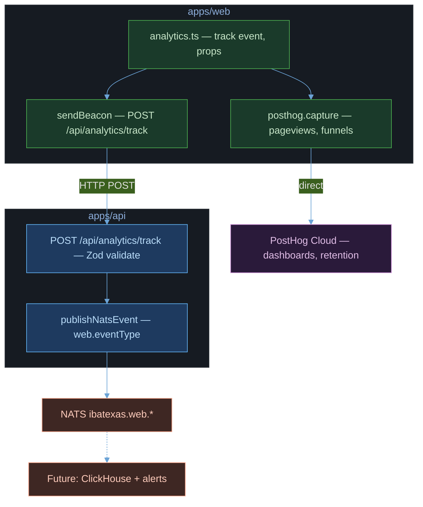

# Analytics & Dashboards

## Architecture



**Dual-channel delivery:**
- **PostHog** (client-side) — dashboards, funnels, session replay, retention analysis
- **NATS** (server-side via sendBeacon → API) — domain event bus for future ClickHouse, alerts, server-side consumers

---

## North Star Metric

**Revenue Per Session (RPS)** = `sum(checkout_completed.orderTotal) / count(distinct ibx_session_id)`

- Calculated in PostHog, NOT as `checkout_completed count / session_started count`
- `ibx_session_id` is registered as a PostHog super property on every event
- `session_started` fires lazily on first meaningful interaction (not on page load) to exclude bounced visitors from the denominator

---

## Event Taxonomy

### Session Events

| Event | Trigger | Properties |
|-------|---------|------------|
| `session_started` | First meaningful interaction (pdp_viewed, search_performed, add_to_cart, checkout_started) | `sessionId` |
| `$pageview` | Every route change (fired by PostHogProvider) | `$current_url` |

### Product Events

| Event | Trigger | Properties |
|-------|---------|------------|
| `pdp_viewed` | PDP page mount | `productId` |
| `pdp_scroll_depth` | Scroll thresholds on PDP | `productId`, `depth` (25\|50\|75\|100) |
| `storytelling_section_viewed` | Storytelling section enters viewport | `productId` |
| `product_card_clicked` | Click on ProductCard in grid | `productId` |
| `review_link_clicked` | Click on review count link | `productId` |

### Cart Events

| Event | Trigger | Properties |
|-------|---------|------------|
| `quick_add_clicked` | "+" button on ProductCard | `productId`, `source` |
| `add_to_cart` | Item added to cart | `productId`, `variantId`, `quantity`, `source` (pdp\|listing\|cross_sell) |
| `sticky_cta_used` | Mobile sticky CTA tap | `productId`, `quantity` |
| `cart_drawer_opened` | Cart drawer opens | — |
| `cart_abandonment_nudge` | Abandonment nudge shown to returning user with stale cart | `cartId`, `itemCount` |
| `cross_sell_viewed` | Cross-sell section enters viewport | `productId`, `suggestedIds[]` |
| `cross_sell_added` | Cross-sell item added to cart | `productId`, `suggestedId` |
| `also_added_viewed` | "Also added" section enters viewport (PDP) | `productId`, `suggestedIds[]` |
| `also_added_cart` | "Also added" item added to cart | `productId`, `suggestedId` |
| `homepage_recs_clicked` | User clicks a recommended product on homepage | `productId` |

### Conversion UX Events

| Event | Trigger | Properties |
|-------|---------|------------|
| `upsell_toast_shown` | Cross-sell upsell toast appears after add-to-cart | `productId`, `crossCategory` |
| `upsell_toast_added` | User adds the suggested product from upsell toast | `productId` |
| `upsell_toast_dismissed` | User dismisses upsell toast (or auto-dismiss) | `productId`, `auto` (boolean) |
| `quantity_changed_inline` | User changes quantity via inline controls on ProductCard | `productId`, `action` (increment\|decrement\|remove), `quantity` |
| `layout_toggled` | User toggles grid/list layout on search page | `layout` (grid\|list) |
| `combo_banner_clicked` | User clicks CTA on combo promotion banner | — |
| `review_section_viewed` | Homepage reviews section enters viewport | — |
| `people_also_ordered_added` | User adds a product from "People Also Ordered" section | `productId` |

### Reorder Events

| Event | Trigger | Properties |
|-------|---------|------------|
| `reorder_completed` | User re-orders from last order card | `orderId`, `itemCount` |

### Wishlist Events

| Event | Trigger | Properties |
|-------|---------|------------|
| `wishlist_toggled` | User adds/removes product from wishlist | `productId`, `action` (add\|remove) |

### Search Events

| Event | Trigger | Properties |
|-------|---------|------------|
| `search_performed` | Search query executed | `query`, `resultCount` |
| `filter_applied` | Filter/sort changed | `filterType` (tag\|category\|sort\|smart), `value` |
| `search_synonym_resolved` | User query matched a synonym and was auto-resolved | `original`, `canonical` |
| `trending_search_clicked` | User clicked a trending search pill | `term` |

### Checkout Events

| Event | Trigger | Properties |
|-------|---------|------------|
| `checkout_started` | Checkout page mount | `cartTotal`, `itemCount`, `deliveryType` |
| `checkout_step_completed` | Delivery estimate fetched | `step` (delivery), `cep` |
| `checkout_completed` | Payment success (guarded, fires once) | `orderId`, `orderTotal`, `itemCount`, `paymentMethod`, `currency` (BRL), `ibx_session_id` |
| `checkout_error` | Payment failure | `step`, `errorType`, `errorMessage`, `paymentMethod` |
| `checkout_abandoned` | Page unload before completion (supplementary) | `step`, `cartTotal` |

---

## KPI Targets (UX Redesign Baseline)

| KPI | Target | How to measure |
|-----|--------|----------------|
| Quick-add adoption | >= 20% of add_to_cart | `quick_add_clicked / add_to_cart` |
| AOV increase | +8-15% vs baseline | Average `checkout_completed.orderTotal` |
| Checkout completion | +5-10% vs baseline | Funnel: `checkout_started` -> `checkout_completed` |
| Cross-sell conversion | >= 5-10% of PDP views | `cross_sell_added / cross_sell_viewed` |
| PDP engagement | Storytelling reach > 60% | `storytelling_section_viewed / pdp_viewed` |
| Time to Add-to-Cart | Median decreasing | `pdp_viewed` -> `add_to_cart` time within session |
| Also-added conversion | >= 3-8% of PDP views | `also_added_cart / also_added_viewed` |
| Reorder rate | >= 15% of returning users | `reorder_completed` / returning sessions |
| Upsell toast conversion | >= 8-12% | `upsell_toast_added / upsell_toast_shown` |
| Inline quantity usage | Increasing trend | `quantity_changed_inline` volume |
| Review section reach | >= 40% of homepage visitors | `review_section_viewed / $pageview(/)` |
| People Also Ordered conv | >= 5% | `people_also_ordered_added / impressions` |

---

## PostHog Dashboards

### Dashboard 1: Executive - Daily Health

**Revenue Per Session (North Star) — PIN AT TOP:**
- Insight type: Trends
- Formula: `sum(checkout_completed.orderTotal)` / `count(distinct ibx_session_id)`
- Display: Daily trend line
- NOT `checkout_completed.orderTotal / unique session_started` — users can have multiple sessions per day

**Conversion Funnel:**
- Insight type: Funnel
- Steps: `pdp_viewed` -> `add_to_cart` -> `checkout_started` -> `checkout_completed`
- Breakdown by: source (pdp/listing/cross_sell), device type

**AOV (Average Order Value):**
- Insight type: Trends
- Formula: Average of `checkout_completed.orderTotal`
- Display: Daily trend

**Checkout Completion Rate:**
- Insight type: Funnel
- Steps: `checkout_started` -> `checkout_completed`
- Breakdown by: paymentMethod
- Note: `checkout_abandoned` via beforeunload is supplementary — funnel drop-off is the primary abandonment metric

### Dashboard 2: Product Behavior

**Add-to-Cart Rate:**
- `add_to_cart` events / `pdp_viewed` events
- Breakdown by source

**Time to Add-to-Cart (High Leverage):**
- Median time from `pdp_viewed` -> `add_to_cart` within same session
- Reveals: storytelling length, CTA placement, decision friction
- This is a silent conversion killer metric

**Quick-Add Usage:**
- `quick_add_clicked` / total `add_to_cart` events
- Target: >= 20%

**PDP Engagement:**
- `pdp_scroll_depth` distribution (25/50/75/100%)
- `storytelling_section_viewed` / `pdp_viewed` (storytelling reach)

**Cross-Sell Performance:**
- `cross_sell_added` / `cross_sell_viewed`
- Target: >= 5-10% of PDP views

**Also-Added Performance:**
- `also_added_cart` / `also_added_viewed`
- Target: >= 3-8% of PDP views
- Gated behind `recommendation_engine` feature flag

**Reorder Adoption:**
- `reorder_completed` volume and repeat rate
- Shows returning user stickiness

**Search Behavior:**
- `search_performed` volume + top queries
- `filter_applied` by filterType

**Upsell Toast Performance:**
- `upsell_toast_added` / `upsell_toast_shown` (conversion rate)
- Auto-dismiss vs manual dismiss ratio
- Revenue attributed to upsell adds

**Inline Quantity Controls:**
- `quantity_changed_inline` by action (increment vs decrement vs remove)
- Shows cart editing behavior without opening drawer

**People Also Ordered:**
- `people_also_ordered_added` volume
- Shows cross-sell effectiveness on menu page

**Homepage Reviews:**
- `review_section_viewed` reach (% of homepage visitors)

### Dashboard 3: Checkout & Revenue

**Checkout Funnel (detailed):**
- `checkout_started` -> `checkout_step_completed(delivery)` -> `checkout_completed`
- Drop-off by step

**Revenue by Payment Method:**
- `checkout_completed` broken down by `paymentMethod` (PIX / card / cash)

**Revenue by Source:**
- `checkout_completed` broken down by session's first `add_to_cart.source` (pdp / listing / cross_sell)

### WhatsApp Channel Events

| Event | Trigger | Properties |
|-------|---------|------------|
| `whatsapp_message_received` | Incoming WhatsApp message | `phone_hash`, `sessionId`, `customerId`, `hasMedia` |
| `whatsapp_message_sent` | Agent response sent via WhatsApp | `phone_hash`, `sessionId`, `customerId`, `tools_used`, `duration_ms` |
| `whatsapp_session_started` | New WhatsApp session created | `phone_hash`, `sessionId`, `customerId` |
| `whatsapp_agent_error` | Agent processing failed | `phone_hash`, `sessionId`, `errorMessage` |
| `whatsapp_interactive_list_sent` | Interactive list message sent | `phone_hash`, `sessionId`, `item_count` |
| `whatsapp_interactive_button_sent` | Interactive button message sent | `phone_hash`, `sessionId`, `button_count` |
| `whatsapp_interactive_selected` | User tapped interactive list/button item | `phone_hash`, `sessionId`, `selection_type` (list\|button), `selection_id` |

**NATS subjects:** `ibatexas.whatsapp.message.received`, `ibatexas.whatsapp.message.sent`

### Consent Events

| Event | Trigger | Properties |
|-------|---------|------------|
| `cookie_consent_given` | User clicks "Aceitar" on cookie consent banner | — |
| `cookie_consent_rejected` | User clicks "Recusar" on cookie consent banner | — |

**Note:** These events are only fired after consent is given (cookie_consent_given fires once on accept; cookie_consent_rejected is tracked locally but NOT sent to PostHog since the user declined tracking).

### Acquisition Events

| Event | Trigger | Key Properties |
|-------|---------|---------------|
| `first_order_completed` | Customer's first-ever order completes | `customerId`, `orderTotal`, `source` |
| `welcome_credit_applied` | BEMVINDO15 coupon auto-applied at checkout | `customerId`, `discountAmount` |
| `qr_code_scanned` | Customer opens wa.me link from QR code | `source` (table/bag/flyer) |
| `whatsapp_cta_clicked` | FirstVisitBanner WhatsApp button clicked | `page` |
| `utm_source_captured` | Session has UTM params | `utm_source`, `utm_medium`, `utm_campaign` |

### Proactive Outreach Events

| Event | Trigger | Key Properties |
|-------|---------|---------------|
| `proactive_nudge_sent` | Outreach message sent to dormant customer | `customerId`, `messageType`, `daysSinceLast` |
| `proactive_nudge_converted` | Order placed within 24h of nudge | `customerId`, `messageType`, `orderTotal` |

### Agent Performance Events

| Event | Trigger | Key Properties |
|-------|---------|---------------|
| `wa_conversation_started` | New WhatsApp session begins (isNew=true) | `phone_hash`, `sessionId` |
| `wa_conversation_converted` | Order placed by a WhatsApp customer | `customerId`, `orderId`, `sessionId` |
| `wa_follow_up_scheduled` | Follow-up reminder queued for a customer | `customerId`, `scheduledAt` |
| `wa_follow_up_converted` | Order placed within follow-up window | `customerId`, `orderId` |
| `loyalty_stamp_earned` | Customer earns a loyalty stamp on order | `customerId`, `stamps` |
| `loyalty_reward_redeemed` | Customer redeems a loyalty reward | `customerId`, `rewardType` |

### PostHog Dashboard Specs — Acquisition & Outreach

**Acquisition Funnel:**
- Insight type: Funnel
- Steps: `qr_code_scanned` OR `whatsapp_cta_clicked` → `first_order_completed`
- Breakdown by: source

**Outreach ROI:**
- Insight type: Funnel
- Steps: `proactive_nudge_sent` → `proactive_nudge_converted`
- Shows: conversion rate of proactive outreach messages

**New Customers/Month:**
- Insight type: Trends
- Formula: UNIQUE `first_order_completed` by month (distinct `customerId`)
- Display: Monthly bar chart

---

## PostHog Configuration

```typescript
posthog.init(NEXT_PUBLIC_POSTHOG_KEY, {
  api_host: NEXT_PUBLIC_POSTHOG_HOST,
  autocapture: false,           // our event taxonomy is explicit
  capture_pageview: false,      // fired manually on Next.js route changes
  persistence: 'localStorage',
  person_profiles: 'identified_only',  // no anonymous user bloat
})
```

- `autocapture: false` — custom events are better than generic click tracking
- `capture_pageview: false` — PostHogProvider fires `$pageview` on route changes
- `person_profiles: 'identified_only'` — only creates person profiles for authenticated users

---

## Pre-Baseline Checklist

Verify in PostHog live events before starting the measurement window:

- [ ] Every event includes `ibx_session_id` and `distinct_id`
- [ ] `distinct_id` is stable across page reloads (not regenerating)
- [ ] `session_started` fires once per meaningful session (not on bounce)
- [ ] `checkout_completed` fires once per order (no duplicates)
- [ ] All `checkout_completed` events include: `orderId`, `orderTotal`, `currency`, `ibx_session_id`
- [ ] `pdp_scroll_depth` fires exactly 4 times max per PDP visit
- [ ] No duplicate events visible in PostHog live event stream
- [ ] `sendBeacon` works in production build (not only dev console.log)
- [ ] RPS test query: `sum(orderTotal) / count(distinct ibx_session_id)` returns expected value
- [ ] NATS subjects follow `ibatexas.web.{eventName}` pattern

---

## Data Integrity Guards

### Session Started — Lazy Firing
`session_started` only fires on first **meaningful interaction**:
- `pdp_viewed`
- `search_performed`
- `add_to_cart`
- `checkout_started`

Bounced visitors (home page only, no interaction) are excluded from the RPS denominator. This is tracked via `sessionStorage` flag `ibx_session_started`.

### Checkout Completed — Dedup Guard
`checkout_completed` is guarded by:
1. `checkoutCompletedRef` (React ref) — prevents double-fire on double-click or re-render
2. `data?.orderId` existence check — only fires when the order was actually created
3. Mandatory fields: `orderId`, `orderTotal`, `currency: 'BRL'`, `ibx_session_id`

### Checkout Abandoned — Supplementary Signal
`checkout_abandoned` via `beforeunload` is **supplementary only**:
- It fires on SPA navigation (false positives)
- It's guarded against firing after `checkout_completed`
- **Primary abandonment** = PostHog funnel: `checkout_started` -> `checkout_completed` drop-off

### Scroll Depth — Position-Based
Uses `window.scrollY + window.innerHeight / document.body.scrollHeight` percentage:
- Short page guard: fires 100% immediately if content fits in viewport
- Each threshold (25/50/75/100%) fires exactly once
- Passive scroll listener for performance
- Consistent across mobile and desktop

---

## Future Scalability

### Phase 2
- **A/B Testing:** PostHog feature flags for experiment control
- **Session Replay:** Enable PostHog session recording for UX analysis
- **Customer Identification:** Call `posthog.identify(customerId)` on auth to link sessions to users

### Phase 3
- **ClickHouse Consumer:** NATS subscriber that writes all `ibatexas.web.*` events to ClickHouse for historical BI queries
- **Real-Time Alerts:** NATS subscriber that monitors for anomalies (checkout error spike, conversion drop)
- **Server-Side Analytics:** Move critical events (order.placed, reservation.created) to server-side PostHog for guaranteed delivery
