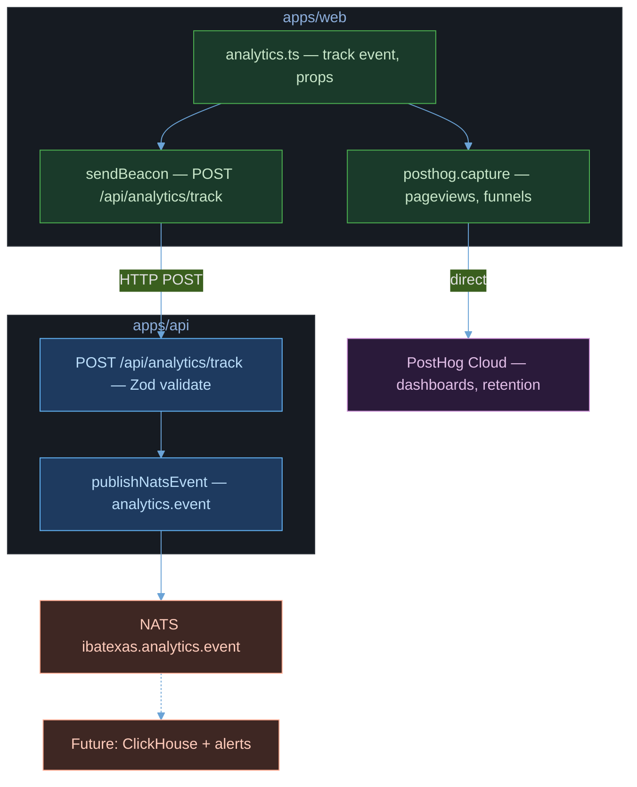

# Analytics & Dashboards

## Architecture


```mermaid
%%{init: {'theme': 'base', 'themeVariables': {'primaryColor': '#1e3a5f', 'primaryTextColor': '#e0e0e0', 'primaryBorderColor': '#4a90d9', 'lineColor': '#6ba3d6', 'background': '#0d1117', 'mainBkg': '#161b22', 'clusterBkg': '#161b22', 'clusterBorder': '#30363d'}}}%%
flowchart TD
  subgraph CLIENT["apps/web"]
    TRACK["analytics.ts — track event, props"]
    PH_CAP["posthog.capture — pageviews, funnels"]
    BEACON["sendBeacon — POST /api/analytics/track"]
  end

  subgraph SERVER["apps/api"]
    ROUTE["POST /api/analytics/track — Zod validate"]
    NATS_PUB["publishNatsEvent — analytics.event"]
  end

  POSTHOG["PostHog Cloud — dashboards, retention"]
  NATS_BUS["NATS ibatexas.analytics.event"]
  FUTURE["Future: ClickHouse + alerts"]

  TRACK --> PH_CAP
  TRACK --> BEACON
  PH_CAP -->|direct| POSTHOG
  BEACON -->|HTTP POST| ROUTE
  ROUTE --> NATS_PUB
  NATS_PUB --> NATS_BUS
  NATS_BUS -.-> FUTURE

  style TRACK fill:#1a3a2a,stroke:#4caf50,color:#c8e6c9
  style PH_CAP fill:#1a3a2a,stroke:#4caf50,color:#c8e6c9
  style BEACON fill:#1a3a2a,stroke:#4caf50,color:#c8e6c9
  style ROUTE fill:#1e3a5f,stroke:#64b5f6,color:#bbdefb
  style NATS_PUB fill:#1e3a5f,stroke:#64b5f6,color:#bbdefb
  style POSTHOG fill:#2a1a3a,stroke:#ce93d8,color:#e1bee7
  style NATS_BUS fill:#3e2723,stroke:#ffab91,color:#ffccbc
  style FUTURE fill:#3e2723,stroke:#ffab91,color:#ffccbc
```

**Dual-channel delivery:**
- **PostHog** (client-side) — dashboards, funnels, session replay, retention analysis
- **NATS** (server-side via sendBeacon → API) — domain event bus for future ClickHouse, alerts, server-side consumers

---

## North Star Metric

**Revenue Per Session (RPS)** = `sum(checkout_completed.orderTotal) / count(distinct ibx_session_id)`

- Calculated in PostHog, NOT as `checkout_completed count / session_started count`
- `ibx_session_id` is registered as a PostHog super property on every event
- `session_started` fires lazily on first meaningful interaction (not on page load) to exclude bounced visitors from the denominator

---

## Event Taxonomy

### Session Events

| Event | Trigger | Properties |
|-------|---------|------------|
| `session_started` | First meaningful interaction (pdp_viewed, search_performed, add_to_cart, checkout_started) | `sessionId` |
| `$pageview` | Every route change (fired by PostHogProvider) | `$current_url` |

### Product Events

| Event | Trigger | Properties |
|-------|---------|------------|
| `pdp_viewed` | PDP page mount | `productId` |
| `pdp_scroll_depth` | Scroll thresholds on PDP | `productId`, `depth` (25\|50\|75\|100) |
| `storytelling_section_viewed` | Storytelling section enters viewport | `productId` |
| `product_card_clicked` | Click on ProductCard in grid | `productId` |
| `review_link_clicked` | Click on review count link | `productId` |

### Cart Events

| Event | Trigger | Properties |
|-------|---------|------------|
| `quick_add_clicked` | "+" button on ProductCard | `productId`, `source` |
| `quick_add_failed` | ProductCard quick-add handler rejected / threw | `productId`, `source`, `reason` |
| `add_to_cart` | Item added to cart | `productId`, `variantId`, `quantity`, `source` (pdp\|pdp_sticky\|listing\|cross_sell) |
| `sticky_cta_used` | Mobile sticky CTA tap | `productId`, `quantity`, `source` (pdp_sticky) |
| `cart_drawer_opened` | Cart drawer opens | — |
| `cart_abandonment_nudge` | Abandonment nudge shown to returning user with stale cart | `cartId`, `itemCount` |
| `coupon_validation_failed` | Coupon code rejected by /api/coupons/validate or request errored | `code`, `reason` (invalid\|error) |
| `cross_sell_viewed` | Cross-sell section enters viewport | `productId`, `suggestedIds[]` |
| `cross_sell_added` | Cross-sell item added to cart (cart drawer, legacy PDP callsites) | `productId`, `suggestedId` |
| `pdp_cross_sell_added` | Item added from the unified PDP cross-sell section | `productId`, `suggestedId`, `source` (also_added\|cross_sell\|people_also_ordered) |
| `also_added_viewed` | "Also added" section enters viewport (PDP) — legacy, superseded by unified `cross_sell_viewed` | `productId`, `suggestedIds[]` |
| `also_added_cart` | "Also added" item added to cart — legacy, superseded by `pdp_cross_sell_added` | `productId`, `suggestedId` |
| `homepage_recs_clicked` | User clicks a recommended product on homepage | `productId` |
| `homepage_recs_viewed` | HomeRecommendations section enters viewport | `count`, `productIds[]` |
| `home_carousel_viewed` | Home featured-products carousel enters viewport | `count` |
| `search_results_viewed` | Search results settle (fires on every filter/query change) | `query`, `resultCount`, `filtersApplied` |
| `cart_drawer_cross_sell_viewed` | Cart drawer cross-sell scroller rendered with ≥1 item | `count`, `productIds[]` |
| `pdp_cross_sell_viewed` | Unified PDP cross-sell section enters viewport | `productId`, `count`, `suggestedIds[]` |

### Conversion UX Events

| Event | Trigger | Properties |
|-------|---------|------------|
| `upsell_toast_shown` | Cross-sell upsell toast appears after add-to-cart | `productId`, `crossCategory` |
| `upsell_toast_added` | User adds the suggested product from upsell toast | `productId` |
| `upsell_toast_dismissed` | User dismisses upsell toast (or auto-dismiss) | `productId`, `auto` (boolean) |
| `quantity_changed_inline` | User changes quantity via inline controls on ProductCard | `productId`, `action` (increment\|decrement\|remove), `quantity` |
| `layout_toggled` | _(declared, not yet emitted — no `track()` callsite)_ | `layout` (grid\|list) |
| `combo_banner_clicked` | _(declared, not yet emitted — no `track()` callsite)_ | — |
| `review_section_viewed` | Homepage reviews section enters viewport | — |
| `people_also_ordered_added` | User adds a product from "People Also Ordered" section | `productId` |

### Reorder Events

| Event | Trigger | Properties |
|-------|---------|------------|
| `reorder_completed` | User re-orders from last order card | `orderId`, `itemCount` |

### Order Tracking Events

| Event | Trigger | Properties |
|-------|---------|------------|
| `order_status_viewed` | Customer views order tracking page | `orderId`, `status` |
| `order_timeline_viewed` | Customer views order detail page with status timeline | `orderId`, `status` |
| `order_history_viewed` | Customer views order list (past orders) | `itemCount` |

### Wishlist Events

| Event | Trigger | Properties |
|-------|---------|------------|
| `wishlist_toggled` | User adds/removes product from wishlist | `productId`, `action` (add\|remove), optional `price`, `title`, `categoryHandle` |

### Search Events

| Event | Trigger | Properties |
|-------|---------|------------|
| `search_performed` | Search query executed | `query`, `resultCount` |
| `filter_applied` | Filter/sort changed | `filterType` (tag\|category\|sort\|smart), `value` |
| `search_synonym_resolved` | _(declared, not yet emitted — no `track()` callsite)_ | `original`, `canonical` |
| `trending_search_clicked` | _(declared, not yet emitted — no `track()` callsite)_ | `term` |

### Checkout Events

| Event | Trigger | Properties |
|-------|---------|------------|
| `checkout_started` | Checkout page mount | `cartTotal`, `itemCount`, `deliveryType` |
| `checkout_step_completed` | Delivery estimate fetched | `step` (delivery), `cep` |
| `checkout_completed` | Payment success (guarded, fires once) | `orderId`, `orderTotal`, `itemCount`, `paymentMethod`, `currency` (BRL), `ibx_session_id` |
| `checkout_error` | Payment failure | `step`, `errorType`, `errorMessage`, `paymentMethod` |
| `checkout_abandoned` | Page unload before completion (supplementary) | `step`, `cartTotal` |

> **Card payments:** `checkout_completed` fires after `stripe.confirmPayment()` succeeds (inline) or on the 3DS redirect return page. The `paymentMethod` property distinguishes card from PIX/cash.

### Payment Lifecycle Events

| Event | Trigger | Properties |
|-------|---------|------------|
| `payment_retry_initiated` | Customer clicks "Retry payment" on order tracking page | `orderId`, `paymentId`, `method`, `previousStatus` |
| `payment_method_switched` | Customer switches payment method (e.g. PIX → cash) | `orderId`, `paymentId`, `previousMethod`, `newMethod` |
| `pix_regenerated` | _(declared, not yet emitted — no `track()` callsite)_ | `orderId`, `paymentId`, `attemptCount` |
| `order_note_added` | Customer or admin adds a note to an order | `orderId`, `author` (customer/admin), `contentLength` |
| `order_amended` | Customer amends an order (add/remove/qty change) | `orderId`, `action` (add/remove/update_qty), `itemTitle` |
| `order_canceled_by_customer` | _(declared, not yet emitted — no `track()` callsite)_ | `orderId`, `fulfillmentStatus`, `paymentStatus`, `minutesSinceCreation` |

---

## KPI Targets (UX Redesign Baseline)

| KPI | Target | How to measure |
|-----|--------|----------------|
| Quick-add adoption | >= 20% of add_to_cart | `quick_add_clicked / add_to_cart` |
| AOV increase | +8-15% vs baseline | Average `checkout_completed.orderTotal` |
| Checkout completion | +5-10% vs baseline | Funnel: `checkout_started` -> `checkout_completed` |
| Cross-sell conversion | >= 5-10% of PDP views | `cross_sell_added / cross_sell_viewed` |
| PDP engagement | Storytelling reach > 60% | `storytelling_section_viewed / pdp_viewed` |
| Time to Add-to-Cart | Median decreasing | `pdp_viewed` -> `add_to_cart` time within session |
| Also-added conversion | >= 3-8% of PDP views | `also_added_cart / also_added_viewed` |
| Reorder rate | >= 15% of returning users | `reorder_completed` / returning sessions |
| Upsell toast conversion | >= 8-12% | `upsell_toast_added / upsell_toast_shown` |
| Inline quantity usage | Increasing trend | `quantity_changed_inline` volume |
| Review section reach | >= 40% of homepage visitors | `review_section_viewed / $pageview(/)` |
| People Also Ordered conv | >= 5% | `people_also_ordered_added / impressions` |

---

## PostHog Dashboards

### Dashboard 1: Executive - Daily Health

**Revenue Per Session (North Star) — PIN AT TOP:**
- Insight type: Trends
- Formula: `sum(checkout_completed.orderTotal)` / `count(distinct ibx_session_id)`
- Display: Daily trend line
- NOT `checkout_completed.orderTotal / unique session_started` — users can have multiple sessions per day

**Conversion Funnel:**
- Insight type: Funnel
- Steps: `pdp_viewed` -> `add_to_cart` -> `checkout_started` -> `checkout_completed`
- Breakdown by: source (pdp/listing/cross_sell), device type

**AOV (Average Order Value):**
- Insight type: Trends
- Formula: Average of `checkout_completed.orderTotal`
- Display: Daily trend

**Checkout Completion Rate:**
- Insight type: Funnel
- Steps: `checkout_started` -> `checkout_completed`
- Breakdown by: paymentMethod
- Note: `checkout_abandoned` via beforeunload is supplementary — funnel drop-off is the primary abandonment metric

### Dashboard 2: Product Behavior

**Add-to-Cart Rate:**
- `add_to_cart` events / `pdp_viewed` events
- Breakdown by source

**Time to Add-to-Cart (High Leverage):**
- Median time from `pdp_viewed` -> `add_to_cart` within same session
- Reveals: storytelling length, CTA placement, decision friction
- This is a silent conversion killer metric

**Quick-Add Usage:**
- `quick_add_clicked` / total `add_to_cart` events
- Target: >= 20%

**PDP Engagement:**
- `pdp_scroll_depth` distribution (25/50/75/100%)
- `storytelling_section_viewed` / `pdp_viewed` (storytelling reach)

**Cross-Sell Performance:**
- `cross_sell_added` / `cross_sell_viewed`
- Target: >= 5-10% of PDP views

**Also-Added Performance:**
- `also_added_cart` / `also_added_viewed`
- Target: >= 3-8% of PDP views
- Gated behind `recommendation_engine` feature flag

**Reorder Adoption:**
- `reorder_completed` volume and repeat rate
- Shows returning user stickiness

**Search Behavior:**
- `search_performed` volume + top queries
- `filter_applied` by filterType

**Upsell Toast Performance:**
- `upsell_toast_added` / `upsell_toast_shown` (conversion rate)
- Auto-dismiss vs manual dismiss ratio
- Revenue attributed to upsell adds

**Inline Quantity Controls:**
- `quantity_changed_inline` by action (increment vs decrement vs remove)
- Shows cart editing behavior without opening drawer

**People Also Ordered:**
- `people_also_ordered_added` volume
- Shows cross-sell effectiveness on menu page

**Homepage Reviews:**
- `review_section_viewed` reach (% of homepage visitors)

### Dashboard 3: Checkout & Revenue

**Checkout Funnel (detailed):**
- `checkout_started` -> `checkout_step_completed(delivery)` -> `checkout_completed`
- Drop-off by step

**Revenue by Payment Method:**
- `checkout_completed` broken down by `paymentMethod` (PIX / card / cash)

**Revenue by Source:**
- `checkout_completed` broken down by session's first `add_to_cart.source` (pdp / listing / cross_sell)

### WhatsApp Channel Events

| Event | Trigger | Properties |
|-------|---------|------------|
| `whatsapp_message_received` | Incoming WhatsApp message | `phone_hash`, `sessionId`, `customerId`, `hasMedia` |
| `whatsapp_message_sent` | Agent response sent via WhatsApp | `phone_hash`, `sessionId`, `customerId`, `tools_used`, `duration_ms` |
| `whatsapp_session_started` | New WhatsApp session created | `phone_hash`, `sessionId`, `customerId` |
| `whatsapp_agent_error` | Agent processing failed | `phone_hash`, `sessionId`, `errorMessage` |
| `whatsapp_interactive_list_sent` | Interactive list message sent | `phone_hash`, `sessionId`, `item_count` |
| `whatsapp_interactive_button_sent` | Interactive button message sent | `phone_hash`, `sessionId`, `button_count` |
| `whatsapp_interactive_selected` | User tapped interactive list/button item | `phone_hash`, `sessionId`, `selection_type` (list\|button), `selection_id` |

**NATS subjects:** `ibatexas.whatsapp.message.received`, `ibatexas.whatsapp.message.sent`

### Consent Events

| Event | Trigger | Properties |
|-------|---------|------------|
| `cookie_consent_given` | User clicks "Aceitar" on cookie consent banner | — |
| `cookie_consent_rejected` | User clicks "Recusar" on cookie consent banner | — |

**Note:** These events are only fired after consent is given (cookie_consent_given fires once on accept; cookie_consent_rejected is tracked locally but NOT sent to PostHog since the user declined tracking).

### Acquisition Events

| Event | Trigger | Key Properties |
|-------|---------|---------------|
| `first_order_completed` | Customer's first-ever order completes | `customerId`, `orderTotal`, `source` |
| `welcome_credit_applied` | BEMVINDO15 coupon auto-applied at checkout | `customerId`, `discountAmount` |
| `qr_code_scanned` | Customer opens wa.me link from QR code | `source` (table/bag/flyer) |
| `whatsapp_cta_clicked` | FirstVisitBanner WhatsApp button clicked | `page` |
| `utm_source_captured` | Session has UTM params | `utm_source`, `utm_medium`, `utm_campaign` |

### Proactive Outreach Events

| Event | Trigger | Key Properties |
|-------|---------|---------------|
| `proactive_nudge_sent` | Outreach message sent to dormant customer | `customerId`, `messageType`, `daysSinceLast` |
| `proactive_nudge_converted` | Order placed within 24h of nudge | `customerId`, `messageType`, `orderTotal` |

### Conversation Archival Events (NATS only — not PostHog)

| Event | Trigger | Key Properties |
|-------|---------|---------------|
| `conversation.message.appended` | `appendMessages()` in session store | `sessionId`, `customerId`, `channel`, `messages[]` |

**Note:** Conversation archival events flow through NATS to the `conversation-archiver` subscriber (Postgres persistence), NOT through PostHog. These are infrastructure events for durable storage, not analytics events.

### IBX-IGE Audit Events (kernel observability)

These events emit when the Intent-Gated Execution kernel runs against live traffic. They are critical for health monitoring.

The kernel is always authoritative (IBX-IGE v3.0) — there is no shadow path. The earlier `audit_kernel_shadow_diverged_{basis,kind,rewrite}` events, their `kernel_shadow_divergence_total` counter, and `recordShadowDivergence()` as a live producer no longer exist: the string literals were removed from the `AnalyticsEvent` union (none remain in `apps/web/src/domains/analytics/events.ts`), and `recordShadowDivergence()` is now a no-op retained only for `MetricsSink` interface compliance.

Four `audit_*` events are actually emitted, all via the `MetricsSink` in `kernel-metrics-sink.ts`:

| Event | Trigger | Key Properties | Operational policy |
|-------|---------|----------------|--------------------|
| `audit_decision_executed` | recordDecision with `decision = EXECUTE` | `intent_kind`, `decision_kind`, `latency_ms`, `basis_count`, `intent_hash_prefix` | Metric — track distribution per intent class |
| `audit_decision_refused` | recordDecision with any non-EXECUTE decision | `intent_kind`, `decision_kind`, `latency_ms`, `basis_count`, `intent_hash_prefix` | Track refusal-rate per intent kind; alert on spike (>2× 7-day baseline) |
| `audit_ledger_hit` | recordLedgerOp with `outcome = hit` (replay-suppressed duplicate) | `intent_kind`, `op`, `outcome`, `latency_ms` | Metric — high rate may indicate webhook redelivery storm |
| `audit_nats_sink_failed` | recordSinkFailure (audit sink emit rejected) | `sink`, `subject`, `error_class`, `consecutive_failures` | Alert at ≥10 consecutive failures (the circuit-breaker escalation threshold) |

> `audit_replay_divergence` is declared in the `AnalyticsEvent` union but has no producer — the kernel currently signals replay drift through the `kernel_replay_drift_total` Prometheus counter (via `createKernelMetricsRecorder().recordReplayDrift`), not this PostHog event. Treat it as declared, not yet emitted.

Post-cutover health monitoring uses `audit_decision_executed` / `audit_decision_refused` rates plus the Prometheus counters in §Kernel metrics below.

**Sample PostHog query (decision distribution):**

```
SELECT event, count() AS volume
FROM events
WHERE event IN ('audit_decision_executed', 'audit_decision_refused')
  AND timestamp > now() - INTERVAL 1 HOUR
GROUP BY event
```

**NATS subjects:** the 4 emitted `audit_*` events also publish to `ibatexas.analytics.event` via the standard pipeline (the `trackAnalytics` wire publishes `analytics.event`). The audit-only durable trail emits separately to `ibatexas.audit.intent.decision.v1` via `@adjudicate/audit/sink-nats`.

### Kernel metrics (Prometheus)

The same `MetricsSink` adapter that emits the active PostHog `audit_*` events above also populates a `prom-client` registry exposed at `GET /metrics` on the API. The endpoint is token-gated: the `x-prometheus-token` header must equal `PROMETHEUS_TOKEN` (unset = 503 closed by default; mismatch = 401).

This table is the human-readable registry the metric names are kept in sync with — `kernel-metrics-sink.ts` references it directly: "Adding a new metric? Update that doc + `docs/ops/analytics-dashboards.md`." Keep it complete.

**Producer:** `apps/api/src/plugins/kernel-metrics-sink.ts` — `createKernelMetricsSink` registers all 19 metrics; the framework-boundary `MetricsSink` hooks populate the first 6, and the out-of-band `createKernelMetricsRecorder` (called from sweepers, the replay CLI, pack-install at boot, the audit-redactor wrap) populates most of the W3 group.
**Scrape route:** `apps/api/src/routes/metrics.ts`.

| Metric | Type | Labels | Purpose |
|--------|------|--------|---------|
| `kernel_decision_total` | Counter | `kind` (Decision kind: EXECUTE / REFUSE / DEFER / REQUEST_CONFIRMATION / ESCALATE / REWRITE), `intent_kind` | Every adjudicate() call. Refusal-rate denominator. |
| `kernel_refusal_total` | Counter | `kind` (refusal kind: SECURITY / BUSINESS_RULE / AUTH / STATE), `intent_kind`, `basis_category`, `basis_code` | Per-intent refusal distribution. Alert on >2× 7-day baseline. |
| `kernel_decision_duration_seconds` | Histogram | `intent_kind` | adjudicate() latency in seconds. Alert on p99 > 100ms. Buckets: 1ms — 10s. |
| `kernel_ledger_op_total` | Counter | `outcome` (hit / miss / ok / duplicate / error), `op` (check / record) | Execution Ledger fail-open detection. |
| `kernel_audit_sink_failure_total` | Counter | `sink` (nats / postgres / console), `reason` (errorClass) | NATS / Postgres audit pipeline health. Drives circuit-breaker engagement. |
| `kernel_defer_resume_duration_seconds` | Histogram | `kind` | Park-to-resume latency for DEFER intents (populated by the resolver). Buckets: 100ms — 4h. |
| `kernel_intent_kind_coverage` | Gauge | — | Ratio of `KNOWN_INTENT_KINDS` observed in the trailing 24h window. < 1.0 means an emitted kind sits outside the typo gate. Alert when below 1.0. |
| `kernel_distinct_intent_kinds_observed` | Gauge | — | Count of distinct intent kinds observed in the 24h window (coverage numerator companion). |
| `kernel_known_intent_kinds_total` | Gauge | — | `KNOWN_INTENT_KINDS.size` — the typo gate's accepted set (coverage denominator). |
| `kernel_intent_kind_unknown_total` | Counter | `kind` | An intent was emitted with a kind NOT in `KNOWN_INTENT_KINDS` — taxonomy drift signal. |
| `kernel_audit_lag_seconds` | Histogram | `sink` | Audit pipeline lag: emit() → durable sink acknowledge, per sink. Buckets: 1ms — 60s. |
| `kernel_replay_drift_total` | Counter | `class` | Replay-drift verdicts from `ibx kernel replay`, one increment per drift event. |
| `kernel_pack_install_total` | Counter | `pack` | `installPack` calls at boot, labelled by pack name. |
| `kernel_defer_pending_gauge` | Gauge | — | Currently parked deferred intents (count of `defer:pending:*` Redis keys). |
| `kernel_defer_quota_exceeded_total` | Counter | `kind` | Per-session DEFER quota-rejection events. |
| `kernel_defer_timeout_total` | Counter | `kind` | DEFER intents that expired before their resume signal arrived (sweeper-published). |
| `kernel_audit_redactor_failures_total` | Counter | `reason` | Audit-redactor fail-open events (cyclic refs, throw on traversal). |
| `kernel_audit_sink_buffer_size` | Gauge | — | In-memory capacity of `persistentBufferedSink` (records held before spill). |
| `kernel_audit_sink_spill_size` | Gauge | — | Audit Redis spill-list depth (records waiting to drain to inner sinks). |

**Scrape config (Prometheus):** the route reads the `x-prometheus-token` header (not bearer auth), so inject it via `http_config.request_headers`. Inject `PROMETHEUS_TOKEN` from the scraper's secret store — do not commit it.

```yaml
scrape_configs:
  - job_name: ibatexas-kernel
    metrics_path: /metrics
    scheme: https
    static_configs:
      - targets: ["api.ibatexas.com.br:443"]
    http_config:
      request_headers:
        x-prometheus-token: ${PROMETHEUS_TOKEN}
```

### NATS Analytics Events

Web analytics events are published to NATS subject `analytics.event` (full: `ibatexas.analytics.event`) for downstream consumers (e.g., PostHog ingestion pipeline).

| Field | Type | Description |
|-------|------|-------------|
| `eventType` | string | The analytics event name (e.g., `add_to_cart`, `checkout_completed`) |
| `properties` | object | Sanitized event properties from the client |
| `timestamp` | string (ISO) | Server-side timestamp |
| `ip` | string | Client IP (for geo/rate-limiting) |

Source: `apps/api/src/routes/analytics.ts` — best-effort, fire-and-forget publish.

### Agent Performance Events

| Event | Trigger | Key Properties |
|-------|---------|---------------|
| `wa_conversation_started` | New WhatsApp session begins (isNew=true) | `phone_hash`, `sessionId` |
| `wa_conversation_converted` | Order placed by a WhatsApp customer | `customerId`, `orderId`, `sessionId` |
| `wa_follow_up_scheduled` | Follow-up reminder queued for a customer | `customerId`, `scheduledAt` |
| `wa_follow_up_converted` | Order placed within follow-up window | `customerId`, `orderId` |
| `loyalty_stamp_earned` | Customer earns a loyalty stamp on order | `customerId`, `stamps` |
| `loyalty_reward_redeemed` | Customer redeems a loyalty reward | `customerId`, `rewardType` |
| `kitchen_closed_checkout_blocked` | User arrives at checkout with food items while kitchen is closed | `kitchenItemCount` |
| `kitchen_closed_items_removed` | User clicks "remove unavailable items" to clear food from cart | `count` |
| `kitchen_closed_banner_viewed` | Kitchen-closed warning banner shown in cart drawer or checkout | `source` (`cart_drawer` or `checkout`), `kitchenItemCount` |

### PostHog Dashboard Specs — Acquisition & Outreach

**Acquisition Funnel:**
- Insight type: Funnel
- Steps: `qr_code_scanned` OR `whatsapp_cta_clicked` → `first_order_completed`
- Breakdown by: source

**Outreach ROI:**
- Insight type: Funnel
- Steps: `proactive_nudge_sent` → `proactive_nudge_converted`
- Shows: conversion rate of proactive outreach messages

**New Customers/Month:**
- Insight type: Trends
- Formula: UNIQUE `first_order_completed` by month (distinct `customerId`)
- Display: Monthly bar chart

---

## PostHog Configuration

Source: `apps/web/src/lib/posthog.ts`.

```typescript
posthog.init(NEXT_PUBLIC_POSTHOG_KEY, {
  api_host: NEXT_PUBLIC_POSTHOG_HOST,   // defaults to https://us.posthog.com
  autocapture: false,                   // our event taxonomy is explicit
  capture_pageview: false,              // fired manually on Next.js route changes
  capture_pageleave: true,
  persistence: 'cookie',
  secure_cookie: location.protocol === 'https:',
  cross_subdomain_cookie: false,
  person_profiles: 'identified_only',   // no anonymous user bloat
})
```

- `autocapture: false` — custom events are better than generic click tracking
- `capture_pageview: false` — PostHogProvider fires `$pageview` on route changes
- `persistence: 'cookie'` — deliberately NOT `localStorage`, to keep analytics state out of script-readable storage (XSS exposure surface). `secure_cookie` is on under HTTPS; `cross_subdomain_cookie: false` scopes the cookie to the storefront host.
- `person_profiles: 'identified_only'` — only creates person profiles for authenticated users

---

## Verifying Events in PostHog Live Events

Before creating dashboards or starting a measurement window, confirm events are flowing correctly:

1. Open PostHog → **Live Events**
2. Trigger each critical event in the storefront (dev or staging)
3. Confirm the event appears in the live stream with the expected properties
4. Check that `ibx_session_id` and `distinct_id` are present on every event
5. Verify `checkout_completed` fires exactly once per order (no duplicates)
6. Verify `pdp_scroll_depth` fires at most 4 times per PDP visit (25/50/75/100)
7. Confirm `session_started` does NOT fire on bounce (home page only, no interaction)

Once events are verified, work through the Pre-Baseline Checklist below before locking in the baseline.

---

## Pre-Baseline Checklist

Verify in PostHog live events before starting the measurement window:

- [ ] Every event includes `ibx_session_id` and `distinct_id`
- [ ] `distinct_id` is stable across page reloads (not regenerating)
- [ ] `session_started` fires once per meaningful session (not on bounce)
- [ ] `checkout_completed` fires once per order (no duplicates)
- [ ] All `checkout_completed` events include: `orderId`, `orderTotal`, `currency`, `ibx_session_id`
- [ ] `pdp_scroll_depth` fires exactly 4 times max per PDP visit
- [ ] No duplicate events visible in PostHog live event stream
- [ ] `sendBeacon` works in production build (not only dev console.log)
- [ ] RPS test query: `sum(orderTotal) / count(distinct ibx_session_id)` returns expected value
- [ ] Web events land on the NATS subject `ibatexas.analytics.event` (single subject; `eventType` is a payload field, not the subject)

---

## Data Integrity Guards

### Session Started — Lazy Firing
`session_started` only fires on first **meaningful interaction**:
- `pdp_viewed`
- `search_performed`
- `add_to_cart`
- `checkout_started`

Bounced visitors (home page only, no interaction) are excluded from the RPS denominator. This is tracked via `sessionStorage` flag `ibx_session_started`.

### Checkout Completed — Dedup Guard
`checkout_completed` is guarded by:
1. `checkoutCompletedRef` (React ref) — prevents double-fire on double-click or re-render
2. `data?.orderId` existence check — only fires when the order was actually created
3. Mandatory fields: `orderId`, `orderTotal`, `currency: 'BRL'`, `ibx_session_id`

### Checkout Abandoned — Supplementary Signal
`checkout_abandoned` via `beforeunload` is **supplementary only**:
- It fires on SPA navigation (false positives)
- It's guarded against firing after `checkout_completed`
- **Primary abandonment** = PostHog funnel: `checkout_started` -> `checkout_completed` drop-off

### Scroll Depth — Position-Based
Uses `window.scrollY + window.innerHeight / document.body.scrollHeight` percentage:
- Short page guard: fires 100% immediately if content fits in viewport
- Each threshold (25/50/75/100%) fires exactly once
- Passive scroll listener for performance
- Consistent across mobile and desktop

---

## Future Scalability

### Phase 2
- **A/B Testing:** PostHog feature flags for experiment control
- **Session Replay:** Enable PostHog session recording for UX analysis
- **Customer Identification:** Call `posthog.identify(customerId)` on auth to link sessions to users

### Phase 3
- **ClickHouse Consumer:** NATS subscriber that writes `ibatexas.analytics.event` to ClickHouse for historical BI queries
- **Real-Time Alerts:** NATS subscriber that monitors for anomalies (checkout error spike, conversion drop)
- **Server-Side Analytics:** Move critical events (order.placed, reservation.created) to server-side PostHog for guaranteed delivery
