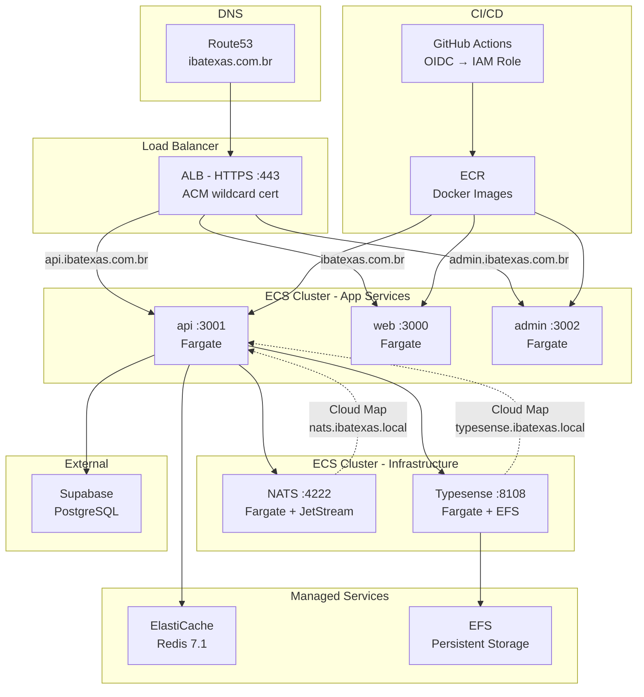

# Deployment Guide

From fresh AWS account to running in production.

---

## Prerequisites

| Tool | Version | Install |
|------|---------|---------|
| AWS CLI | v2+ | `brew install awscli` → `aws configure` |
| Terraform | >= 1.6 | `brew install tfenv && tfenv install 1.9.8 && tfenv use 1.9.8` |
| gh CLI | latest | `brew install gh` → `gh auth login` |
| Supabase | — | Create project at [supabase.com](https://supabase.com) (South America - São Paulo region) |
| Domain | — | `ibatexas.com.br` registered at a domain registrar |

---

## Quick Start

```bash
ibx infra init                     # S3 bucket + DynamoDB lock table
terraform -chdir=infra/terraform/environments/dev init -migrate-state
ibx infra apply                    # Provision all AWS resources (~94 resources, ~5-10 min one-time)
ibx infra secrets                  # Populate 14 Secrets Manager entries (interactive)
ibx infra github                   # Set GitHub repo secrets (OIDC role, DB URLs)
git push origin dev                # Trigger first staging deploy
```

---

## Architecture Overview



- **3 app services**: api, web, admin — all ECS Fargate behind ALB with host-based routing
- **Redis**: ElastiCache `cache.t4g.micro` — BullMQ queues, caching, sessions
- **NATS**: ECS Fargate with JetStream — event bus (`cart.abandoned`, `order.placed`, `conversation.message.appended`, etc.)
- **Typesense**: ECS Fargate with EFS — search index with persistent storage
- **Deploys**: GitHub Actions with OIDC (no long-lived AWS keys)

---

## How CD Works

> **Deploy time:** A regular CD deploy takes **~5-7 minutes** (build + push + rolling update). This is much faster than the initial `ibx infra apply` which provisions infrastructure from scratch. Terraform is NOT involved in regular deploys — only Docker build, ECR push, and ECS service update.

### Staging — push to `dev`

Workflow: `.github/workflows/deploy-staging.yml`

```
push to dev → build 3 Docker images (~2-3 min) → push to ECR (~1 min) → run Prisma migrations → deploy ECS → wait stable (~2-3 min)
```

- **Auto-deploys** on every push to `dev`
- **Concurrency**: cancel-in-progress (latest push wins)
- Images tagged: `sha-<commit>` + `dev-latest`

### Production — push to `main`

Workflow: `.github/workflows/deploy.yml`

```
push to main → build (~2-3 min) → push ECR (~1 min) → migrate → deploy ECS → wait stable (~2-3 min) → health check
```

- **Auto-deploys** on every push to `main`
- **No cancel-in-progress** — each deploy completes fully
- Images tagged: `sha-<commit>` + `latest`
- **Health checks** after deploy: verifies `api /health`, `web /`, `admin /`

### Pipeline steps (both workflows)

1. **Build**: Multi-stage Docker builds (Node 22, pnpm 10.32.1)
2. **Push**: ECR with commit SHA tags
3. **Migrate**: Prisma migrations via `DIRECT_DATABASE_URL` (direct Supabase connection, port 5432). Includes domain schema migration for `conversations` + `conversation_messages` tables.
4. **Deploy**: Sequential ECS service updates (api → web → admin)
5. **Wait**: ECS deployment controller waits for stability (10 min timeout)
6. **Health** (production only): HTTP checks on all 3 public endpoints

### Infrastructure vs. CD — what runs when?

| Action | What runs | Time | When needed |
|--------|-----------|------|-------------|
| `ibx infra apply` | Terraform (create/update AWS resources) | 5-10 min first run, seconds after | Only when changing infrastructure |
| `git push origin dev` | GitHub Actions (build → ECR → ECS) | ~5-7 min | Every code change |
| `ibx infra secrets` | AWS CLI (populate Secrets Manager) | ~2 min | When adding/rotating secrets (14 secrets) |
| `ibx infra github` | gh CLI (set GitHub repo secrets) | ~1 min | One-time setup |

---

## Step-by-Step Setup

### 1. AWS Bootstrap

```bash
brew install awscli        # Install AWS CLI (v2)
aws configure              # Prompts for credentials (see below)
brew install tfenv         # Terraform version manager (HashiCorp license change blocks brew install terraform >= 1.6)
tfenv install 1.9.8        # Install Terraform 1.9.8
tfenv use 1.9.8            # Activate it
ibx infra init             # Creates S3 bucket + DynamoDB lock table
```

**Getting AWS credentials for `aws configure`:**

1. Log in at [console.aws.amazon.com](https://console.aws.amazon.com)
2. Click your username (top-right) → **Security credentials**
3. Scroll to **Access keys** → **Create access key**
4. Copy the **Access Key ID** and **Secret Access Key** (shown only once — save it)

When prompted by `aws configure`, enter:

| Prompt | Value |
|--------|-------|
| AWS Access Key ID | *(from step 4)* |
| AWS Secret Access Key | *(from step 4)* |
| Default region name | `us-east-1` |
| Default output format | `json` |

### 2. Enable Terraform State Backend

Migrate to the S3 backend:

```bash
terraform -chdir=infra/terraform/environments/dev init -migrate-state
```

> **Note:** `-chdir` must come before the subcommand (`init`), not after.

### 3. Supabase Project

Create project at [supabase.com](https://supabase.com) in **South America (São Paulo)** region. Grab:

- `DATABASE_URL` — pooler connection (port 6543, for app runtime)
- `DIRECT_DATABASE_URL` — direct connection (port 5432, for Prisma migrations)

### 4. Terraform Apply

```bash
ibx infra apply
```

This provisions ~99 AWS resources: ECS cluster, ALB, ECR repos, Route53 zone, ACM certs, ElastiCache, NATS/Typesense services, EFS, security groups, IAM roles, Secrets Manager entries, Cloud Map service discovery.

> **Timing:** First `ibx infra apply` takes ~5-10 minutes (ElastiCache and ALB are the slowest). ACM certificate validation can add up to 10 minutes — it will timeout if DNS nameservers aren't configured yet (re-run after configuring). Subsequent `ibx infra apply` runs are fast (seconds) since Terraform only applies diffs.

### 5. Domain Nameservers

After apply, copy the 4 Route53 NS records and set them at your domain registrar.

```bash
# Nameservers are shown in the apply output, or fetch them with:
terraform -chdir=infra/terraform/environments/dev output route53_nameservers
```

Set all 4 NS records at your domain registrar for `ibatexas.com.br`. DNS propagation can take 5 min to 24 hours.

### 6. ACM Certificate Validation

The wildcard cert (`*.ibatexas.com.br`) uses DNS validation. Once nameservers propagate (5 min – 24 hours), it auto-validates.

Check: `ibx infra status` (look at ACM Certificate line)

### 7. Populate Secrets

```bash
ibx infra secrets          # Interactive prompts for all 14 secrets
# OR for CI:
ibx infra secrets --from-env   # Reads from environment variables
```

**REDIS_URL** and **NATS_URL** are auto-populated by Terraform — you don't need to set these.

Secrets are injected per-service (not all secrets to all services):

| Secret | API | Web | Admin |
|--------|:---:|:---:|:-----:|
| JWT_SECRET | **Required** | - | - |
| DATABASE_URL | **Required** | - | - |
| ANTHROPIC_API_KEY | **Required** | - | - |
| STRIPE_SECRET_KEY | **Required** | - | - |
| STRIPE_WEBHOOK_SECRET | **Required** | - | - |
| TWILIO_AUTH_TOKEN | **Required** | - | - |
| TWILIO_ACCOUNT_SID | **Required** | - | - |
| TWILIO_VERIFY_SID | **Required** | - | - |
| MEDUSA_API_KEY | **Required** | - | - |
| TYPESENSE_API_KEY | Optional | - | - |
| REDIS_URL | **Required** | - | - |
| NATS_URL | **Required** | - | - |
| CORS_ORIGIN | Optional | - | - |
| SENTRY_DSN | Optional | Optional | Optional |

> `DIRECT_DATABASE_URL` is NOT an ECS secret — it's a GitHub Actions secret used only for Prisma migrations during deploys.

### 8. GitHub Secrets

```bash
ibx infra github           # Sets AWS_DEPLOY_ROLE_ARN + prompts for DB URLs
```

### 9. First Deploy

```bash
git push origin dev        # Triggers staging deploy
ibx infra deploy --watch   # Or push + monitor in one command
```

---

## External Services

| Service | Secret(s) | Where to get it |
|---------|-----------|----------------|
| Stripe | `STRIPE_SECRET_KEY`, `STRIPE_WEBHOOK_SECRET` | [stripe.com/dashboard](https://stripe.com/dashboard) |
| Twilio | `TWILIO_ACCOUNT_SID`, `TWILIO_AUTH_TOKEN`, `TWILIO_VERIFY_SID` | [twilio.com/console](https://twilio.com/console) |
| Anthropic | `ANTHROPIC_API_KEY` | [console.anthropic.com](https://console.anthropic.com) |
| Sentry | `SENTRY_DSN` | [sentry.io](https://sentry.io) — optional, set to `"disabled"` to skip |
| PostHog | (set in app config) | [posthog.com](https://posthog.com) |

---

## Checking Status

```bash
ibx infra status           # Dashboard with confidence summary
ibx infra status --json    # Machine-readable for CI
ibx infra checklist        # Numbered deployment checklist
ibx infra explain          # Root cause analysis for failures
ibx infra doctor           # Deep diagnostics (ECR, CloudWatch, Cloud Map)
```

---

## Rollback

### Automatic

ECS has `deployment_circuit_breaker` enabled with `rollback = true`. If new tasks fail health checks, ECS automatically rolls back to the previous task definition.

### Manual

```bash
# Find previous task definition
aws ecs describe-services --cluster ibatexas-dev --services ibatexas-dev-api \
  --query "services[0].taskDefinition" --output text

# Roll back to a specific revision
aws ecs update-service --cluster ibatexas-dev --service ibatexas-dev-api \
  --task-definition ibatexas-dev-api:<previous-revision>
```

ECR keeps the last 25 images (lifecycle policy), so previous images are always available.

---

## Common Failure Modes

### First deploy gets stuck in health check loop

**Cause**: Redis, NATS, or Typesense not ready when API starts. The `/health` endpoint checks all three — returns 503 if any fails.

**Fix**: `ibx infra status` → verify ECS services for nats and typesense are running.

### ECS deploy succeeds but app crashes

**Cause**: Missing or invalid secrets in Secrets Manager. The API validates all env vars at startup (Zod schema) and crashes if required ones are missing. ECS also fails to start tasks if a referenced secret has no value.

**Fix**: `ibx infra secrets` → populate missing values. Secrets are injected per-service (see table in Step 7) — only the API needs most secrets; web and admin only need SENTRY_DSN. Then trigger a new deploy.

### GitHub Actions deploy fails

**Cause**: OIDC role not configured or `AWS_DEPLOY_ROLE_ARN` GitHub secret not set.

**Fix**: `ibx infra github` → re-set the deploy role ARN.

### ACM certificate stuck on PENDING_VALIDATION

**Cause**: Domain nameservers not pointing to Route53 yet. DNS propagation can take up to 24 hours.

**Fix**: Verify NS records at your domain registrar match Route53 output. Wait for propagation.

### Terraform state lock

**Cause**: Concurrent `terraform apply` runs, or a previous run crashed without releasing the lock.

**Fix**: `terraform force-unlock <LOCK_ID>` (the lock ID is shown in the error message).

### Deploy shows green but app serves 500s

**Cause**: Running image is outdated (old task definition) or secrets were rotated but not redeployed.

**Fix**: `ibx infra explain` → identifies image freshness and secret staleness issues.

### Secrets rotated but old values still running

**Cause**: ECS tasks cache secrets at startup. Rotating a secret in Secrets Manager doesn't restart running tasks.

**Fix**: Force a new deployment: `aws ecs update-service --cluster ibatexas-dev --service ibatexas-dev-api --force-new-deployment`

---

## Troubleshooting

### Terraform version mismatch

The project requires Terraform >= 1.6. Check: `terraform version`

### ECS capacity provider issues

Default VPC subnets need `assign_public_ip = true` for Fargate tasks (no NAT gateway). This is already configured.

### Supabase connection timeouts

Ensure ECS security groups allow outbound to `0.0.0.0/0` on ports 5432 (direct) and 6543 (pooler). Supabase is external — no VPC peering.

### Cold-start deploy timeouts

First deploys can take longer (cold ECR, image pull, capacity provisioning). Use `ibx infra deploy --watch --timeout 20m` for the initial deploy.
